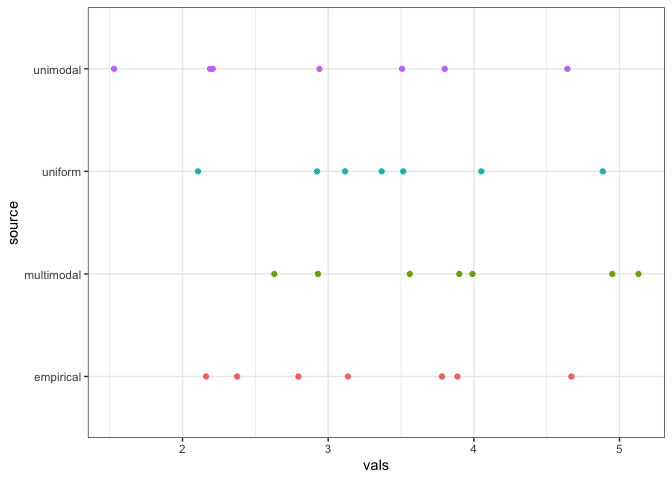
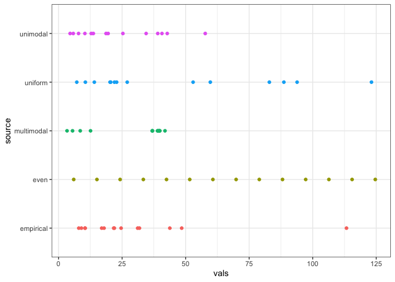

BSD decay?
================

``` r
library(isds)
library(ggplot2)
library(dplyr)
```

    ## 
    ## Attaching package: 'dplyr'

    ## The following objects are masked from 'package:stats':
    ## 
    ##     filter, lag

    ## The following objects are masked from 'package:base':
    ## 
    ##     intersect, setdiff, setequal, union

``` r
library(tidyr)
knitr::opts_chunk$set(echo = TRUE)

toyp <- get_toy_portal_data(years = 1990:2010)
```

    ## Loading in data version 1.90.0

``` r
ebsd <- toyp %>%
  group_by(species) %>%
  summarize(meanwgt = mean(wgt)) %>%
  ungroup() %>%
  mutate(logwgt = log(meanwgt))

set.seed(1977)

uniform_log_bsd <- draw_uniform_bsd(s = nrow(ebsd), min = .75 * min(ebsd$logwgt), max = 1.1 *max(ebsd$logwgt))

unimodal_log_bsd <- draw_unimodal_bsd(ebsd$logwgt)

mmodal_log_bsd_full <- draw_multimodal_bsd(emp_vector = ebsd$logwgt, min_sd_coeff = 1, max_sd_coeff = 2)

mmodal_log_bsd <- mmodal_log_bsd_full$bsd
even_log_bsd <- seq(from = .75 * min(ebsd$logwgt), to = 1.1 *max(ebsd$logwgt),
                    length.out = length(ebsd$logwgt))


uniform_bsd <- draw_uniform_bsd(s = nrow(ebsd), min = .75 * min(ebsd$meanwgt), max = 1.1 * max(ebsd$meanwgt))
unimodal_bsd <- draw_unimodal_bsd(ebsd$meanwgt)
mmodal_bsd_full <- draw_multimodal_bsd(emp_vector = ebsd$meanwgt, min_mode_gap = 20, min_sd_coeff = 1, max_sd_coeff = 3)
mmodal_bsd <- mmodal_bsd_full$bsd
even_bsd <- seq(from = .75 * min(ebsd$meanwgt), to = 1.1 *max(ebsd$meanwgt),
                    length.out = length(ebsd$meanwgt))
```

``` r
all_log_bsds <- data.frame(
  vals = c(mmodal_log_bsd, uniform_log_bsd, unimodal_log_bsd, ebsd$logwgt, even_log_bsd),
  source = c(rep("multimodal", nrow(ebsd)),
             rep("uniform", nrow(ebsd)), 
             rep("unimodal", nrow(ebsd)),
             rep("empirical", nrow(ebsd)),
             rep("even", nrow(ebsd)))
)


all_log_bsd_plot <- ggplot(data = all_log_bsds, aes(x = vals, y = source, color = source)) +
  geom_point() +
  theme_bw() +
  theme(legend.position = "none")

all_log_bsd_plot
```



``` r
all_bsds <- data.frame(
  vals = c(mmodal_bsd, uniform_bsd, unimodal_bsd, ebsd$meanwgt, even_bsd),
  source = c(rep("multimodal", nrow(ebsd)),
             rep("uniform", nrow(ebsd)), 
             rep("unimodal", nrow(ebsd)),
             rep("empirical", nrow(ebsd)),
             rep("even", nrow(ebsd)))
)


all_bsd_plot <- ggplot(data = all_bsds, aes(x = vals, y = source, color = source)) +
  geom_point() +
  theme_bw() +
  theme(legend.position = "none")

all_bsd_plot
```



``` r
# 
# raw_ssq<- all_bsds %>%
#   group_by(source) %>%
#   summarize(ssq_prop = get_ssq_prop(vals))

all_log_ssq <- list() 
for(i in 1:6) {
  all_log_ssq[[i]] <-  all_log_bsds %>%
  group_by(source) %>%
  summarize(ssq_prop = get_ssq_prop(vals, nbclumps = i)) %>%
    ungroup() %>%
    mutate(nbclumps = i)
}

all_log_ssq <- bind_rows(all_log_ssq)

log_ssq_plot <- ggplot(data =all_log_ssq, aes(x = nbclumps, y = ssq_prop, color = source)) + 
  geom_line() +
  theme_bw()
log_ssq_plot
```


``` r
all_ssq <- list() 

for(i in 1:10) {
  all_ssq[[i]] <- all_bsds %>%
  group_by(source) %>%
  summarize(ssq_prop = get_ssq_prop(vals, nbclumps = i)) %>%
    ungroup() %>%
    mutate(nbclumps = i)
}

all_ssq <- bind_rows(all_ssq)

ssq_plot <- ggplot(data =all_ssq, aes(x = nbclumps, y = ssq_prop, color = source)) + 
  geom_line() +
  theme_bw()
ssq_plot
```


``` r
#raw_ssq
#log_ssq
```

Maybe you could pick the nb clumps based on the elbow of the scree plot of the within group sum of squares? When the slope starts to become less negative, truncate?

``` r
raw_elbows <- all_bsds %>%
  group_by(source) %>%
  summarize(elbow = get_kmeans_elbow(vals)) %>%
  ungroup()
raw_elbows
```

    ## # A tibble: 5 x 2
    ##   source     elbow
    ##   <fct>      <dbl>
    ## 1 empirical      2
    ## 2 even           2
    ## 3 multimodal     2
    ## 4 uniform        2
    ## 5 unimodal       2

``` r
log_elbows <- all_log_bsds %>%
  group_by(source) %>%
  summarize(elbow = get_kmeans_elbow(vals)) %>%
  ungroup()
log_elbows
```

    ## # A tibble: 5 x 2
    ##   source     elbow
    ##   <fct>      <dbl>
    ## 1 empirical      2
    ## 2 even           2
    ## 3 multimodal     2
    ## 4 uniform        2
    ## 5 unimodal       2

There's a lot to do, but at least for now it looks like multimodality actually comes through pretty sharply. Not on the log scale, though.
