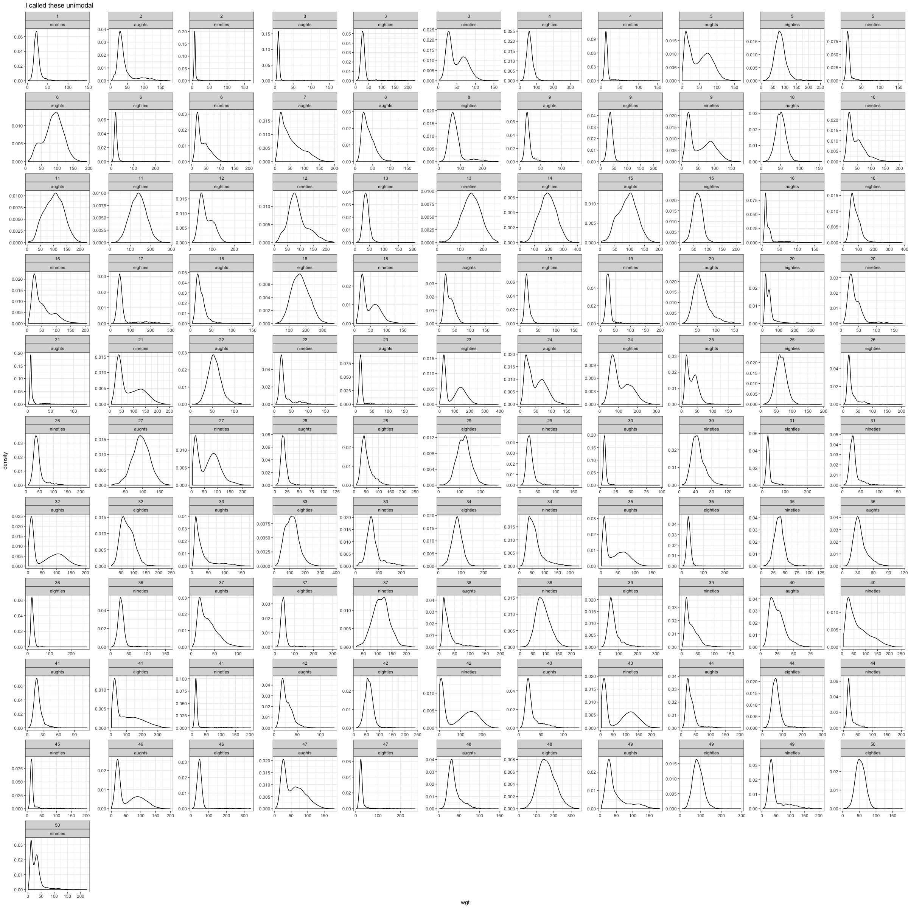
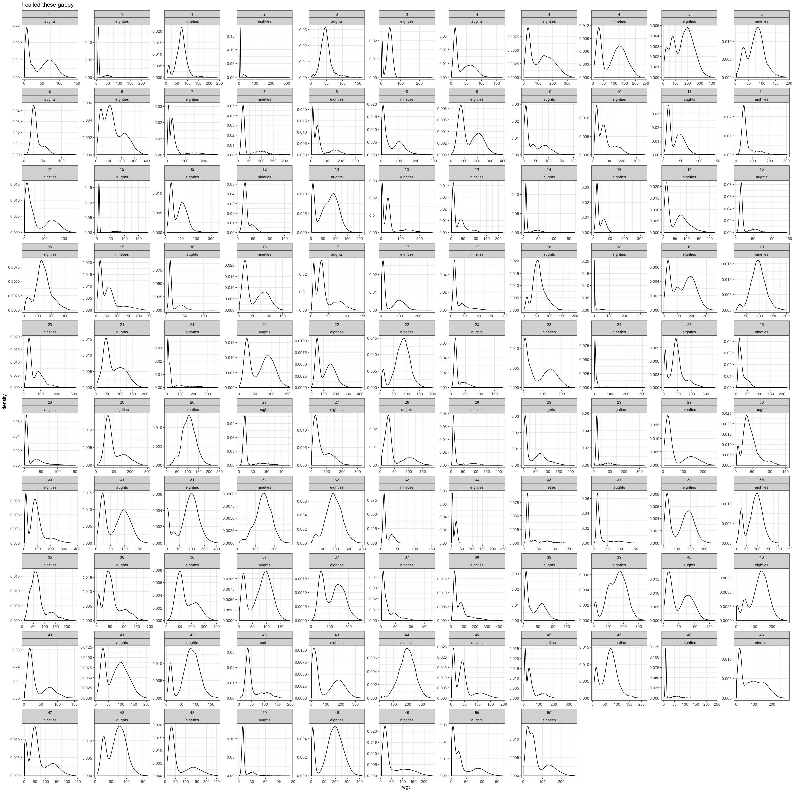
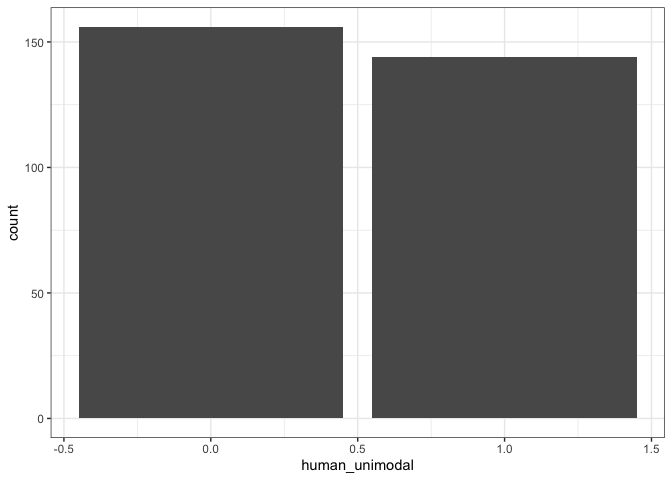
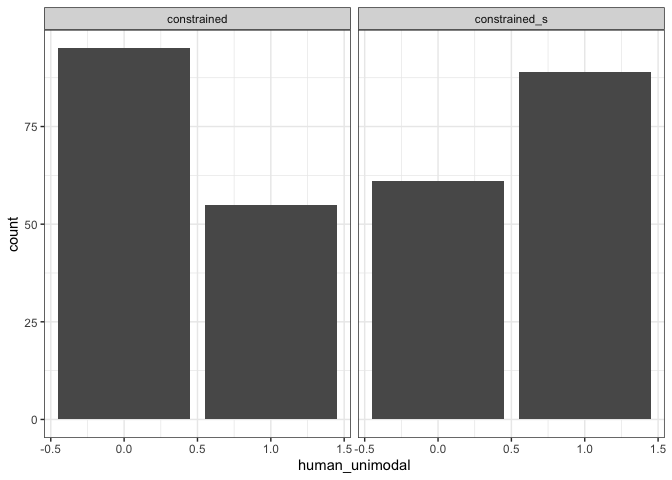

Visualizing human classification outcome
================

Load classified sims
--------------------

``` r
sims <- read.csv(here::here("analysis", "sims_nounif.csv"), stringsAsFactors = F)

scoring <- read.csv(here::here("analysis", "sim_scores_short.csv"), stringsAsFactors = F)

scoring <- scoring %>%
  mutate(computer_unimodal = ifelse(is.na(computer_unimodal), 0, 1))

sims_scored <- left_join(scoring, sims, by = c("sim", "source", "time_chunk"))
```

Sample plots
------------

``` r
sample_uni <- ggplot(data = filter(sims_scored, human_unimodal == 1), aes(x = wgt)) +
  geom_density() +
  theme_bw() +
  facet_wrap(vars(sim, time_chunk), scales = "free") +
  ggtitle("I called these unimodal")
sample_uni
```



``` r
sample_gap <- ggplot(data = filter(sims_scored, gaps >= 1), aes(x = wgt)) +
  geom_density() +
  theme_bw() +
  facet_wrap(vars(sim, time_chunk), scales = "free") + 
  ggtitle("I called these gappy")
sample_gap
```



Overall
-------

``` r
overall_hist <- ggplot(data = scoring, aes(x = human_unimodal)) +
  geom_bar() +
  theme_bw()
overall_hist
```



``` r
facetted_hist <- overall_hist +
  facet_wrap(vars(source))
facetted_hist
```


