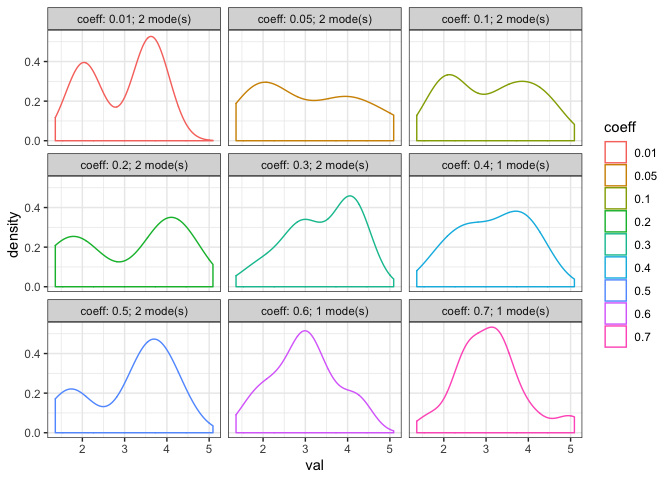
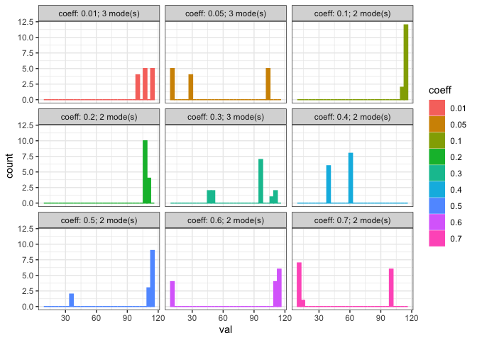

BSD decay?
================

``` r
library(isds)
library(ggplot2)
library(dplyr)
```

    ## 
    ## Attaching package: 'dplyr'

    ## The following objects are masked from 'package:stats':
    ## 
    ##     filter, lag

    ## The following objects are masked from 'package:base':
    ## 
    ##     intersect, setdiff, setequal, union

``` r
library(tidyr)
knitr::opts_chunk$set(echo = TRUE)

toyp <- get_toy_portal_data(years = 1990:2010)

set.seed(1977)

nsims = 100

coeffs <- c(0.01, 0.05, seq(.1, .7, by = .1))
```

    ## Warning: Ignoring unknown parameters: binwidth, bins, pad


    ## Warning: Ignoring unknown parameters: binwidth, bins, pad


``` r
single_bsds <- lapply(coeffs, FUN = function(X)  return(filter(all_bsds, sim == sample.int(n = nsims, size = 1), coeff == X)))

single_bsds <- bind_rows(single_bsds) %>%
  left_join(bsd_modes, by = c("coeff", "sim", "source")) %>%
  mutate(facet_name = paste0("coeff: ", coeff, "; ", nb_modes, " mode(s)"))

single_bsd_density_plots <- ggplot(data = single_bsds, aes(x = val, color = coeff)) +
  geom_density() + 
  facet_wrap(facet_name ~ .) +
  theme_bw()

single_bsd_density_plots
```



``` r
single_bsd_histograms <- ggplot(data = single_bsds, aes(x = val, fill = coeff, color = coeff)) +
  geom_histogram() + 
  facet_wrap(facet_name ~ .) +
  theme_bw()

single_bsd_histograms
```

    ## `stat_bin()` using `bins = 30`. Pick better value with `binwidth`.



``` r
empirical_density_plot <- ggplot(data = filter(all_bsds, source == "empirical"), aes (x = val)) +
  geom_density() +
  ggtitle(paste0("Empirical BSD: ", filter(bsd_modes, source == "empirical")$nb_modes, " mode(s)")) +
  theme_bw()

empirical_count_plot <-  ggplot(data = filter(all_bsds, source == "empirical"), aes (x = val)) +
  geom_histogram() +
  ggtitle(paste0("Empirical BSD: ", filter(bsd_modes, source == "empirical")$nb_modes, " mode(s)")) +
  theme_bw()

gridExtra::grid.arrange(grobs = list(empirical_density_plot, empirical_count_plot), nrow = 1)
```

    ## `stat_bin()` using `bins = 30`. Pick better value with `binwidth`.


