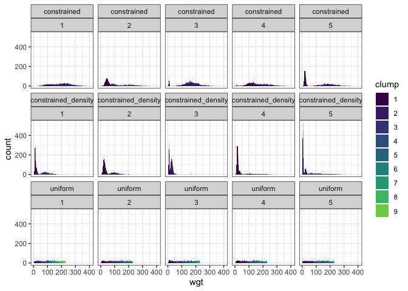

New workflow
================

``` r
portal <- get_toy_portal_data(years = c(1980:1985), download = F)

head(portal)
```

    ##   species wgt
    ## 1      DM  43
    ## 2      DM  38
    ## 3      DM  37
    ## 4      DO  53
    ## 5      DM  42
    ## 6      DS 131

``` r
portal <- get_clumps(portal, max_n_clumps = length(unique(portal[,1]))) %>%
  mutate(source = "empirical")
```

    ## Package 'mclust' version 5.4.5
    ## Type 'citation("mclust")' for citing this R package in publications.

    ## Warning in pastecs::turnpoints(id$p): value out of range in 'gammafn'

    ## Warning in pastecs::turnpoints(id$p): value out of range in 'gammafn'

    ## Warning in pastecs::turnpoints(id$p): value out of range in 'gammafn'

``` r
nsims = 5
```

``` r
uniform_clumps <- replicate(nsims, sim_wrapper(portal, "uniform"), simplify = F)
```

    ## Warning in pastecs::turnpoints(id$p): value out of range in 'gammafn'

    ## Warning in pastecs::turnpoints(id$p): value out of range in 'gammafn'

    ## Warning in pastecs::turnpoints(id$p): value out of range in 'gammafn'

    ## Warning in pastecs::turnpoints(id$p): value out of range in 'gammafn'

    ## Warning in pastecs::turnpoints(id$p): value out of range in 'gammafn'

    ## Warning in pastecs::turnpoints(id$p): value out of range in 'gammafn'

    ## Warning in pastecs::turnpoints(id$p): value out of range in 'gammafn'

    ## Warning in pastecs::turnpoints(id$p): value out of range in 'gammafn'

    ## Warning in pastecs::turnpoints(id$p): value out of range in 'gammafn'

``` r
names(uniform_clumps) <- 1:nsims

c_clumps <- replicate(nsims, sim_wrapper(portal, "constrained"), simplify = F)
```

    ## Warning in data.frame(species = this_row[4], wgt = rnorm(n = this_row[1], :
    ## row names were found from a short variable and have been discarded

    ## Warning in data.frame(species = this_row[4], wgt = rnorm(n = this_row[1], :
    ## row names were found from a short variable and have been discarded

    ## Warning in data.frame(species = this_row[4], wgt = rnorm(n = this_row[1], :
    ## row names were found from a short variable and have been discarded

    ## Warning in data.frame(species = this_row[4], wgt = rnorm(n = this_row[1], :
    ## row names were found from a short variable and have been discarded

    ## Warning in data.frame(species = this_row[4], wgt = rnorm(n = this_row[1], :
    ## row names were found from a short variable and have been discarded

    ## Warning in data.frame(species = this_row[4], wgt = rnorm(n = this_row[1], :
    ## row names were found from a short variable and have been discarded

    ## Warning in data.frame(species = this_row[4], wgt = rnorm(n = this_row[1], :
    ## row names were found from a short variable and have been discarded

    ## Warning in data.frame(species = this_row[4], wgt = rnorm(n = this_row[1], :
    ## row names were found from a short variable and have been discarded

    ## Warning in pastecs::turnpoints(id$p): value out of range in 'gammafn'

    ## Warning in pastecs::turnpoints(id$p): value out of range in 'gammafn'

    ## Warning in data.frame(species = this_row[4], wgt = rnorm(n = this_row[1], :
    ## row names were found from a short variable and have been discarded

    ## Warning in data.frame(species = this_row[4], wgt = rnorm(n = this_row[1], :
    ## row names were found from a short variable and have been discarded

    ## Warning in data.frame(species = this_row[4], wgt = rnorm(n = this_row[1], :
    ## row names were found from a short variable and have been discarded

    ## Warning in data.frame(species = this_row[4], wgt = rnorm(n = this_row[1], :
    ## row names were found from a short variable and have been discarded

    ## Warning in data.frame(species = this_row[4], wgt = rnorm(n = this_row[1], :
    ## row names were found from a short variable and have been discarded

    ## Warning in data.frame(species = this_row[4], wgt = rnorm(n = this_row[1], :
    ## row names were found from a short variable and have been discarded

    ## Warning in data.frame(species = this_row[4], wgt = rnorm(n = this_row[1], :
    ## row names were found from a short variable and have been discarded

    ## Warning in data.frame(species = this_row[4], wgt = rnorm(n = this_row[1], :
    ## row names were found from a short variable and have been discarded

    ## Warning in data.frame(species = this_row[4], wgt = rnorm(n = this_row[1], :
    ## row names were found from a short variable and have been discarded

    ## Warning in pastecs::turnpoints(id$p): value out of range in 'gammafn'

    ## Warning in pastecs::turnpoints(id$p): value out of range in 'gammafn'

    ## Warning in data.frame(species = this_row[4], wgt = rnorm(n = this_row[1], :
    ## row names were found from a short variable and have been discarded

    ## Warning in data.frame(species = this_row[4], wgt = rnorm(n = this_row[1], :
    ## row names were found from a short variable and have been discarded

    ## Warning in data.frame(species = this_row[4], wgt = rnorm(n = this_row[1], :
    ## row names were found from a short variable and have been discarded

    ## Warning in data.frame(species = this_row[4], wgt = rnorm(n = this_row[1], :
    ## row names were found from a short variable and have been discarded

    ## Warning in data.frame(species = this_row[4], wgt = rnorm(n = this_row[1], :
    ## row names were found from a short variable and have been discarded

    ## Warning in data.frame(species = this_row[4], wgt = rnorm(n = this_row[1], :
    ## row names were found from a short variable and have been discarded

    ## Warning in data.frame(species = this_row[4], wgt = rnorm(n = this_row[1], :
    ## row names were found from a short variable and have been discarded

    ## Warning in pastecs::turnpoints(id$p): value out of range in 'gammafn'

    ## Warning in pastecs::turnpoints(id$p): value out of range in 'gammafn'

    ## Warning in pastecs::turnpoints(id$p): value out of range in 'gammafn'

    ## Warning in data.frame(species = this_row[4], wgt = rnorm(n = this_row[1], :
    ## row names were found from a short variable and have been discarded

    ## Warning in data.frame(species = this_row[4], wgt = rnorm(n = this_row[1], :
    ## row names were found from a short variable and have been discarded

    ## Warning in data.frame(species = this_row[4], wgt = rnorm(n = this_row[1], :
    ## row names were found from a short variable and have been discarded

    ## Warning in data.frame(species = this_row[4], wgt = rnorm(n = this_row[1], :
    ## row names were found from a short variable and have been discarded

    ## Warning in data.frame(species = this_row[4], wgt = rnorm(n = this_row[1], :
    ## row names were found from a short variable and have been discarded

    ## Warning in data.frame(species = this_row[4], wgt = rnorm(n = this_row[1], :
    ## row names were found from a short variable and have been discarded

    ## Warning in data.frame(species = this_row[4], wgt = rnorm(n = this_row[1], :
    ## row names were found from a short variable and have been discarded

    ## Warning in data.frame(species = this_row[4], wgt = rnorm(n = this_row[1], :
    ## row names were found from a short variable and have been discarded

    ## Warning in data.frame(species = this_row[4], wgt = rnorm(n = this_row[1], :
    ## row names were found from a short variable and have been discarded

    ## Warning in pastecs::turnpoints(id$p): value out of range in 'gammafn'

    ## Warning in pastecs::turnpoints(id$p): value out of range in 'gammafn'

    ## Warning in pastecs::turnpoints(id$p): value out of range in 'gammafn'

    ## Warning in pastecs::turnpoints(id$p): value out of range in 'gammafn'

    ## Warning in data.frame(species = this_row[4], wgt = rnorm(n = this_row[1], :
    ## row names were found from a short variable and have been discarded

    ## Warning in data.frame(species = this_row[4], wgt = rnorm(n = this_row[1], :
    ## row names were found from a short variable and have been discarded

    ## Warning in data.frame(species = this_row[4], wgt = rnorm(n = this_row[1], :
    ## row names were found from a short variable and have been discarded

    ## Warning in data.frame(species = this_row[4], wgt = rnorm(n = this_row[1], :
    ## row names were found from a short variable and have been discarded

    ## Warning in data.frame(species = this_row[4], wgt = rnorm(n = this_row[1], :
    ## row names were found from a short variable and have been discarded

    ## Warning in data.frame(species = this_row[4], wgt = rnorm(n = this_row[1], :
    ## row names were found from a short variable and have been discarded

    ## Warning in data.frame(species = this_row[4], wgt = rnorm(n = this_row[1], :
    ## row names were found from a short variable and have been discarded

    ## Warning in data.frame(species = this_row[4], wgt = rnorm(n = this_row[1], :
    ## row names were found from a short variable and have been discarded

    ## Warning in data.frame(species = this_row[4], wgt = rnorm(n = this_row[1], :
    ## row names were found from a short variable and have been discarded

    ## Warning in pastecs::turnpoints(id$p): value out of range in 'gammafn'

    ## Warning in pastecs::turnpoints(id$p): value out of range in 'gammafn'

    ## Warning in pastecs::turnpoints(id$p): value out of range in 'gammafn'

    ## Warning in pastecs::turnpoints(id$p): value out of range in 'gammafn'

``` r
names(c_clumps) <- 1:nsims

c_d_clumps <- replicate(nsims, sim_wrapper(portal, "constrained_density"), simplify = F)
```

    ## Warning in data.frame(species = this_row[4], wgt = rnorm(n = this_row[1], :
    ## row names were found from a short variable and have been discarded

    ## Warning in data.frame(species = this_row[4], wgt = rnorm(n = this_row[1], :
    ## row names were found from a short variable and have been discarded

    ## Warning in data.frame(species = this_row[4], wgt = rnorm(n = this_row[1], :
    ## row names were found from a short variable and have been discarded

    ## Warning in data.frame(species = this_row[4], wgt = rnorm(n = this_row[1], :
    ## row names were found from a short variable and have been discarded

    ## Warning in data.frame(species = this_row[4], wgt = rnorm(n = this_row[1], :
    ## row names were found from a short variable and have been discarded

    ## Warning in data.frame(species = this_row[4], wgt = rnorm(n = this_row[1], :
    ## row names were found from a short variable and have been discarded

    ## Warning in data.frame(species = this_row[4], wgt = rnorm(n = this_row[1], :
    ## row names were found from a short variable and have been discarded

    ## Warning in pastecs::turnpoints(id$p): value out of range in 'gammafn'

    ## Warning in data.frame(species = this_row[4], wgt = rnorm(n = this_row[1], :
    ## row names were found from a short variable and have been discarded

    ## Warning in data.frame(species = this_row[4], wgt = rnorm(n = this_row[1], :
    ## row names were found from a short variable and have been discarded

    ## Warning in data.frame(species = this_row[4], wgt = rnorm(n = this_row[1], :
    ## row names were found from a short variable and have been discarded

    ## Warning in data.frame(species = this_row[4], wgt = rnorm(n = this_row[1], :
    ## row names were found from a short variable and have been discarded

    ## Warning in data.frame(species = this_row[4], wgt = rnorm(n = this_row[1], :
    ## row names were found from a short variable and have been discarded

    ## Warning in data.frame(species = this_row[4], wgt = rnorm(n = this_row[1], :
    ## row names were found from a short variable and have been discarded

    ## Warning in data.frame(species = this_row[4], wgt = rnorm(n = this_row[1], :
    ## row names were found from a short variable and have been discarded

    ## Warning in data.frame(species = this_row[4], wgt = rnorm(n = this_row[1], :
    ## row names were found from a short variable and have been discarded

    ## Warning in pastecs::turnpoints(id$p): value out of range in 'gammafn'

    ## Warning in pastecs::turnpoints(id$p): value out of range in 'gammafn'

    ## Warning in pastecs::turnpoints(id$p): value out of range in 'gammafn'

    ## Warning in data.frame(species = this_row[4], wgt = rnorm(n = this_row[1], :
    ## row names were found from a short variable and have been discarded

    ## Warning in data.frame(species = this_row[4], wgt = rnorm(n = this_row[1], :
    ## row names were found from a short variable and have been discarded

    ## Warning in data.frame(species = this_row[4], wgt = rnorm(n = this_row[1], :
    ## row names were found from a short variable and have been discarded

    ## Warning in data.frame(species = this_row[4], wgt = rnorm(n = this_row[1], :
    ## row names were found from a short variable and have been discarded

    ## Warning in data.frame(species = this_row[4], wgt = rnorm(n = this_row[1], :
    ## row names were found from a short variable and have been discarded

    ## Warning in data.frame(species = this_row[4], wgt = rnorm(n = this_row[1], :
    ## row names were found from a short variable and have been discarded

    ## Warning in data.frame(species = this_row[4], wgt = rnorm(n = this_row[1], :
    ## row names were found from a short variable and have been discarded

    ## Warning in data.frame(species = this_row[4], wgt = rnorm(n = this_row[1], :
    ## row names were found from a short variable and have been discarded

    ## Warning in pastecs::turnpoints(id$p): value out of range in 'gammafn'

    ## Warning in pastecs::turnpoints(id$p): value out of range in 'gammafn'

    ## Warning in pastecs::turnpoints(id$p): value out of range in 'gammafn'

    ## Warning in pastecs::turnpoints(id$p): value out of range in 'gammafn'

    ## Warning in pastecs::turnpoints(id$p): value out of range in 'gammafn'

    ## Warning in data.frame(species = this_row[4], wgt = rnorm(n = this_row[1], :
    ## row names were found from a short variable and have been discarded

    ## Warning in data.frame(species = this_row[4], wgt = rnorm(n = this_row[1], :
    ## row names were found from a short variable and have been discarded

    ## Warning in data.frame(species = this_row[4], wgt = rnorm(n = this_row[1], :
    ## row names were found from a short variable and have been discarded

    ## Warning in data.frame(species = this_row[4], wgt = rnorm(n = this_row[1], :
    ## row names were found from a short variable and have been discarded

    ## Warning in data.frame(species = this_row[4], wgt = rnorm(n = this_row[1], :
    ## row names were found from a short variable and have been discarded

    ## Warning in data.frame(species = this_row[4], wgt = rnorm(n = this_row[1], :
    ## row names were found from a short variable and have been discarded

    ## Warning in data.frame(species = this_row[4], wgt = rnorm(n = this_row[1], :
    ## row names were found from a short variable and have been discarded

    ## Warning in data.frame(species = this_row[4], wgt = rnorm(n = this_row[1], :
    ## row names were found from a short variable and have been discarded

    ## Warning in data.frame(species = this_row[4], wgt = rnorm(n = this_row[1], :
    ## row names were found from a short variable and have been discarded

    ## Warning in pastecs::turnpoints(id$p): value out of range in 'gammafn'

    ## Warning in pastecs::turnpoints(id$p): value out of range in 'gammafn'

    ## Warning in pastecs::turnpoints(id$p): value out of range in 'gammafn'

    ## Warning in data.frame(species = this_row[4], wgt = rnorm(n = this_row[1], :
    ## row names were found from a short variable and have been discarded

    ## Warning in data.frame(species = this_row[4], wgt = rnorm(n = this_row[1], :
    ## row names were found from a short variable and have been discarded

    ## Warning in data.frame(species = this_row[4], wgt = rnorm(n = this_row[1], :
    ## row names were found from a short variable and have been discarded

    ## Warning in data.frame(species = this_row[4], wgt = rnorm(n = this_row[1], :
    ## row names were found from a short variable and have been discarded

    ## Warning in data.frame(species = this_row[4], wgt = rnorm(n = this_row[1], :
    ## row names were found from a short variable and have been discarded

    ## Warning in data.frame(species = this_row[4], wgt = rnorm(n = this_row[1], :
    ## row names were found from a short variable and have been discarded

    ## Warning in data.frame(species = this_row[4], wgt = rnorm(n = this_row[1], :
    ## row names were found from a short variable and have been discarded

    ## Warning in data.frame(species = this_row[4], wgt = rnorm(n = this_row[1], :
    ## row names were found from a short variable and have been discarded

    ## Warning in data.frame(species = this_row[4], wgt = rnorm(n = this_row[1], :
    ## row names were found from a short variable and have been discarded

    ## Warning in pastecs::turnpoints(id$p): value out of range in 'gammafn'

    ## Warning in pastecs::turnpoints(id$p): value out of range in 'gammafn'

    ## Warning in pastecs::turnpoints(id$p): value out of range in 'gammafn'

``` r
names(c_d_clumps) <- 1:nsims
```

``` r
all_sim_clumps <- bind_rows(
  list(uniform = bind_rows(uniform_clumps, .id = "sim"), 
  constrained = bind_rows(c_clumps, .id = "sim"), 
  constrained_density = bind_rows(c_d_clumps, .id = "sim")), .id = "source")
```

    ## Warning in bind_rows_(x, .id): Unequal factor levels: coercing to character

    ## Warning in bind_rows_(x, .id): binding character and factor vector,
    ## coercing into character vector

    ## Warning in bind_rows_(x, .id): binding character and factor vector,
    ## coercing into character vector

    ## Warning in bind_rows_(x, .id): binding character and factor vector,
    ## coercing into character vector

    ## Warning in bind_rows_(x, .id): binding character and factor vector,
    ## coercing into character vector

    ## Warning in bind_rows_(x, .id): binding character and factor vector,
    ## coercing into character vector

    ## Warning in bind_rows_(x, .id): Unequal factor levels: coercing to character

    ## Warning in bind_rows_(x, .id): binding character and factor vector,
    ## coercing into character vector

    ## Warning in bind_rows_(x, .id): binding character and factor vector,
    ## coercing into character vector

    ## Warning in bind_rows_(x, .id): Unequal factor levels: coercing to character

    ## Warning in bind_rows_(x, .id): binding character and factor vector,
    ## coercing into character vector

    ## Warning in bind_rows_(x, .id): binding character and factor vector,
    ## coercing into character vector

    ## Warning in bind_rows_(x, .id): binding character and factor vector,
    ## coercing into character vector

    ## Warning in bind_rows_(x, .id): binding character and factor vector,
    ## coercing into character vector

    ## Warning in bind_rows_(x, .id): binding character and factor vector,
    ## coercing into character vector

``` r
empirical_plot <- ggplot(data = portal, aes(x = wgt, fill = clump, group = clump)) +
   geom_density() +
  scale_fill_viridis_d(end = .8) +
  theme_bw()

clump_plot <- ggplot(data = all_sim_clumps, aes(x = wgt, fill = clump, group = clump)) +
  geom_density() +
  facet_wrap(vars(source, sim), nrow = 3) +
  scale_fill_viridis_d(end = .8) +
  theme_bw()

empirical_plot
```


``` r
clump_plot
```


