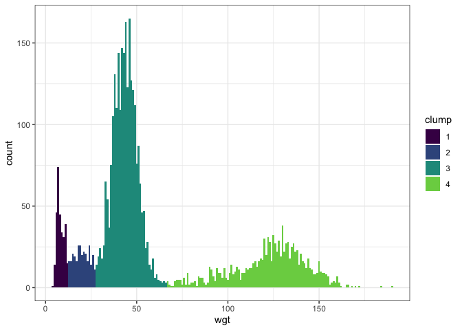

New workflow
================

    ##   species wgt
    ## 1      DM  43
    ## 2      DM  38
    ## 3      DM  37
    ## 4      DO  53
    ## 5      DM  42
    ## 6      DS 131

    ## Package 'mclust' version 5.4.5
    ## Type 'citation("mclust")' for citing this R package in publications.

 

    ## Warning: Removed 6 rows containing missing values (geom_bar).

    ## `stat_bin()` using `bins = 30`. Pick better value with `binwidth`.

