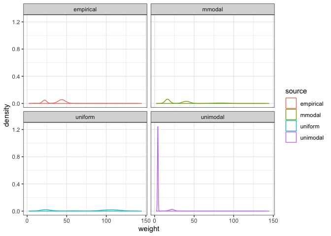
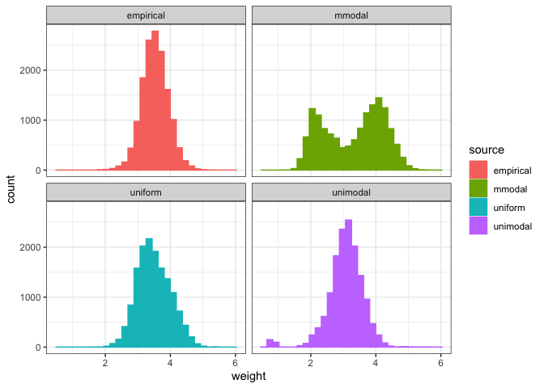

Single ISD sims
================

``` r
library(isds)
library(ggplot2)
library(dplyr)
```

    ## 
    ## Attaching package: 'dplyr'

    ## The following objects are masked from 'package:stats':
    ## 
    ##     filter, lag

    ## The following objects are masked from 'package:base':
    ## 
    ##     intersect, setdiff, setequal, union

``` r
library(tidyr)
knitr::opts_chunk$set(echo = TRUE)

toyp <- get_toy_portal_data(years = 1990:2010)
```

    ## Loading in data version 1.90.0

``` r
intraspp_sd_coeff <- .1
```

Get underlying BSDs...

``` r
ebsd <- toyp %>%
  group_by(species) %>%
  summarize(meanwgt = mean(wgt)) %>%
  ungroup() %>%
  mutate(logwgt = log(meanwgt))

set.seed(1977)

nsims = 1

uniform_log_bsd <- replicate(n = nsims, expr = draw_uniform_bsd(s = nrow(ebsd), min =  min(ebsd$logwgt), max =max(ebsd$logwgt)))

uniform_log_bsd <- as.data.frame(uniform_log_bsd) %>%
  tidyr::gather(key = "sim", value = "val") %>%
  dplyr::mutate(sim = as.integer(substr(sim, start = 2, stop = nchar(sim))),
                source = "uniform")

unimodal_log_bsd <- replicate(n = nsims, expr = draw_unimodal_bsd(ebsd$logwgt))
unimodal_log_bsd <- as.data.frame(unimodal_log_bsd) %>%
  tidyr::gather(key = "sim", value = "val") %>%
  dplyr::mutate(sim = as.integer(substr(sim, start = 2, stop = nchar(sim))),
                source = "unimodal")

mmodal_log_bsd_full <- replicate(n = nsims, expr = draw_multimodal_bsd(emp_vector = ebsd$logwgt, min_mode_gap = .5, min_sd_coeff = .2, max_sd_coeff = .2), simplify = F)

mmodal_log_bsd <- lapply(mmodal_log_bsd_full, FUN = function(X) return(X$bsd))
mmodal_log_bsd <- dplyr::bind_cols(mmodal_log_bsd) %>%
   tidyr::gather(key = "sim", value = "val") %>%
  dplyr::mutate(sim = as.integer(substr(sim, start = 2, stop = nchar(sim))),
                source = "mmodal")

empirical_log_bsd <- ebsd %>%
  select(logwgt) %>%
  mutate(sim = -99, source = "empirical") %>%
  rename(val = logwgt)

all_bsds <- bind_rows(empirical_log_bsd, mmodal_log_bsd, uniform_log_bsd, unimodal_log_bsd)

community_pars <- get_community_pars(toyp, dat_name = "portal")
```

Set up for drawing ISDs: - add SADs - add sd coefficients

``` r
all_bsds <- all_bsds %>%
  group_by(source, sim) %>%
  mutate(abundance = sample(draw_sad(community_pars = community_pars),
                            size = community_pars$S, replace = F),
         sd = intraspp_sd_coeff * val) %>%
  ungroup()
```

``` r
get_individual_isds <- function(bsd_df) {
  each_species <- vector(length = nrow(bsd_df), mode = "list")
  
  for(i in 1:length(each_species)) {
    each_species[[i]] <- data.frame(
      species = rep(i, times = bsd_df$abundance[i]),
      weight = rnorm(n = bsd_df$abundance[i], mean = bsd_df$val[i], sd = bsd_df$sd[i])
    )
  }
  
  all_species <- bind_rows(each_species)
  
  return(all_species)
}

all_isds <- lapply(unique(all_bsds$source),
                          FUN = function(X) return(get_individual_isds(filter(all_bsds, source == X))))

names(all_isds) <- unique(all_bsds$source)

all_isds <- bind_rows(all_isds, .id = "source")
```

``` r
single_isd_density_plots <- ggplot(data = all_isds, aes(x = weight, color = source)) +
  geom_density() + 
  facet_wrap(source ~ .) +
  theme_bw()

single_isd_density_plots
```



``` r
single_isd_histograms <- ggplot(data = all_isds, aes(x = weight, fill = source, color = source)) +
  geom_histogram() + 
  facet_wrap(source ~ .) +
  theme_bw()

single_isd_histograms
```

    ## `stat_bin()` using `bins = 30`. Pick better value with `binwidth`.


