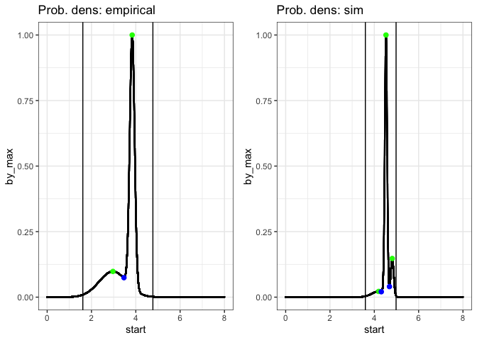
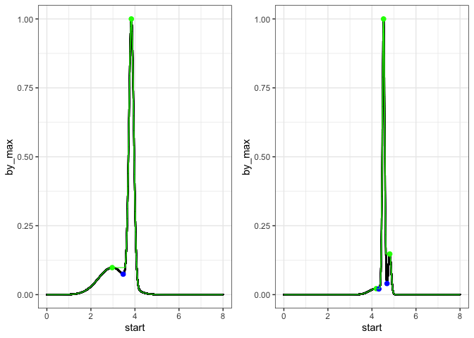

Exploring analysis of rank P plots
================

``` r
library(drake)
library(isds)
library(ggplot2)
library(dplyr)
```

    ## 
    ## Attaching package: 'dplyr'

    ## The following objects are masked from 'package:stats':
    ## 
    ##     filter, lag

    ## The following objects are masked from 'package:base':
    ## 
    ##     intersect, setdiff, setequal, union

``` r
knitr::opts_chunk$set(echo = TRUE)

## Set up the cache and config
db <- DBI::dbConnect(RSQLite::SQLite(), here::here("drake", "drake-cache.sqlite"))
cache <- storr::storr_dbi("datatable", "keystable", db)
```

Get a sim.

``` r
loadd(ids_dat1, cache = cache)

empirical <- ids_dat1[[1]]
sim <- ids_dat1[[2]]

loadd(sims_dat1, cache = cache)
empirical_dat <- sims_dat1[[1]]
sim_dat <- sims_dat1[[2]]
rm(sims_dat1)
rm(ids_dat1)
```

``` r
e <- plot_integrated_density(empirical$integrated_density, plot_title = "empirical") +
  geom_vline(xintercept = c(log(min(empirical_dat$community$wgt)), log(max(empirical_dat$community$wgt))))
s <- plot_integrated_density(sim$integrated_density, plot_title = "sim")+
  geom_vline(xintercept = c(log(min(sim_dat$community$wgt)), log(max(sim_dat$community$wgt))))
gridExtra::grid.arrange(grobs = list(e, s), nrow = 1)
```



Truncate to min and max body size? Plus a buffer of log units?

``` r
truncate_id <- function(id_list, dat) {
  id_list$integrated_density <- id_list$integrated_density %>%
  dplyr::filter(dplyr::between(start, log(min(dat$community$wgt)) - .1,
                             log(max(dat$community$wgt)) + .1))
  return(id_list)
}


sim_t <- truncate_id(sim, sim_dat)
empirical_t <- truncate_id(empirical, empirical_dat)

e_t <- plot_integrated_density(empirical_t$integrated_density, plot_title = "empirical truncated") +
  geom_vline(xintercept = c(log(min(empirical_dat$community$wgt)), log(max(empirical_dat$community$wgt))))
s_t <- plot_integrated_density(sim_t$integrated_density, plot_title = "sim truncated")+
  geom_vline(xintercept = c(log(min(sim_dat$community$wgt)), log(max(sim_dat$community$wgt))))
gridExtra::grid.arrange(grobs = list(e_t, s_t), nrow = 1)
```


Try fitting inverse parabolas?

Try smoothing the integrated density so it is unimodal with two minima (one at each end); exactly one turnpoint.

``` r
erode <- function(integrated_density_list) {
  this_intd <- integrated_density_list$integrated_density
maxima <- this_intd%>%
  filter(start_is_peak)

this_intd$by_max_eroded <- this_intd$by_max

for(i in 1:(nrow(maxima) - 1)) {
  # rise <- maxima$by_max[i+1] - maxima$by_max[i]
  begin <- maxima$start[i]
  end <- maxima$start[i + 1]
  # run <- end - begin
  # slope <- rise / run
  # this_intd <-this_intd %>%
  #   mutate(by_max_eroded = ifelse(between(start, begin, end),
  #                          maxima$by_max[i] + (slope * (start - begin)), 
  #                          by_max)) %>%
  #   mutate(by_max_eroded = ifelse(by_max > by_max_eroded,
  #                                 by_max,
  #                                 by_max_eroded))
  
  lower_peak <- min(maxima$by_max[i], maxima$by_max[i + 1])
  
  a <- which(between(this_intd$start, begin, end))
  b <- which(this_intd$by_max_eroded < lower_peak)
  
  this_intd$by_max_eroded [ a[which(a %in% b)]] <- lower_peak
}

integrated_density_list$integrated_density <- this_intd
return(integrated_density_list)
}

empirical_t_eroded <- empirical_t

empirical_eroded <- erode(empirical)
sim_eroded <- erode(sim)

eroded_e_plot <- plot_integrated_density(empirical$integrated_density) +
  geom_line(data = empirical_eroded$integrated_density,
            aes(x = start, y = by_max_eroded), color= 'green')
eroded_s_plot <- plot_integrated_density(sim$integrated_density) +
  geom_line(data = sim_eroded$integrated_density,
            aes(x = start, y = by_max_eroded), color = 'green')

gridExtra::grid.arrange(grobs = list(eroded_e_plot,
                                     eroded_s_plot), nrow = 1)
```



``` r
get_eroded_diff <- function(eroded_list) {
  return(sum(eroded_list$integrated_density$by_max_eroded - 
               eroded_list$integrated_density$by_max))
}

get_eroded_width <- function(eroded_list) {
  return(sum(eroded_list$integrated_density$by_max_eroded !=
               eroded_list$integrated_density$by_max))
}

sim_diff <- get_eroded_diff(sim_eroded)
sim_width <- get_eroded_width(sim_eroded)

sim_diff
```

    ## [1] 106.3842

``` r
sim_diff/sim_width
```

    ## [1] 0.03302832

``` r
e_diff <- get_eroded_diff(empirical_eroded)
e_width <- get_eroded_width(empirical_eroded)

e_diff
```

    ## [1] 61.87787

``` r
e_diff /e_width
```

    ## [1] 0.01051808

``` r
sim_d <- sim_eroded$integrated_density$by_max_eroded - 
  sim_eroded$integrated_density$by_max

sim_d[ which(sim_eroded$integrated_density$start_is_pit)]
```

    ## [1] 0.001167257 0.107205618

``` r
sim_d <- sim_d[ which(sim_d > 0)]

emp_d <- empirical_eroded$integrated_density$by_max_eroded -
  empirical_eroded$integrated_density$by_max

emp_d[ which(empirical_eroded$integrated_density$start_is_pit)]
```

    ## [1] 0.02376185

``` r
emp_d <- emp_d[ which(emp_d > 0)]

mean(sim_d)
```

    ## [1] 0.03302832

``` r
sd(sim_d)
```

    ## [1] 0.04028002

``` r
mean(emp_d)
```

    ## [1] 0.01051808

``` r
sd(emp_d)
```

    ## [1] 0.008188289

try depth?
