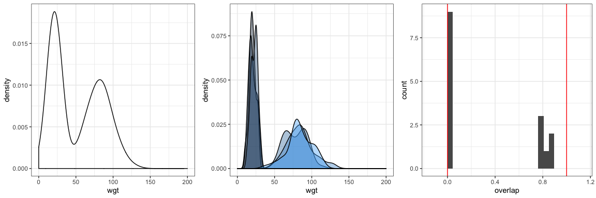
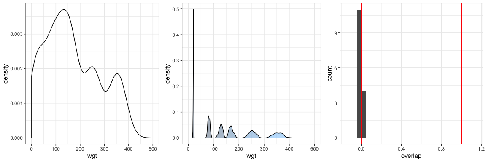
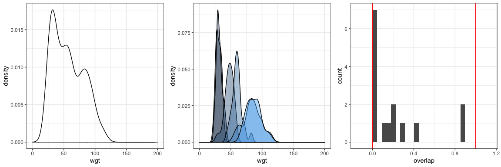
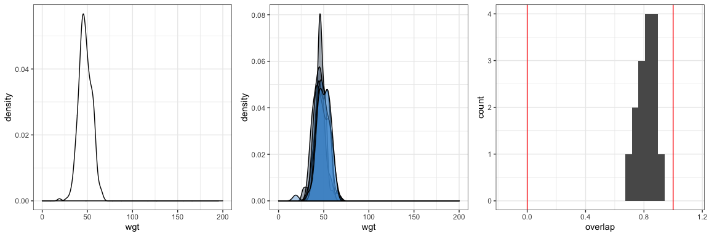
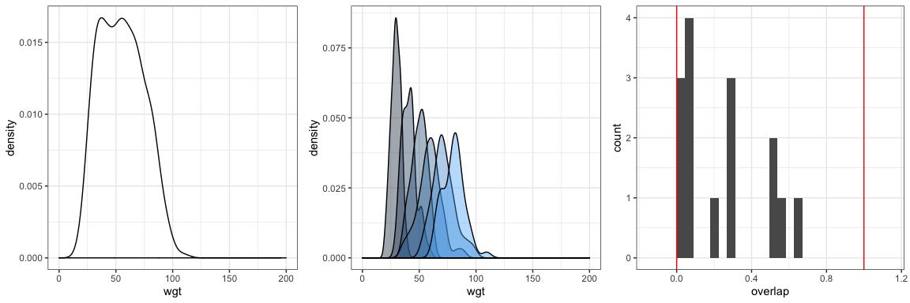

Toy overlap
================

Scenarios:
----------

### Six species, two overlapped groups

``` r
set.seed(2)
means_62 <- c(20, 21, 22, 80, 81, 82) 
sds_62 <- .2 * means_62
an_sad <- c(50, 50, 50, 50, 50, 50)

an_sad[ which(an_sad == 1)] <- 2

six_two <- sample_community(means_62, sds_62, an_sad)


six_two_plot_all <- ggplot(data = six_two, aes(x = wgt)) +
  geom_density() +
  theme_bw() +
  xlim(0, 200)

six_two_plot_all
```


``` r
six_two_plot <- ggplot(data = six_two, aes(x = wgt, fill = species, group = species)) +
  geom_density(alpha =  .4) +  theme_bw() +
   theme(legend.position = "none") +
  xlim(0, 200)

six_two_plot
```


``` r
six_two_overlap <- get_overlap(six_two)

six_two_o <- ggplot(data = six_two_overlap, aes(x = overlap)) +
  geom_histogram(boundary = 0) + geom_vline(xintercept = c(0, 1), color = "red") + xlim(-.15, 1.15) +
  theme_bw()

six_two_o
```

    ## `stat_bin()` using `bins = 30`. Pick better value with `binwidth`.

    ## Warning: Removed 2 rows containing missing values (geom_bar).


``` r
summ_plots$six_two <- list(six_two_plot_all, six_two_plot, six_two_o)
overlaps$six_two <- six_two_overlap
```

### Six nonoverlapping species

``` r
means_66 <- c(20,80, 130, 170, 250, 350) 
sds_66 <- .05 * means_66
six_six <- sample_community(means_66, sds_66, an_sad)


six_six_plot_all <- ggplot(data = six_six, aes(x = wgt)) +
  geom_density() +
  theme_bw() +
  xlim(0, 500)

six_six_plot_all
```


``` r
six_six_plot <- ggplot(data = six_six, aes(x = wgt, fill = species, group = species)) +
  geom_density(alpha =  .4) +  theme_bw() +
   theme(legend.position = "none") +
  xlim(0, 500)

six_six_plot
```


``` r
six_six_overlap <- get_overlap(six_six)

six_six_o <- ggplot(data = six_six_overlap, aes(x = overlap)) +
  geom_histogram(boundary = 0) + geom_vline(xintercept = c(0, 1), color = "red") + xlim(-.15, 1.15) +
  theme_bw()

six_six_o
```

    ## `stat_bin()` using `bins = 30`. Pick better value with `binwidth`.

    ## Warning: Removed 2 rows containing missing values (geom_bar).


``` r
summ_plots$six_six <- list(six_six_plot_all, six_six_plot, six_six_o)

overlaps$six_six <- six_six_overlap
```

### Two groups of two overlapping with two that span the overlap

``` r
means_222 <- c(31, 32, 45, 60, 85, 86)
sds_222 <- .15 * means_222

two_two_two <- sample_community(means_222, sds_222, an_sad)

two_two_two_plot_all <- ggplot(data = two_two_two, aes(x = wgt)) +
  geom_density() +
  theme_bw() +
  xlim(0, 200)

two_two_two_plot_all
```


``` r
two_two_two_plot <- ggplot(data = two_two_two, aes(x = wgt, fill = species, group = species)) +
  geom_density(alpha =  .4) + theme_bw() +
   theme(legend.position = "none") +
  xlim(0, 200)

two_two_two_plot
```


``` r
two_two_two_overlap <- get_overlap(two_two_two)

two_two_two_o <- ggplot(data = two_two_two_overlap, aes(x = overlap)) +
  geom_histogram(boundary = 0) + geom_vline(xintercept = c(0, 1), color = "red") + xlim(-.15, 1.15) +
  theme_bw()

two_two_two_o
```

    ## `stat_bin()` using `bins = 30`. Pick better value with `binwidth`.

    ## Warning: Removed 2 rows containing missing values (geom_bar).


``` r
summ_plots$two_two_two <- list(two_two_two_plot_all, two_two_two_plot, two_two_two_o)
overlaps$two_two_two <- two_two_two_overlap
```

### Six species, one group

``` r
means_61 <- c(45, 46, 47, 48, 49, 50)
sds_61 <- .15 * means_61

six_one <- sample_community(means_61, sds_61, an_sad)

six_one_plot_all <- ggplot(data = six_one, aes(x = wgt)) +
  geom_density() +
  theme_bw() +
  xlim(0, 200)

six_one_plot_all
```


``` r
six_one_plot <- ggplot(data = six_one, aes(x = wgt, fill = species, group = species)) +
  geom_density(alpha =  .4) + theme_bw() +
   theme(legend.position = "none") +
  xlim(0, 200)

six_one_plot
```


``` r
six_one_overlap <- get_overlap(six_one)

six_one_o <- ggplot(data = six_one_overlap, aes(x = overlap)) +
  geom_histogram(boundary = 0) + geom_vline(xintercept = c(0, 1), color = "red") + xlim(-.15, 1.15) +
  theme_bw()

six_one_o
```

    ## `stat_bin()` using `bins = 30`. Pick better value with `binwidth`.

    ## Warning: Removed 2 rows containing missing values (geom_bar).


``` r
summ_plots$six_one <- list(six_one_plot_all, six_one_plot, six_one_o)
overlaps$six_one <- six_one_overlap
```

### Six overlapping

``` r
means_6 <- c(30, 40, 50, 60, 70, 80)
sds_6 <- .15 * means_6

six_ov <- sample_community(means_6, sds_6, an_sad)

six_ov_plot_all <- ggplot(data = six_ov, aes(x = wgt)) +
  geom_density() +
  theme_bw() +
  xlim(0, 200)

six_ov_plot_all
```


``` r
six_ov_plot <- ggplot(data = six_ov, aes(x = wgt, fill = species, group = species)) +
  geom_density(alpha =  .4) +
  theme_bw() +
   theme(legend.position = "none") +
  xlim(0, 200)

six_ov_plot
```


``` r
six_ov_overlap <- get_overlap(six_ov)

six_ov_o <- ggplot(data = six_ov_overlap, aes(x = overlap)) +
  geom_histogram(boundary = 0) + geom_vline(xintercept = c(0, 1), color = "red") + xlim(-.15, 1.15) +
  theme_bw()

six_ov_o
```

    ## `stat_bin()` using `bins = 30`. Pick better value with `binwidth`.

    ## Warning: Removed 2 rows containing missing values (geom_bar).


``` r
summ_plots$six_ov <- list(six_ov_plot_all, six_ov_plot, six_ov_o)
overlaps$six_ov <- six_ov_overlap
```

``` r
for(i in 1:length(summ_plots)) {
  gridExtra::grid.arrange(grobs = summ_plots[[i]], nrow = 1)
}
```

    ## `stat_bin()` using `bins = 30`. Pick better value with `binwidth`.

    ## Warning: Removed 2 rows containing missing values (geom_bar).



    ## `stat_bin()` using `bins = 30`. Pick better value with `binwidth`.

    ## Warning: Removed 2 rows containing missing values (geom_bar).



    ## `stat_bin()` using `bins = 30`. Pick better value with `binwidth`.

    ## Warning: Removed 2 rows containing missing values (geom_bar).



    ## `stat_bin()` using `bins = 30`. Pick better value with `binwidth`.

    ## Warning: Removed 2 rows containing missing values (geom_bar).



    ## `stat_bin()` using `bins = 30`. Pick better value with `binwidth`.

    ## Warning: Removed 2 rows containing missing values (geom_bar).



``` r
overlaps <- bind_rows(overlaps, .id = "source")

overlaps <- overlaps %>%
  mutate(abs_overlap = abs(overlap - .5))

overlap_hists <- ggplot(data = overlaps, aes(x = overlap)) +
  geom_histogram() +
  facet_wrap(vars(source), scales = "free_y") +
  theme_bw()
overlap_hists
```

    ## `stat_bin()` using `bins = 30`. Pick better value with `binwidth`.


``` r
overlaps <- group_by(overlaps, source) %>%
  mutate(med_overlap = median(abs_overlap),
         quarter_overlap = quantile(abs_overlap, probs = .25)) %>%
  ungroup()

overlap_hists1 <- ggplot(data = overlaps, aes(x = abs_overlap)) +
  geom_histogram()  + 
  geom_point(aes(x =quarter_overlap, y = 5), color = "pink") +
  facet_wrap(vars(source), scales = "free_y") +
  theme_bw()
overlap_hists1
```

    ## `stat_bin()` using `bins = 30`. Pick better value with `binwidth`.


