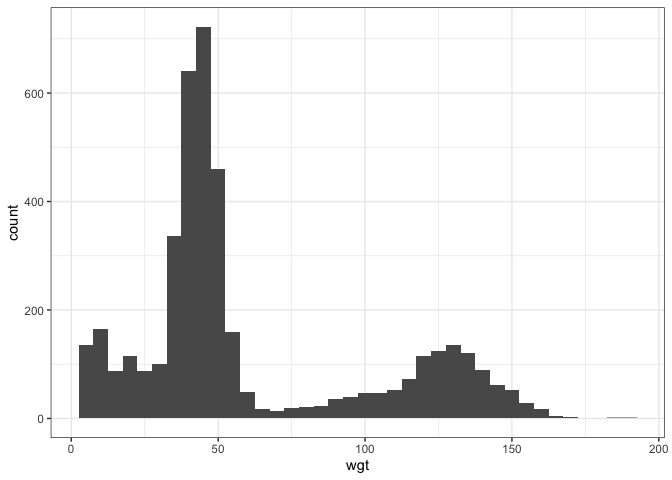
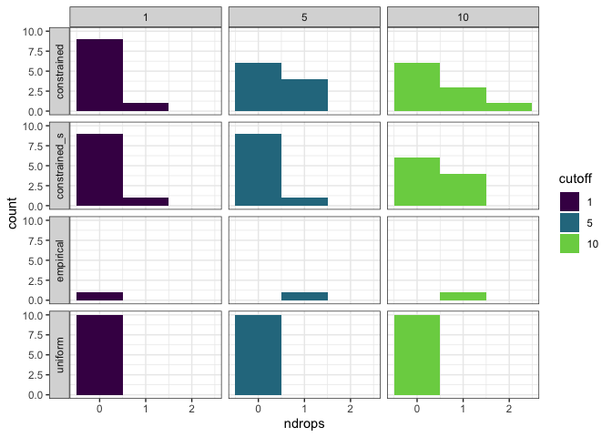
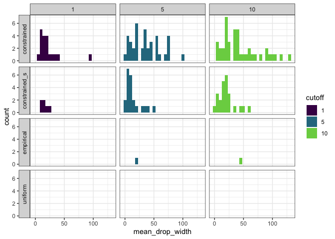

ID gaps
================

``` r
library(isds)
library(ggplot2)
library(dplyr)
```

    ## 
    ## Attaching package: 'dplyr'

    ## The following objects are masked from 'package:stats':
    ## 
    ##     filter, lag

    ## The following objects are masked from 'package:base':
    ## 
    ##     intersect, setdiff, setequal, union

``` r
source(here::here("analysis", "fxns2.r"))

portal_isd <- get_toy_portal_data(years = c(1980:1985), chosen_treatment = "control")
head(portal_isd)
```

    ##   species wgt
    ## 1       1  43
    ## 2       1  38
    ## 3       1  37
    ## 4       2  53
    ## 5       1  42
    ## 6       3 131

``` r
raw_isd_plot <- ggplot(data = portal_isd, aes(x = wgt)) +
  geom_histogram(binwidth = 5) +
  theme_bw()

raw_isd_plot
```



``` r
portal_gmm <- fit_gmm(portal_isd)

portal_id <- integrate_gmm(portal_gmm)

portal_drops <- drops_wrapper(portal_isd, cutoffs = c(1, 5, 10)) %>%
  mutate(source = "empirical", sim = NA)

nsamples = 100

set.seed(1)
uniform_isds <- replicate(nsamples, expr = sample_uniform_isd(portal_isd), simplify = F)
constrained_isds <- replicate(nsamples, expr = sample_constrained_isd(portal_isd, size_relationship = "none"), simplify = F)
```

    ## Warning in data.frame(species = this_row[4], wgt = rnorm(n = this_row[1], :
    ## row names were found from a short variable and have been discarded

    ## Warning in data.frame(species = this_row[4], wgt = rnorm(n = this_row[1], :
    ## row names were found from a short variable and have been discarded

    ## Warning in data.frame(species = this_row[4], wgt = rnorm(n = this_row[1], :
    ## row names were found from a short variable and have been discarded

    ## Warning in data.frame(species = this_row[4], wgt = rnorm(n = this_row[1], :
    ## row names were found from a short variable and have been discarded

    ## Warning in data.frame(species = this_row[4], wgt = rnorm(n = this_row[1], :
    ## row names were found from a short variable and have been discarded

    ## Warning in data.frame(species = this_row[4], wgt = rnorm(n = this_row[1], :
    ## row names were found from a short variable and have been discarded

    ## Warning in data.frame(species = this_row[4], wgt = rnorm(n = this_row[1], :
    ## row names were found from a short variable and have been discarded

    ## Warning in data.frame(species = this_row[4], wgt = rnorm(n = this_row[1], :
    ## row names were found from a short variable and have been discarded

    ## Warning in data.frame(species = this_row[4], wgt = rnorm(n = this_row[1], :
    ## row names were found from a short variable and have been discarded

    ## Warning in data.frame(species = this_row[4], wgt = rnorm(n = this_row[1], :
    ## row names were found from a short variable and have been discarded

    ## Warning in data.frame(species = this_row[4], wgt = rnorm(n = this_row[1], :
    ## row names were found from a short variable and have been discarded

    ## Warning in data.frame(species = this_row[4], wgt = rnorm(n = this_row[1], :
    ## row names were found from a short variable and have been discarded

    ## Warning in data.frame(species = this_row[4], wgt = rnorm(n = this_row[1], :
    ## row names were found from a short variable and have been discarded

    ## Warning in data.frame(species = this_row[4], wgt = rnorm(n = this_row[1], :
    ## row names were found from a short variable and have been discarded

    ## Warning in data.frame(species = this_row[4], wgt = rnorm(n = this_row[1], :
    ## row names were found from a short variable and have been discarded

    ## Warning in data.frame(species = this_row[4], wgt = rnorm(n = this_row[1], :
    ## row names were found from a short variable and have been discarded

    ## Warning in data.frame(species = this_row[4], wgt = rnorm(n = this_row[1], :
    ## row names were found from a short variable and have been discarded

    ## Warning in data.frame(species = this_row[4], wgt = rnorm(n = this_row[1], :
    ## row names were found from a short variable and have been discarded

    ## Warning in data.frame(species = this_row[4], wgt = rnorm(n = this_row[1], :
    ## row names were found from a short variable and have been discarded

    ## Warning in data.frame(species = this_row[4], wgt = rnorm(n = this_row[1], :
    ## row names were found from a short variable and have been discarded

    ## Warning in data.frame(species = this_row[4], wgt = rnorm(n = this_row[1], :
    ## row names were found from a short variable and have been discarded

    ## Warning in data.frame(species = this_row[4], wgt = rnorm(n = this_row[1], :
    ## row names were found from a short variable and have been discarded

    ## Warning in data.frame(species = this_row[4], wgt = rnorm(n = this_row[1], :
    ## row names were found from a short variable and have been discarded

    ## Warning in data.frame(species = this_row[4], wgt = rnorm(n = this_row[1], :
    ## row names were found from a short variable and have been discarded

    ## Warning in data.frame(species = this_row[4], wgt = rnorm(n = this_row[1], :
    ## row names were found from a short variable and have been discarded

    ## Warning in data.frame(species = this_row[4], wgt = rnorm(n = this_row[1], :
    ## row names were found from a short variable and have been discarded

    ## Warning in data.frame(species = this_row[4], wgt = rnorm(n = this_row[1], :
    ## row names were found from a short variable and have been discarded

    ## Warning in data.frame(species = this_row[4], wgt = rnorm(n = this_row[1], :
    ## row names were found from a short variable and have been discarded

    ## Warning in data.frame(species = this_row[4], wgt = rnorm(n = this_row[1], :
    ## row names were found from a short variable and have been discarded

    ## Warning in data.frame(species = this_row[4], wgt = rnorm(n = this_row[1], :
    ## row names were found from a short variable and have been discarded

    ## Warning in data.frame(species = this_row[4], wgt = rnorm(n = this_row[1], :
    ## row names were found from a short variable and have been discarded

    ## Warning in data.frame(species = this_row[4], wgt = rnorm(n = this_row[1], :
    ## row names were found from a short variable and have been discarded

    ## Warning in data.frame(species = this_row[4], wgt = rnorm(n = this_row[1], :
    ## row names were found from a short variable and have been discarded

    ## Warning in data.frame(species = this_row[4], wgt = rnorm(n = this_row[1], :
    ## row names were found from a short variable and have been discarded

    ## Warning in data.frame(species = this_row[4], wgt = rnorm(n = this_row[1], :
    ## row names were found from a short variable and have been discarded

    ## Warning in data.frame(species = this_row[4], wgt = rnorm(n = this_row[1], :
    ## row names were found from a short variable and have been discarded

    ## Warning in data.frame(species = this_row[4], wgt = rnorm(n = this_row[1], :
    ## row names were found from a short variable and have been discarded

    ## Warning in data.frame(species = this_row[4], wgt = rnorm(n = this_row[1], :
    ## row names were found from a short variable and have been discarded

    ## Warning in data.frame(species = this_row[4], wgt = rnorm(n = this_row[1], :
    ## row names were found from a short variable and have been discarded

    ## Warning in data.frame(species = this_row[4], wgt = rnorm(n = this_row[1], :
    ## row names were found from a short variable and have been discarded

    ## Warning in data.frame(species = this_row[4], wgt = rnorm(n = this_row[1], :
    ## row names were found from a short variable and have been discarded

    ## Warning in data.frame(species = this_row[4], wgt = rnorm(n = this_row[1], :
    ## row names were found from a short variable and have been discarded

    ## Warning in data.frame(species = this_row[4], wgt = rnorm(n = this_row[1], :
    ## row names were found from a short variable and have been discarded

    ## Warning in data.frame(species = this_row[4], wgt = rnorm(n = this_row[1], :
    ## row names were found from a short variable and have been discarded

    ## Warning in data.frame(species = this_row[4], wgt = rnorm(n = this_row[1], :
    ## row names were found from a short variable and have been discarded

    ## Warning in data.frame(species = this_row[4], wgt = rnorm(n = this_row[1], :
    ## row names were found from a short variable and have been discarded

    ## Warning in data.frame(species = this_row[4], wgt = rnorm(n = this_row[1], :
    ## row names were found from a short variable and have been discarded

    ## Warning in data.frame(species = this_row[4], wgt = rnorm(n = this_row[1], :
    ## row names were found from a short variable and have been discarded

    ## Warning in data.frame(species = this_row[4], wgt = rnorm(n = this_row[1], :
    ## row names were found from a short variable and have been discarded

    ## Warning in data.frame(species = this_row[4], wgt = rnorm(n = this_row[1], :
    ## row names were found from a short variable and have been discarded

    ## Warning in data.frame(species = this_row[4], wgt = rnorm(n = this_row[1], :
    ## row names were found from a short variable and have been discarded

    ## Warning in data.frame(species = this_row[4], wgt = rnorm(n = this_row[1], :
    ## row names were found from a short variable and have been discarded

    ## Warning in data.frame(species = this_row[4], wgt = rnorm(n = this_row[1], :
    ## row names were found from a short variable and have been discarded

    ## Warning in data.frame(species = this_row[4], wgt = rnorm(n = this_row[1], :
    ## row names were found from a short variable and have been discarded

    ## Warning in data.frame(species = this_row[4], wgt = rnorm(n = this_row[1], :
    ## row names were found from a short variable and have been discarded

    ## Warning in data.frame(species = this_row[4], wgt = rnorm(n = this_row[1], :
    ## row names were found from a short variable and have been discarded

    ## Warning in data.frame(species = this_row[4], wgt = rnorm(n = this_row[1], :
    ## row names were found from a short variable and have been discarded

    ## Warning in data.frame(species = this_row[4], wgt = rnorm(n = this_row[1], :
    ## row names were found from a short variable and have been discarded

    ## Warning in data.frame(species = this_row[4], wgt = rnorm(n = this_row[1], :
    ## row names were found from a short variable and have been discarded

    ## Warning in data.frame(species = this_row[4], wgt = rnorm(n = this_row[1], :
    ## row names were found from a short variable and have been discarded

    ## Warning in data.frame(species = this_row[4], wgt = rnorm(n = this_row[1], :
    ## row names were found from a short variable and have been discarded

    ## Warning in data.frame(species = this_row[4], wgt = rnorm(n = this_row[1], :
    ## row names were found from a short variable and have been discarded

    ## Warning in data.frame(species = this_row[4], wgt = rnorm(n = this_row[1], :
    ## row names were found from a short variable and have been discarded

    ## Warning in data.frame(species = this_row[4], wgt = rnorm(n = this_row[1], :
    ## row names were found from a short variable and have been discarded

    ## Warning in data.frame(species = this_row[4], wgt = rnorm(n = this_row[1], :
    ## row names were found from a short variable and have been discarded

    ## Warning in data.frame(species = this_row[4], wgt = rnorm(n = this_row[1], :
    ## row names were found from a short variable and have been discarded

    ## Warning in data.frame(species = this_row[4], wgt = rnorm(n = this_row[1], :
    ## row names were found from a short variable and have been discarded

    ## Warning in data.frame(species = this_row[4], wgt = rnorm(n = this_row[1], :
    ## row names were found from a short variable and have been discarded

    ## Warning in data.frame(species = this_row[4], wgt = rnorm(n = this_row[1], :
    ## row names were found from a short variable and have been discarded

    ## Warning in data.frame(species = this_row[4], wgt = rnorm(n = this_row[1], :
    ## row names were found from a short variable and have been discarded

    ## Warning in data.frame(species = this_row[4], wgt = rnorm(n = this_row[1], :
    ## row names were found from a short variable and have been discarded

    ## Warning in data.frame(species = this_row[4], wgt = rnorm(n = this_row[1], :
    ## row names were found from a short variable and have been discarded

    ## Warning in data.frame(species = this_row[4], wgt = rnorm(n = this_row[1], :
    ## row names were found from a short variable and have been discarded

    ## Warning in data.frame(species = this_row[4], wgt = rnorm(n = this_row[1], :
    ## row names were found from a short variable and have been discarded

    ## Warning in data.frame(species = this_row[4], wgt = rnorm(n = this_row[1], :
    ## row names were found from a short variable and have been discarded

    ## Warning in data.frame(species = this_row[4], wgt = rnorm(n = this_row[1], :
    ## row names were found from a short variable and have been discarded

    ## Warning in data.frame(species = this_row[4], wgt = rnorm(n = this_row[1], :
    ## row names were found from a short variable and have been discarded

    ## Warning in data.frame(species = this_row[4], wgt = rnorm(n = this_row[1], :
    ## row names were found from a short variable and have been discarded

    ## Warning in data.frame(species = this_row[4], wgt = rnorm(n = this_row[1], :
    ## row names were found from a short variable and have been discarded

    ## Warning in data.frame(species = this_row[4], wgt = rnorm(n = this_row[1], :
    ## row names were found from a short variable and have been discarded

    ## Warning in data.frame(species = this_row[4], wgt = rnorm(n = this_row[1], :
    ## row names were found from a short variable and have been discarded

    ## Warning in data.frame(species = this_row[4], wgt = rnorm(n = this_row[1], :
    ## row names were found from a short variable and have been discarded

    ## Warning in data.frame(species = this_row[4], wgt = rnorm(n = this_row[1], :
    ## row names were found from a short variable and have been discarded

    ## Warning in data.frame(species = this_row[4], wgt = rnorm(n = this_row[1], :
    ## row names were found from a short variable and have been discarded

    ## Warning in data.frame(species = this_row[4], wgt = rnorm(n = this_row[1], :
    ## row names were found from a short variable and have been discarded

    ## Warning in data.frame(species = this_row[4], wgt = rnorm(n = this_row[1], :
    ## row names were found from a short variable and have been discarded

    ## Warning in data.frame(species = this_row[4], wgt = rnorm(n = this_row[1], :
    ## row names were found from a short variable and have been discarded

    ## Warning in data.frame(species = this_row[4], wgt = rnorm(n = this_row[1], :
    ## row names were found from a short variable and have been discarded

    ## Warning in data.frame(species = this_row[4], wgt = rnorm(n = this_row[1], :
    ## row names were found from a short variable and have been discarded

    ## Warning in data.frame(species = this_row[4], wgt = rnorm(n = this_row[1], :
    ## row names were found from a short variable and have been discarded

    ## Warning in data.frame(species = this_row[4], wgt = rnorm(n = this_row[1], :
    ## row names were found from a short variable and have been discarded

    ## Warning in data.frame(species = this_row[4], wgt = rnorm(n = this_row[1], :
    ## row names were found from a short variable and have been discarded

    ## Warning in data.frame(species = this_row[4], wgt = rnorm(n = this_row[1], :
    ## row names were found from a short variable and have been discarded

    ## Warning in data.frame(species = this_row[4], wgt = rnorm(n = this_row[1], :
    ## row names were found from a short variable and have been discarded

    ## Warning in data.frame(species = this_row[4], wgt = rnorm(n = this_row[1], :
    ## row names were found from a short variable and have been discarded

    ## Warning in data.frame(species = this_row[4], wgt = rnorm(n = this_row[1], :
    ## row names were found from a short variable and have been discarded

    ## Warning in data.frame(species = this_row[4], wgt = rnorm(n = this_row[1], :
    ## row names were found from a short variable and have been discarded

    ## Warning in data.frame(species = this_row[4], wgt = rnorm(n = this_row[1], :
    ## row names were found from a short variable and have been discarded

    ## Warning in data.frame(species = this_row[4], wgt = rnorm(n = this_row[1], :
    ## row names were found from a short variable and have been discarded

    ## Warning in data.frame(species = this_row[4], wgt = rnorm(n = this_row[1], :
    ## row names were found from a short variable and have been discarded

    ## Warning in data.frame(species = this_row[4], wgt = rnorm(n = this_row[1], :
    ## row names were found from a short variable and have been discarded

    ## Warning in data.frame(species = this_row[4], wgt = rnorm(n = this_row[1], :
    ## row names were found from a short variable and have been discarded

    ## Warning in data.frame(species = this_row[4], wgt = rnorm(n = this_row[1], :
    ## row names were found from a short variable and have been discarded

    ## Warning in data.frame(species = this_row[4], wgt = rnorm(n = this_row[1], :
    ## row names were found from a short variable and have been discarded

    ## Warning in data.frame(species = this_row[4], wgt = rnorm(n = this_row[1], :
    ## row names were found from a short variable and have been discarded

    ## Warning in data.frame(species = this_row[4], wgt = rnorm(n = this_row[1], :
    ## row names were found from a short variable and have been discarded

    ## Warning in data.frame(species = this_row[4], wgt = rnorm(n = this_row[1], :
    ## row names were found from a short variable and have been discarded

    ## Warning in data.frame(species = this_row[4], wgt = rnorm(n = this_row[1], :
    ## row names were found from a short variable and have been discarded

    ## Warning in data.frame(species = this_row[4], wgt = rnorm(n = this_row[1], :
    ## row names were found from a short variable and have been discarded

    ## Warning in data.frame(species = this_row[4], wgt = rnorm(n = this_row[1], :
    ## row names were found from a short variable and have been discarded

    ## Warning in data.frame(species = this_row[4], wgt = rnorm(n = this_row[1], :
    ## row names were found from a short variable and have been discarded

    ## Warning in data.frame(species = this_row[4], wgt = rnorm(n = this_row[1], :
    ## row names were found from a short variable and have been discarded

    ## Warning in data.frame(species = this_row[4], wgt = rnorm(n = this_row[1], :
    ## row names were found from a short variable and have been discarded

    ## Warning in data.frame(species = this_row[4], wgt = rnorm(n = this_row[1], :
    ## row names were found from a short variable and have been discarded

    ## Warning in data.frame(species = this_row[4], wgt = rnorm(n = this_row[1], :
    ## row names were found from a short variable and have been discarded

    ## Warning in data.frame(species = this_row[4], wgt = rnorm(n = this_row[1], :
    ## row names were found from a short variable and have been discarded

    ## Warning in data.frame(species = this_row[4], wgt = rnorm(n = this_row[1], :
    ## row names were found from a short variable and have been discarded

    ## Warning in data.frame(species = this_row[4], wgt = rnorm(n = this_row[1], :
    ## row names were found from a short variable and have been discarded

    ## Warning in data.frame(species = this_row[4], wgt = rnorm(n = this_row[1], :
    ## row names were found from a short variable and have been discarded

    ## Warning in data.frame(species = this_row[4], wgt = rnorm(n = this_row[1], :
    ## row names were found from a short variable and have been discarded

    ## Warning in data.frame(species = this_row[4], wgt = rnorm(n = this_row[1], :
    ## row names were found from a short variable and have been discarded

    ## Warning in data.frame(species = this_row[4], wgt = rnorm(n = this_row[1], :
    ## row names were found from a short variable and have been discarded

    ## Warning in data.frame(species = this_row[4], wgt = rnorm(n = this_row[1], :
    ## row names were found from a short variable and have been discarded

    ## Warning in data.frame(species = this_row[4], wgt = rnorm(n = this_row[1], :
    ## row names were found from a short variable and have been discarded

    ## Warning in data.frame(species = this_row[4], wgt = rnorm(n = this_row[1], :
    ## row names were found from a short variable and have been discarded

    ## Warning in data.frame(species = this_row[4], wgt = rnorm(n = this_row[1], :
    ## row names were found from a short variable and have been discarded

    ## Warning in data.frame(species = this_row[4], wgt = rnorm(n = this_row[1], :
    ## row names were found from a short variable and have been discarded

    ## Warning in data.frame(species = this_row[4], wgt = rnorm(n = this_row[1], :
    ## row names were found from a short variable and have been discarded

    ## Warning in data.frame(species = this_row[4], wgt = rnorm(n = this_row[1], :
    ## row names were found from a short variable and have been discarded

    ## Warning in data.frame(species = this_row[4], wgt = rnorm(n = this_row[1], :
    ## row names were found from a short variable and have been discarded

    ## Warning in data.frame(species = this_row[4], wgt = rnorm(n = this_row[1], :
    ## row names were found from a short variable and have been discarded

    ## Warning in data.frame(species = this_row[4], wgt = rnorm(n = this_row[1], :
    ## row names were found from a short variable and have been discarded

    ## Warning in data.frame(species = this_row[4], wgt = rnorm(n = this_row[1], :
    ## row names were found from a short variable and have been discarded

    ## Warning in data.frame(species = this_row[4], wgt = rnorm(n = this_row[1], :
    ## row names were found from a short variable and have been discarded

    ## Warning in data.frame(species = this_row[4], wgt = rnorm(n = this_row[1], :
    ## row names were found from a short variable and have been discarded

    ## Warning in data.frame(species = this_row[4], wgt = rnorm(n = this_row[1], :
    ## row names were found from a short variable and have been discarded

    ## Warning in data.frame(species = this_row[4], wgt = rnorm(n = this_row[1], :
    ## row names were found from a short variable and have been discarded

    ## Warning in data.frame(species = this_row[4], wgt = rnorm(n = this_row[1], :
    ## row names were found from a short variable and have been discarded

    ## Warning in data.frame(species = this_row[4], wgt = rnorm(n = this_row[1], :
    ## row names were found from a short variable and have been discarded

    ## Warning in data.frame(species = this_row[4], wgt = rnorm(n = this_row[1], :
    ## row names were found from a short variable and have been discarded

    ## Warning in data.frame(species = this_row[4], wgt = rnorm(n = this_row[1], :
    ## row names were found from a short variable and have been discarded

    ## Warning in data.frame(species = this_row[4], wgt = rnorm(n = this_row[1], :
    ## row names were found from a short variable and have been discarded

    ## Warning in data.frame(species = this_row[4], wgt = rnorm(n = this_row[1], :
    ## row names were found from a short variable and have been discarded

    ## Warning in data.frame(species = this_row[4], wgt = rnorm(n = this_row[1], :
    ## row names were found from a short variable and have been discarded

    ## Warning in data.frame(species = this_row[4], wgt = rnorm(n = this_row[1], :
    ## row names were found from a short variable and have been discarded

    ## Warning in data.frame(species = this_row[4], wgt = rnorm(n = this_row[1], :
    ## row names were found from a short variable and have been discarded

    ## Warning in data.frame(species = this_row[4], wgt = rnorm(n = this_row[1], :
    ## row names were found from a short variable and have been discarded

    ## Warning in data.frame(species = this_row[4], wgt = rnorm(n = this_row[1], :
    ## row names were found from a short variable and have been discarded

    ## Warning in data.frame(species = this_row[4], wgt = rnorm(n = this_row[1], :
    ## row names were found from a short variable and have been discarded

    ## Warning in data.frame(species = this_row[4], wgt = rnorm(n = this_row[1], :
    ## row names were found from a short variable and have been discarded

    ## Warning in data.frame(species = this_row[4], wgt = rnorm(n = this_row[1], :
    ## row names were found from a short variable and have been discarded

    ## Warning in data.frame(species = this_row[4], wgt = rnorm(n = this_row[1], :
    ## row names were found from a short variable and have been discarded

    ## Warning in data.frame(species = this_row[4], wgt = rnorm(n = this_row[1], :
    ## row names were found from a short variable and have been discarded

    ## Warning in data.frame(species = this_row[4], wgt = rnorm(n = this_row[1], :
    ## row names were found from a short variable and have been discarded

    ## Warning in data.frame(species = this_row[4], wgt = rnorm(n = this_row[1], :
    ## row names were found from a short variable and have been discarded

    ## Warning in data.frame(species = this_row[4], wgt = rnorm(n = this_row[1], :
    ## row names were found from a short variable and have been discarded

    ## Warning in data.frame(species = this_row[4], wgt = rnorm(n = this_row[1], :
    ## row names were found from a short variable and have been discarded

    ## Warning in data.frame(species = this_row[4], wgt = rnorm(n = this_row[1], :
    ## row names were found from a short variable and have been discarded

    ## Warning in data.frame(species = this_row[4], wgt = rnorm(n = this_row[1], :
    ## row names were found from a short variable and have been discarded

    ## Warning in data.frame(species = this_row[4], wgt = rnorm(n = this_row[1], :
    ## row names were found from a short variable and have been discarded

    ## Warning in data.frame(species = this_row[4], wgt = rnorm(n = this_row[1], :
    ## row names were found from a short variable and have been discarded

    ## Warning in data.frame(species = this_row[4], wgt = rnorm(n = this_row[1], :
    ## row names were found from a short variable and have been discarded

    ## Warning in data.frame(species = this_row[4], wgt = rnorm(n = this_row[1], :
    ## row names were found from a short variable and have been discarded

    ## Warning in data.frame(species = this_row[4], wgt = rnorm(n = this_row[1], :
    ## row names were found from a short variable and have been discarded

    ## Warning in data.frame(species = this_row[4], wgt = rnorm(n = this_row[1], :
    ## row names were found from a short variable and have been discarded

    ## Warning in data.frame(species = this_row[4], wgt = rnorm(n = this_row[1], :
    ## row names were found from a short variable and have been discarded

    ## Warning in data.frame(species = this_row[4], wgt = rnorm(n = this_row[1], :
    ## row names were found from a short variable and have been discarded

    ## Warning in data.frame(species = this_row[4], wgt = rnorm(n = this_row[1], :
    ## row names were found from a short variable and have been discarded

    ## Warning in data.frame(species = this_row[4], wgt = rnorm(n = this_row[1], :
    ## row names were found from a short variable and have been discarded

    ## Warning in data.frame(species = this_row[4], wgt = rnorm(n = this_row[1], :
    ## row names were found from a short variable and have been discarded

    ## Warning in data.frame(species = this_row[4], wgt = rnorm(n = this_row[1], :
    ## row names were found from a short variable and have been discarded

    ## Warning in data.frame(species = this_row[4], wgt = rnorm(n = this_row[1], :
    ## row names were found from a short variable and have been discarded

    ## Warning in data.frame(species = this_row[4], wgt = rnorm(n = this_row[1], :
    ## row names were found from a short variable and have been discarded

    ## Warning in data.frame(species = this_row[4], wgt = rnorm(n = this_row[1], :
    ## row names were found from a short variable and have been discarded

    ## Warning in data.frame(species = this_row[4], wgt = rnorm(n = this_row[1], :
    ## row names were found from a short variable and have been discarded

    ## Warning in data.frame(species = this_row[4], wgt = rnorm(n = this_row[1], :
    ## row names were found from a short variable and have been discarded

    ## Warning in data.frame(species = this_row[4], wgt = rnorm(n = this_row[1], :
    ## row names were found from a short variable and have been discarded

    ## Warning in data.frame(species = this_row[4], wgt = rnorm(n = this_row[1], :
    ## row names were found from a short variable and have been discarded

    ## Warning in data.frame(species = this_row[4], wgt = rnorm(n = this_row[1], :
    ## row names were found from a short variable and have been discarded

    ## Warning in data.frame(species = this_row[4], wgt = rnorm(n = this_row[1], :
    ## row names were found from a short variable and have been discarded

    ## Warning in data.frame(species = this_row[4], wgt = rnorm(n = this_row[1], :
    ## row names were found from a short variable and have been discarded

    ## Warning in data.frame(species = this_row[4], wgt = rnorm(n = this_row[1], :
    ## row names were found from a short variable and have been discarded

    ## Warning in data.frame(species = this_row[4], wgt = rnorm(n = this_row[1], :
    ## row names were found from a short variable and have been discarded

    ## Warning in data.frame(species = this_row[4], wgt = rnorm(n = this_row[1], :
    ## row names were found from a short variable and have been discarded

    ## Warning in data.frame(species = this_row[4], wgt = rnorm(n = this_row[1], :
    ## row names were found from a short variable and have been discarded

    ## Warning in data.frame(species = this_row[4], wgt = rnorm(n = this_row[1], :
    ## row names were found from a short variable and have been discarded

    ## Warning in data.frame(species = this_row[4], wgt = rnorm(n = this_row[1], :
    ## row names were found from a short variable and have been discarded

    ## Warning in data.frame(species = this_row[4], wgt = rnorm(n = this_row[1], :
    ## row names were found from a short variable and have been discarded

    ## Warning in data.frame(species = this_row[4], wgt = rnorm(n = this_row[1], :
    ## row names were found from a short variable and have been discarded

    ## Warning in data.frame(species = this_row[4], wgt = rnorm(n = this_row[1], :
    ## row names were found from a short variable and have been discarded

    ## Warning in data.frame(species = this_row[4], wgt = rnorm(n = this_row[1], :
    ## row names were found from a short variable and have been discarded

    ## Warning in data.frame(species = this_row[4], wgt = rnorm(n = this_row[1], :
    ## row names were found from a short variable and have been discarded

    ## Warning in data.frame(species = this_row[4], wgt = rnorm(n = this_row[1], :
    ## row names were found from a short variable and have been discarded

    ## Warning in data.frame(species = this_row[4], wgt = rnorm(n = this_row[1], :
    ## row names were found from a short variable and have been discarded

    ## Warning in data.frame(species = this_row[4], wgt = rnorm(n = this_row[1], :
    ## row names were found from a short variable and have been discarded

    ## Warning in data.frame(species = this_row[4], wgt = rnorm(n = this_row[1], :
    ## row names were found from a short variable and have been discarded

    ## Warning in data.frame(species = this_row[4], wgt = rnorm(n = this_row[1], :
    ## row names were found from a short variable and have been discarded

    ## Warning in data.frame(species = this_row[4], wgt = rnorm(n = this_row[1], :
    ## row names were found from a short variable and have been discarded

    ## Warning in data.frame(species = this_row[4], wgt = rnorm(n = this_row[1], :
    ## row names were found from a short variable and have been discarded

    ## Warning in data.frame(species = this_row[4], wgt = rnorm(n = this_row[1], :
    ## row names were found from a short variable and have been discarded

    ## Warning in data.frame(species = this_row[4], wgt = rnorm(n = this_row[1], :
    ## row names were found from a short variable and have been discarded

    ## Warning in data.frame(species = this_row[4], wgt = rnorm(n = this_row[1], :
    ## row names were found from a short variable and have been discarded

    ## Warning in data.frame(species = this_row[4], wgt = rnorm(n = this_row[1], :
    ## row names were found from a short variable and have been discarded

    ## Warning in data.frame(species = this_row[4], wgt = rnorm(n = this_row[1], :
    ## row names were found from a short variable and have been discarded

    ## Warning in data.frame(species = this_row[4], wgt = rnorm(n = this_row[1], :
    ## row names were found from a short variable and have been discarded

    ## Warning in data.frame(species = this_row[4], wgt = rnorm(n = this_row[1], :
    ## row names were found from a short variable and have been discarded

    ## Warning in data.frame(species = this_row[4], wgt = rnorm(n = this_row[1], :
    ## row names were found from a short variable and have been discarded

    ## Warning in data.frame(species = this_row[4], wgt = rnorm(n = this_row[1], :
    ## row names were found from a short variable and have been discarded

    ## Warning in data.frame(species = this_row[4], wgt = rnorm(n = this_row[1], :
    ## row names were found from a short variable and have been discarded

    ## Warning in data.frame(species = this_row[4], wgt = rnorm(n = this_row[1], :
    ## row names were found from a short variable and have been discarded

    ## Warning in data.frame(species = this_row[4], wgt = rnorm(n = this_row[1], :
    ## row names were found from a short variable and have been discarded

    ## Warning in data.frame(species = this_row[4], wgt = rnorm(n = this_row[1], :
    ## row names were found from a short variable and have been discarded

    ## Warning in data.frame(species = this_row[4], wgt = rnorm(n = this_row[1], :
    ## row names were found from a short variable and have been discarded

    ## Warning in data.frame(species = this_row[4], wgt = rnorm(n = this_row[1], :
    ## row names were found from a short variable and have been discarded

    ## Warning in data.frame(species = this_row[4], wgt = rnorm(n = this_row[1], :
    ## row names were found from a short variable and have been discarded

    ## Warning in data.frame(species = this_row[4], wgt = rnorm(n = this_row[1], :
    ## row names were found from a short variable and have been discarded

    ## Warning in data.frame(species = this_row[4], wgt = rnorm(n = this_row[1], :
    ## row names were found from a short variable and have been discarded

    ## Warning in data.frame(species = this_row[4], wgt = rnorm(n = this_row[1], :
    ## row names were found from a short variable and have been discarded

    ## Warning in data.frame(species = this_row[4], wgt = rnorm(n = this_row[1], :
    ## row names were found from a short variable and have been discarded

    ## Warning in data.frame(species = this_row[4], wgt = rnorm(n = this_row[1], :
    ## row names were found from a short variable and have been discarded

    ## Warning in data.frame(species = this_row[4], wgt = rnorm(n = this_row[1], :
    ## row names were found from a short variable and have been discarded

    ## Warning in data.frame(species = this_row[4], wgt = rnorm(n = this_row[1], :
    ## row names were found from a short variable and have been discarded

    ## Warning in data.frame(species = this_row[4], wgt = rnorm(n = this_row[1], :
    ## row names were found from a short variable and have been discarded

    ## Warning in data.frame(species = this_row[4], wgt = rnorm(n = this_row[1], :
    ## row names were found from a short variable and have been discarded

    ## Warning in data.frame(species = this_row[4], wgt = rnorm(n = this_row[1], :
    ## row names were found from a short variable and have been discarded

    ## Warning in data.frame(species = this_row[4], wgt = rnorm(n = this_row[1], :
    ## row names were found from a short variable and have been discarded

    ## Warning in data.frame(species = this_row[4], wgt = rnorm(n = this_row[1], :
    ## row names were found from a short variable and have been discarded

    ## Warning in data.frame(species = this_row[4], wgt = rnorm(n = this_row[1], :
    ## row names were found from a short variable and have been discarded

    ## Warning in data.frame(species = this_row[4], wgt = rnorm(n = this_row[1], :
    ## row names were found from a short variable and have been discarded

    ## Warning in data.frame(species = this_row[4], wgt = rnorm(n = this_row[1], :
    ## row names were found from a short variable and have been discarded

    ## Warning in data.frame(species = this_row[4], wgt = rnorm(n = this_row[1], :
    ## row names were found from a short variable and have been discarded

    ## Warning in data.frame(species = this_row[4], wgt = rnorm(n = this_row[1], :
    ## row names were found from a short variable and have been discarded

    ## Warning in data.frame(species = this_row[4], wgt = rnorm(n = this_row[1], :
    ## row names were found from a short variable and have been discarded

    ## Warning in data.frame(species = this_row[4], wgt = rnorm(n = this_row[1], :
    ## row names were found from a short variable and have been discarded

    ## Warning in data.frame(species = this_row[4], wgt = rnorm(n = this_row[1], :
    ## row names were found from a short variable and have been discarded

    ## Warning in data.frame(species = this_row[4], wgt = rnorm(n = this_row[1], :
    ## row names were found from a short variable and have been discarded

    ## Warning in data.frame(species = this_row[4], wgt = rnorm(n = this_row[1], :
    ## row names were found from a short variable and have been discarded

    ## Warning in data.frame(species = this_row[4], wgt = rnorm(n = this_row[1], :
    ## row names were found from a short variable and have been discarded

    ## Warning in data.frame(species = this_row[4], wgt = rnorm(n = this_row[1], :
    ## row names were found from a short variable and have been discarded

    ## Warning in data.frame(species = this_row[4], wgt = rnorm(n = this_row[1], :
    ## row names were found from a short variable and have been discarded

    ## Warning in data.frame(species = this_row[4], wgt = rnorm(n = this_row[1], :
    ## row names were found from a short variable and have been discarded

    ## Warning in data.frame(species = this_row[4], wgt = rnorm(n = this_row[1], :
    ## row names were found from a short variable and have been discarded

    ## Warning in data.frame(species = this_row[4], wgt = rnorm(n = this_row[1], :
    ## row names were found from a short variable and have been discarded

    ## Warning in data.frame(species = this_row[4], wgt = rnorm(n = this_row[1], :
    ## row names were found from a short variable and have been discarded

    ## Warning in data.frame(species = this_row[4], wgt = rnorm(n = this_row[1], :
    ## row names were found from a short variable and have been discarded

    ## Warning in data.frame(species = this_row[4], wgt = rnorm(n = this_row[1], :
    ## row names were found from a short variable and have been discarded

    ## Warning in data.frame(species = this_row[4], wgt = rnorm(n = this_row[1], :
    ## row names were found from a short variable and have been discarded

    ## Warning in data.frame(species = this_row[4], wgt = rnorm(n = this_row[1], :
    ## row names were found from a short variable and have been discarded

    ## Warning in data.frame(species = this_row[4], wgt = rnorm(n = this_row[1], :
    ## row names were found from a short variable and have been discarded

    ## Warning in data.frame(species = this_row[4], wgt = rnorm(n = this_row[1], :
    ## row names were found from a short variable and have been discarded

    ## Warning in data.frame(species = this_row[4], wgt = rnorm(n = this_row[1], :
    ## row names were found from a short variable and have been discarded

    ## Warning in data.frame(species = this_row[4], wgt = rnorm(n = this_row[1], :
    ## row names were found from a short variable and have been discarded

    ## Warning in data.frame(species = this_row[4], wgt = rnorm(n = this_row[1], :
    ## row names were found from a short variable and have been discarded

    ## Warning in data.frame(species = this_row[4], wgt = rnorm(n = this_row[1], :
    ## row names were found from a short variable and have been discarded

    ## Warning in data.frame(species = this_row[4], wgt = rnorm(n = this_row[1], :
    ## row names were found from a short variable and have been discarded

    ## Warning in data.frame(species = this_row[4], wgt = rnorm(n = this_row[1], :
    ## row names were found from a short variable and have been discarded

    ## Warning in data.frame(species = this_row[4], wgt = rnorm(n = this_row[1], :
    ## row names were found from a short variable and have been discarded

    ## Warning in data.frame(species = this_row[4], wgt = rnorm(n = this_row[1], :
    ## row names were found from a short variable and have been discarded

    ## Warning in data.frame(species = this_row[4], wgt = rnorm(n = this_row[1], :
    ## row names were found from a short variable and have been discarded

    ## Warning in data.frame(species = this_row[4], wgt = rnorm(n = this_row[1], :
    ## row names were found from a short variable and have been discarded

    ## Warning in data.frame(species = this_row[4], wgt = rnorm(n = this_row[1], :
    ## row names were found from a short variable and have been discarded

    ## Warning in data.frame(species = this_row[4], wgt = rnorm(n = this_row[1], :
    ## row names were found from a short variable and have been discarded

    ## Warning in data.frame(species = this_row[4], wgt = rnorm(n = this_row[1], :
    ## row names were found from a short variable and have been discarded

    ## Warning in data.frame(species = this_row[4], wgt = rnorm(n = this_row[1], :
    ## row names were found from a short variable and have been discarded

    ## Warning in data.frame(species = this_row[4], wgt = rnorm(n = this_row[1], :
    ## row names were found from a short variable and have been discarded

    ## Warning in data.frame(species = this_row[4], wgt = rnorm(n = this_row[1], :
    ## row names were found from a short variable and have been discarded

    ## Warning in data.frame(species = this_row[4], wgt = rnorm(n = this_row[1], :
    ## row names were found from a short variable and have been discarded

    ## Warning in data.frame(species = this_row[4], wgt = rnorm(n = this_row[1], :
    ## row names were found from a short variable and have been discarded

    ## Warning in data.frame(species = this_row[4], wgt = rnorm(n = this_row[1], :
    ## row names were found from a short variable and have been discarded

    ## Warning in data.frame(species = this_row[4], wgt = rnorm(n = this_row[1], :
    ## row names were found from a short variable and have been discarded

    ## Warning in data.frame(species = this_row[4], wgt = rnorm(n = this_row[1], :
    ## row names were found from a short variable and have been discarded

    ## Warning in data.frame(species = this_row[4], wgt = rnorm(n = this_row[1], :
    ## row names were found from a short variable and have been discarded

    ## Warning in data.frame(species = this_row[4], wgt = rnorm(n = this_row[1], :
    ## row names were found from a short variable and have been discarded

    ## Warning in data.frame(species = this_row[4], wgt = rnorm(n = this_row[1], :
    ## row names were found from a short variable and have been discarded

    ## Warning in data.frame(species = this_row[4], wgt = rnorm(n = this_row[1], :
    ## row names were found from a short variable and have been discarded

    ## Warning in data.frame(species = this_row[4], wgt = rnorm(n = this_row[1], :
    ## row names were found from a short variable and have been discarded

    ## Warning in data.frame(species = this_row[4], wgt = rnorm(n = this_row[1], :
    ## row names were found from a short variable and have been discarded

    ## Warning in data.frame(species = this_row[4], wgt = rnorm(n = this_row[1], :
    ## row names were found from a short variable and have been discarded

    ## Warning in data.frame(species = this_row[4], wgt = rnorm(n = this_row[1], :
    ## row names were found from a short variable and have been discarded

    ## Warning in data.frame(species = this_row[4], wgt = rnorm(n = this_row[1], :
    ## row names were found from a short variable and have been discarded

    ## Warning in data.frame(species = this_row[4], wgt = rnorm(n = this_row[1], :
    ## row names were found from a short variable and have been discarded

    ## Warning in data.frame(species = this_row[4], wgt = rnorm(n = this_row[1], :
    ## row names were found from a short variable and have been discarded

    ## Warning in data.frame(species = this_row[4], wgt = rnorm(n = this_row[1], :
    ## row names were found from a short variable and have been discarded

    ## Warning in data.frame(species = this_row[4], wgt = rnorm(n = this_row[1], :
    ## row names were found from a short variable and have been discarded

    ## Warning in data.frame(species = this_row[4], wgt = rnorm(n = this_row[1], :
    ## row names were found from a short variable and have been discarded

    ## Warning in data.frame(species = this_row[4], wgt = rnorm(n = this_row[1], :
    ## row names were found from a short variable and have been discarded

    ## Warning in data.frame(species = this_row[4], wgt = rnorm(n = this_row[1], :
    ## row names were found from a short variable and have been discarded

    ## Warning in data.frame(species = this_row[4], wgt = rnorm(n = this_row[1], :
    ## row names were found from a short variable and have been discarded

    ## Warning in data.frame(species = this_row[4], wgt = rnorm(n = this_row[1], :
    ## row names were found from a short variable and have been discarded

    ## Warning in data.frame(species = this_row[4], wgt = rnorm(n = this_row[1], :
    ## row names were found from a short variable and have been discarded

    ## Warning in data.frame(species = this_row[4], wgt = rnorm(n = this_row[1], :
    ## row names were found from a short variable and have been discarded

    ## Warning in data.frame(species = this_row[4], wgt = rnorm(n = this_row[1], :
    ## row names were found from a short variable and have been discarded

    ## Warning in data.frame(species = this_row[4], wgt = rnorm(n = this_row[1], :
    ## row names were found from a short variable and have been discarded

    ## Warning in data.frame(species = this_row[4], wgt = rnorm(n = this_row[1], :
    ## row names were found from a short variable and have been discarded

    ## Warning in data.frame(species = this_row[4], wgt = rnorm(n = this_row[1], :
    ## row names were found from a short variable and have been discarded

    ## Warning in data.frame(species = this_row[4], wgt = rnorm(n = this_row[1], :
    ## row names were found from a short variable and have been discarded

    ## Warning in data.frame(species = this_row[4], wgt = rnorm(n = this_row[1], :
    ## row names were found from a short variable and have been discarded

    ## Warning in data.frame(species = this_row[4], wgt = rnorm(n = this_row[1], :
    ## row names were found from a short variable and have been discarded

    ## Warning in data.frame(species = this_row[4], wgt = rnorm(n = this_row[1], :
    ## row names were found from a short variable and have been discarded

    ## Warning in data.frame(species = this_row[4], wgt = rnorm(n = this_row[1], :
    ## row names were found from a short variable and have been discarded

    ## Warning in data.frame(species = this_row[4], wgt = rnorm(n = this_row[1], :
    ## row names were found from a short variable and have been discarded

    ## Warning in data.frame(species = this_row[4], wgt = rnorm(n = this_row[1], :
    ## row names were found from a short variable and have been discarded

    ## Warning in data.frame(species = this_row[4], wgt = rnorm(n = this_row[1], :
    ## row names were found from a short variable and have been discarded

    ## Warning in data.frame(species = this_row[4], wgt = rnorm(n = this_row[1], :
    ## row names were found from a short variable and have been discarded

    ## Warning in data.frame(species = this_row[4], wgt = rnorm(n = this_row[1], :
    ## row names were found from a short variable and have been discarded

    ## Warning in data.frame(species = this_row[4], wgt = rnorm(n = this_row[1], :
    ## row names were found from a short variable and have been discarded

    ## Warning in data.frame(species = this_row[4], wgt = rnorm(n = this_row[1], :
    ## row names were found from a short variable and have been discarded

    ## Warning in data.frame(species = this_row[4], wgt = rnorm(n = this_row[1], :
    ## row names were found from a short variable and have been discarded

    ## Warning in data.frame(species = this_row[4], wgt = rnorm(n = this_row[1], :
    ## row names were found from a short variable and have been discarded

    ## Warning in data.frame(species = this_row[4], wgt = rnorm(n = this_row[1], :
    ## row names were found from a short variable and have been discarded

    ## Warning in data.frame(species = this_row[4], wgt = rnorm(n = this_row[1], :
    ## row names were found from a short variable and have been discarded

    ## Warning in data.frame(species = this_row[4], wgt = rnorm(n = this_row[1], :
    ## row names were found from a short variable and have been discarded

    ## Warning in data.frame(species = this_row[4], wgt = rnorm(n = this_row[1], :
    ## row names were found from a short variable and have been discarded

    ## Warning in data.frame(species = this_row[4], wgt = rnorm(n = this_row[1], :
    ## row names were found from a short variable and have been discarded

    ## Warning in data.frame(species = this_row[4], wgt = rnorm(n = this_row[1], :
    ## row names were found from a short variable and have been discarded

    ## Warning in data.frame(species = this_row[4], wgt = rnorm(n = this_row[1], :
    ## row names were found from a short variable and have been discarded

    ## Warning in data.frame(species = this_row[4], wgt = rnorm(n = this_row[1], :
    ## row names were found from a short variable and have been discarded

    ## Warning in data.frame(species = this_row[4], wgt = rnorm(n = this_row[1], :
    ## row names were found from a short variable and have been discarded

    ## Warning in data.frame(species = this_row[4], wgt = rnorm(n = this_row[1], :
    ## row names were found from a short variable and have been discarded

    ## Warning in data.frame(species = this_row[4], wgt = rnorm(n = this_row[1], :
    ## row names were found from a short variable and have been discarded

    ## Warning in data.frame(species = this_row[4], wgt = rnorm(n = this_row[1], :
    ## row names were found from a short variable and have been discarded

    ## Warning in data.frame(species = this_row[4], wgt = rnorm(n = this_row[1], :
    ## row names were found from a short variable and have been discarded

    ## Warning in data.frame(species = this_row[4], wgt = rnorm(n = this_row[1], :
    ## row names were found from a short variable and have been discarded

    ## Warning in data.frame(species = this_row[4], wgt = rnorm(n = this_row[1], :
    ## row names were found from a short variable and have been discarded

    ## Warning in data.frame(species = this_row[4], wgt = rnorm(n = this_row[1], :
    ## row names were found from a short variable and have been discarded

    ## Warning in data.frame(species = this_row[4], wgt = rnorm(n = this_row[1], :
    ## row names were found from a short variable and have been discarded

    ## Warning in data.frame(species = this_row[4], wgt = rnorm(n = this_row[1], :
    ## row names were found from a short variable and have been discarded

    ## Warning in data.frame(species = this_row[4], wgt = rnorm(n = this_row[1], :
    ## row names were found from a short variable and have been discarded

    ## Warning in data.frame(species = this_row[4], wgt = rnorm(n = this_row[1], :
    ## row names were found from a short variable and have been discarded

    ## Warning in data.frame(species = this_row[4], wgt = rnorm(n = this_row[1], :
    ## row names were found from a short variable and have been discarded

    ## Warning in data.frame(species = this_row[4], wgt = rnorm(n = this_row[1], :
    ## row names were found from a short variable and have been discarded

    ## Warning in data.frame(species = this_row[4], wgt = rnorm(n = this_row[1], :
    ## row names were found from a short variable and have been discarded

    ## Warning in data.frame(species = this_row[4], wgt = rnorm(n = this_row[1], :
    ## row names were found from a short variable and have been discarded

    ## Warning in data.frame(species = this_row[4], wgt = rnorm(n = this_row[1], :
    ## row names were found from a short variable and have been discarded

    ## Warning in data.frame(species = this_row[4], wgt = rnorm(n = this_row[1], :
    ## row names were found from a short variable and have been discarded

    ## Warning in data.frame(species = this_row[4], wgt = rnorm(n = this_row[1], :
    ## row names were found from a short variable and have been discarded

    ## Warning in data.frame(species = this_row[4], wgt = rnorm(n = this_row[1], :
    ## row names were found from a short variable and have been discarded

    ## Warning in data.frame(species = this_row[4], wgt = rnorm(n = this_row[1], :
    ## row names were found from a short variable and have been discarded

    ## Warning in data.frame(species = this_row[4], wgt = rnorm(n = this_row[1], :
    ## row names were found from a short variable and have been discarded

    ## Warning in data.frame(species = this_row[4], wgt = rnorm(n = this_row[1], :
    ## row names were found from a short variable and have been discarded

    ## Warning in data.frame(species = this_row[4], wgt = rnorm(n = this_row[1], :
    ## row names were found from a short variable and have been discarded

    ## Warning in data.frame(species = this_row[4], wgt = rnorm(n = this_row[1], :
    ## row names were found from a short variable and have been discarded

    ## Warning in data.frame(species = this_row[4], wgt = rnorm(n = this_row[1], :
    ## row names were found from a short variable and have been discarded

    ## Warning in data.frame(species = this_row[4], wgt = rnorm(n = this_row[1], :
    ## row names were found from a short variable and have been discarded

    ## Warning in data.frame(species = this_row[4], wgt = rnorm(n = this_row[1], :
    ## row names were found from a short variable and have been discarded

    ## Warning in data.frame(species = this_row[4], wgt = rnorm(n = this_row[1], :
    ## row names were found from a short variable and have been discarded

    ## Warning in data.frame(species = this_row[4], wgt = rnorm(n = this_row[1], :
    ## row names were found from a short variable and have been discarded

    ## Warning in data.frame(species = this_row[4], wgt = rnorm(n = this_row[1], :
    ## row names were found from a short variable and have been discarded

    ## Warning in data.frame(species = this_row[4], wgt = rnorm(n = this_row[1], :
    ## row names were found from a short variable and have been discarded

    ## Warning in data.frame(species = this_row[4], wgt = rnorm(n = this_row[1], :
    ## row names were found from a short variable and have been discarded

    ## Warning in data.frame(species = this_row[4], wgt = rnorm(n = this_row[1], :
    ## row names were found from a short variable and have been discarded

    ## Warning in data.frame(species = this_row[4], wgt = rnorm(n = this_row[1], :
    ## row names were found from a short variable and have been discarded

    ## Warning in data.frame(species = this_row[4], wgt = rnorm(n = this_row[1], :
    ## row names were found from a short variable and have been discarded

    ## Warning in data.frame(species = this_row[4], wgt = rnorm(n = this_row[1], :
    ## row names were found from a short variable and have been discarded

    ## Warning in data.frame(species = this_row[4], wgt = rnorm(n = this_row[1], :
    ## row names were found from a short variable and have been discarded

    ## Warning in data.frame(species = this_row[4], wgt = rnorm(n = this_row[1], :
    ## row names were found from a short variable and have been discarded

    ## Warning in data.frame(species = this_row[4], wgt = rnorm(n = this_row[1], :
    ## row names were found from a short variable and have been discarded

    ## Warning in data.frame(species = this_row[4], wgt = rnorm(n = this_row[1], :
    ## row names were found from a short variable and have been discarded

    ## Warning in data.frame(species = this_row[4], wgt = rnorm(n = this_row[1], :
    ## row names were found from a short variable and have been discarded

    ## Warning in data.frame(species = this_row[4], wgt = rnorm(n = this_row[1], :
    ## row names were found from a short variable and have been discarded

    ## Warning in data.frame(species = this_row[4], wgt = rnorm(n = this_row[1], :
    ## row names were found from a short variable and have been discarded

    ## Warning in data.frame(species = this_row[4], wgt = rnorm(n = this_row[1], :
    ## row names were found from a short variable and have been discarded

    ## Warning in data.frame(species = this_row[4], wgt = rnorm(n = this_row[1], :
    ## row names were found from a short variable and have been discarded

    ## Warning in data.frame(species = this_row[4], wgt = rnorm(n = this_row[1], :
    ## row names were found from a short variable and have been discarded

    ## Warning in data.frame(species = this_row[4], wgt = rnorm(n = this_row[1], :
    ## row names were found from a short variable and have been discarded

    ## Warning in data.frame(species = this_row[4], wgt = rnorm(n = this_row[1], :
    ## row names were found from a short variable and have been discarded

    ## Warning in data.frame(species = this_row[4], wgt = rnorm(n = this_row[1], :
    ## row names were found from a short variable and have been discarded

    ## Warning in data.frame(species = this_row[4], wgt = rnorm(n = this_row[1], :
    ## row names were found from a short variable and have been discarded

    ## Warning in data.frame(species = this_row[4], wgt = rnorm(n = this_row[1], :
    ## row names were found from a short variable and have been discarded

    ## Warning in data.frame(species = this_row[4], wgt = rnorm(n = this_row[1], :
    ## row names were found from a short variable and have been discarded

    ## Warning in data.frame(species = this_row[4], wgt = rnorm(n = this_row[1], :
    ## row names were found from a short variable and have been discarded

    ## Warning in data.frame(species = this_row[4], wgt = rnorm(n = this_row[1], :
    ## row names were found from a short variable and have been discarded

    ## Warning in data.frame(species = this_row[4], wgt = rnorm(n = this_row[1], :
    ## row names were found from a short variable and have been discarded

    ## Warning in data.frame(species = this_row[4], wgt = rnorm(n = this_row[1], :
    ## row names were found from a short variable and have been discarded

    ## Warning in data.frame(species = this_row[4], wgt = rnorm(n = this_row[1], :
    ## row names were found from a short variable and have been discarded

    ## Warning in data.frame(species = this_row[4], wgt = rnorm(n = this_row[1], :
    ## row names were found from a short variable and have been discarded

    ## Warning in data.frame(species = this_row[4], wgt = rnorm(n = this_row[1], :
    ## row names were found from a short variable and have been discarded

    ## Warning in data.frame(species = this_row[4], wgt = rnorm(n = this_row[1], :
    ## row names were found from a short variable and have been discarded

    ## Warning in data.frame(species = this_row[4], wgt = rnorm(n = this_row[1], :
    ## row names were found from a short variable and have been discarded

    ## Warning in data.frame(species = this_row[4], wgt = rnorm(n = this_row[1], :
    ## row names were found from a short variable and have been discarded

    ## Warning in data.frame(species = this_row[4], wgt = rnorm(n = this_row[1], :
    ## row names were found from a short variable and have been discarded

    ## Warning in data.frame(species = this_row[4], wgt = rnorm(n = this_row[1], :
    ## row names were found from a short variable and have been discarded

    ## Warning in data.frame(species = this_row[4], wgt = rnorm(n = this_row[1], :
    ## row names were found from a short variable and have been discarded

    ## Warning in data.frame(species = this_row[4], wgt = rnorm(n = this_row[1], :
    ## row names were found from a short variable and have been discarded

    ## Warning in data.frame(species = this_row[4], wgt = rnorm(n = this_row[1], :
    ## row names were found from a short variable and have been discarded

    ## Warning in data.frame(species = this_row[4], wgt = rnorm(n = this_row[1], :
    ## row names were found from a short variable and have been discarded

    ## Warning in data.frame(species = this_row[4], wgt = rnorm(n = this_row[1], :
    ## row names were found from a short variable and have been discarded

    ## Warning in data.frame(species = this_row[4], wgt = rnorm(n = this_row[1], :
    ## row names were found from a short variable and have been discarded

    ## Warning in data.frame(species = this_row[4], wgt = rnorm(n = this_row[1], :
    ## row names were found from a short variable and have been discarded

    ## Warning in data.frame(species = this_row[4], wgt = rnorm(n = this_row[1], :
    ## row names were found from a short variable and have been discarded

    ## Warning in data.frame(species = this_row[4], wgt = rnorm(n = this_row[1], :
    ## row names were found from a short variable and have been discarded

    ## Warning in data.frame(species = this_row[4], wgt = rnorm(n = this_row[1], :
    ## row names were found from a short variable and have been discarded

    ## Warning in data.frame(species = this_row[4], wgt = rnorm(n = this_row[1], :
    ## row names were found from a short variable and have been discarded

    ## Warning in data.frame(species = this_row[4], wgt = rnorm(n = this_row[1], :
    ## row names were found from a short variable and have been discarded

    ## Warning in data.frame(species = this_row[4], wgt = rnorm(n = this_row[1], :
    ## row names were found from a short variable and have been discarded

    ## Warning in data.frame(species = this_row[4], wgt = rnorm(n = this_row[1], :
    ## row names were found from a short variable and have been discarded

    ## Warning in data.frame(species = this_row[4], wgt = rnorm(n = this_row[1], :
    ## row names were found from a short variable and have been discarded

    ## Warning in data.frame(species = this_row[4], wgt = rnorm(n = this_row[1], :
    ## row names were found from a short variable and have been discarded

    ## Warning in data.frame(species = this_row[4], wgt = rnorm(n = this_row[1], :
    ## row names were found from a short variable and have been discarded

    ## Warning in data.frame(species = this_row[4], wgt = rnorm(n = this_row[1], :
    ## row names were found from a short variable and have been discarded

    ## Warning in data.frame(species = this_row[4], wgt = rnorm(n = this_row[1], :
    ## row names were found from a short variable and have been discarded

    ## Warning in data.frame(species = this_row[4], wgt = rnorm(n = this_row[1], :
    ## row names were found from a short variable and have been discarded

    ## Warning in data.frame(species = this_row[4], wgt = rnorm(n = this_row[1], :
    ## row names were found from a short variable and have been discarded

    ## Warning in data.frame(species = this_row[4], wgt = rnorm(n = this_row[1], :
    ## row names were found from a short variable and have been discarded

    ## Warning in data.frame(species = this_row[4], wgt = rnorm(n = this_row[1], :
    ## row names were found from a short variable and have been discarded

    ## Warning in data.frame(species = this_row[4], wgt = rnorm(n = this_row[1], :
    ## row names were found from a short variable and have been discarded

    ## Warning in data.frame(species = this_row[4], wgt = rnorm(n = this_row[1], :
    ## row names were found from a short variable and have been discarded

    ## Warning in data.frame(species = this_row[4], wgt = rnorm(n = this_row[1], :
    ## row names were found from a short variable and have been discarded

    ## Warning in data.frame(species = this_row[4], wgt = rnorm(n = this_row[1], :
    ## row names were found from a short variable and have been discarded

    ## Warning in data.frame(species = this_row[4], wgt = rnorm(n = this_row[1], :
    ## row names were found from a short variable and have been discarded

    ## Warning in data.frame(species = this_row[4], wgt = rnorm(n = this_row[1], :
    ## row names were found from a short variable and have been discarded

    ## Warning in data.frame(species = this_row[4], wgt = rnorm(n = this_row[1], :
    ## row names were found from a short variable and have been discarded

    ## Warning in data.frame(species = this_row[4], wgt = rnorm(n = this_row[1], :
    ## row names were found from a short variable and have been discarded

    ## Warning in data.frame(species = this_row[4], wgt = rnorm(n = this_row[1], :
    ## row names were found from a short variable and have been discarded

    ## Warning in data.frame(species = this_row[4], wgt = rnorm(n = this_row[1], :
    ## row names were found from a short variable and have been discarded

    ## Warning in data.frame(species = this_row[4], wgt = rnorm(n = this_row[1], :
    ## row names were found from a short variable and have been discarded

    ## Warning in data.frame(species = this_row[4], wgt = rnorm(n = this_row[1], :
    ## row names were found from a short variable and have been discarded

    ## Warning in data.frame(species = this_row[4], wgt = rnorm(n = this_row[1], :
    ## row names were found from a short variable and have been discarded

    ## Warning in data.frame(species = this_row[4], wgt = rnorm(n = this_row[1], :
    ## row names were found from a short variable and have been discarded

    ## Warning in data.frame(species = this_row[4], wgt = rnorm(n = this_row[1], :
    ## row names were found from a short variable and have been discarded

    ## Warning in data.frame(species = this_row[4], wgt = rnorm(n = this_row[1], :
    ## row names were found from a short variable and have been discarded

    ## Warning in data.frame(species = this_row[4], wgt = rnorm(n = this_row[1], :
    ## row names were found from a short variable and have been discarded

    ## Warning in data.frame(species = this_row[4], wgt = rnorm(n = this_row[1], :
    ## row names were found from a short variable and have been discarded

    ## Warning in data.frame(species = this_row[4], wgt = rnorm(n = this_row[1], :
    ## row names were found from a short variable and have been discarded

    ## Warning in data.frame(species = this_row[4], wgt = rnorm(n = this_row[1], :
    ## row names were found from a short variable and have been discarded

    ## Warning in data.frame(species = this_row[4], wgt = rnorm(n = this_row[1], :
    ## row names were found from a short variable and have been discarded

    ## Warning in data.frame(species = this_row[4], wgt = rnorm(n = this_row[1], :
    ## row names were found from a short variable and have been discarded

    ## Warning in data.frame(species = this_row[4], wgt = rnorm(n = this_row[1], :
    ## row names were found from a short variable and have been discarded

    ## Warning in data.frame(species = this_row[4], wgt = rnorm(n = this_row[1], :
    ## row names were found from a short variable and have been discarded

    ## Warning in data.frame(species = this_row[4], wgt = rnorm(n = this_row[1], :
    ## row names were found from a short variable and have been discarded

    ## Warning in data.frame(species = this_row[4], wgt = rnorm(n = this_row[1], :
    ## row names were found from a short variable and have been discarded

    ## Warning in data.frame(species = this_row[4], wgt = rnorm(n = this_row[1], :
    ## row names were found from a short variable and have been discarded

    ## Warning in data.frame(species = this_row[4], wgt = rnorm(n = this_row[1], :
    ## row names were found from a short variable and have been discarded

    ## Warning in data.frame(species = this_row[4], wgt = rnorm(n = this_row[1], :
    ## row names were found from a short variable and have been discarded

    ## Warning in data.frame(species = this_row[4], wgt = rnorm(n = this_row[1], :
    ## row names were found from a short variable and have been discarded

    ## Warning in data.frame(species = this_row[4], wgt = rnorm(n = this_row[1], :
    ## row names were found from a short variable and have been discarded

    ## Warning in data.frame(species = this_row[4], wgt = rnorm(n = this_row[1], :
    ## row names were found from a short variable and have been discarded

    ## Warning in data.frame(species = this_row[4], wgt = rnorm(n = this_row[1], :
    ## row names were found from a short variable and have been discarded

    ## Warning in data.frame(species = this_row[4], wgt = rnorm(n = this_row[1], :
    ## row names were found from a short variable and have been discarded

    ## Warning in data.frame(species = this_row[4], wgt = rnorm(n = this_row[1], :
    ## row names were found from a short variable and have been discarded

    ## Warning in data.frame(species = this_row[4], wgt = rnorm(n = this_row[1], :
    ## row names were found from a short variable and have been discarded

    ## Warning in data.frame(species = this_row[4], wgt = rnorm(n = this_row[1], :
    ## row names were found from a short variable and have been discarded

    ## Warning in data.frame(species = this_row[4], wgt = rnorm(n = this_row[1], :
    ## row names were found from a short variable and have been discarded

    ## Warning in data.frame(species = this_row[4], wgt = rnorm(n = this_row[1], :
    ## row names were found from a short variable and have been discarded

    ## Warning in data.frame(species = this_row[4], wgt = rnorm(n = this_row[1], :
    ## row names were found from a short variable and have been discarded

    ## Warning in data.frame(species = this_row[4], wgt = rnorm(n = this_row[1], :
    ## row names were found from a short variable and have been discarded

    ## Warning in data.frame(species = this_row[4], wgt = rnorm(n = this_row[1], :
    ## row names were found from a short variable and have been discarded

    ## Warning in data.frame(species = this_row[4], wgt = rnorm(n = this_row[1], :
    ## row names were found from a short variable and have been discarded

    ## Warning in data.frame(species = this_row[4], wgt = rnorm(n = this_row[1], :
    ## row names were found from a short variable and have been discarded

    ## Warning in data.frame(species = this_row[4], wgt = rnorm(n = this_row[1], :
    ## row names were found from a short variable and have been discarded

    ## Warning in data.frame(species = this_row[4], wgt = rnorm(n = this_row[1], :
    ## row names were found from a short variable and have been discarded

    ## Warning in data.frame(species = this_row[4], wgt = rnorm(n = this_row[1], :
    ## row names were found from a short variable and have been discarded

    ## Warning in data.frame(species = this_row[4], wgt = rnorm(n = this_row[1], :
    ## row names were found from a short variable and have been discarded

    ## Warning in data.frame(species = this_row[4], wgt = rnorm(n = this_row[1], :
    ## row names were found from a short variable and have been discarded

    ## Warning in data.frame(species = this_row[4], wgt = rnorm(n = this_row[1], :
    ## row names were found from a short variable and have been discarded

    ## Warning in data.frame(species = this_row[4], wgt = rnorm(n = this_row[1], :
    ## row names were found from a short variable and have been discarded

    ## Warning in data.frame(species = this_row[4], wgt = rnorm(n = this_row[1], :
    ## row names were found from a short variable and have been discarded

    ## Warning in data.frame(species = this_row[4], wgt = rnorm(n = this_row[1], :
    ## row names were found from a short variable and have been discarded

    ## Warning in data.frame(species = this_row[4], wgt = rnorm(n = this_row[1], :
    ## row names were found from a short variable and have been discarded

    ## Warning in data.frame(species = this_row[4], wgt = rnorm(n = this_row[1], :
    ## row names were found from a short variable and have been discarded

    ## Warning in data.frame(species = this_row[4], wgt = rnorm(n = this_row[1], :
    ## row names were found from a short variable and have been discarded

    ## Warning in data.frame(species = this_row[4], wgt = rnorm(n = this_row[1], :
    ## row names were found from a short variable and have been discarded

    ## Warning in data.frame(species = this_row[4], wgt = rnorm(n = this_row[1], :
    ## row names were found from a short variable and have been discarded

    ## Warning in data.frame(species = this_row[4], wgt = rnorm(n = this_row[1], :
    ## row names were found from a short variable and have been discarded

    ## Warning in data.frame(species = this_row[4], wgt = rnorm(n = this_row[1], :
    ## row names were found from a short variable and have been discarded

    ## Warning in data.frame(species = this_row[4], wgt = rnorm(n = this_row[1], :
    ## row names were found from a short variable and have been discarded

    ## Warning in data.frame(species = this_row[4], wgt = rnorm(n = this_row[1], :
    ## row names were found from a short variable and have been discarded

    ## Warning in data.frame(species = this_row[4], wgt = rnorm(n = this_row[1], :
    ## row names were found from a short variable and have been discarded

    ## Warning in data.frame(species = this_row[4], wgt = rnorm(n = this_row[1], :
    ## row names were found from a short variable and have been discarded

    ## Warning in data.frame(species = this_row[4], wgt = rnorm(n = this_row[1], :
    ## row names were found from a short variable and have been discarded

    ## Warning in data.frame(species = this_row[4], wgt = rnorm(n = this_row[1], :
    ## row names were found from a short variable and have been discarded

    ## Warning in data.frame(species = this_row[4], wgt = rnorm(n = this_row[1], :
    ## row names were found from a short variable and have been discarded

    ## Warning in data.frame(species = this_row[4], wgt = rnorm(n = this_row[1], :
    ## row names were found from a short variable and have been discarded

    ## Warning in data.frame(species = this_row[4], wgt = rnorm(n = this_row[1], :
    ## row names were found from a short variable and have been discarded

    ## Warning in data.frame(species = this_row[4], wgt = rnorm(n = this_row[1], :
    ## row names were found from a short variable and have been discarded

    ## Warning in data.frame(species = this_row[4], wgt = rnorm(n = this_row[1], :
    ## row names were found from a short variable and have been discarded

    ## Warning in data.frame(species = this_row[4], wgt = rnorm(n = this_row[1], :
    ## row names were found from a short variable and have been discarded

    ## Warning in data.frame(species = this_row[4], wgt = rnorm(n = this_row[1], :
    ## row names were found from a short variable and have been discarded

    ## Warning in data.frame(species = this_row[4], wgt = rnorm(n = this_row[1], :
    ## row names were found from a short variable and have been discarded

    ## Warning in data.frame(species = this_row[4], wgt = rnorm(n = this_row[1], :
    ## row names were found from a short variable and have been discarded

    ## Warning in data.frame(species = this_row[4], wgt = rnorm(n = this_row[1], :
    ## row names were found from a short variable and have been discarded

    ## Warning in data.frame(species = this_row[4], wgt = rnorm(n = this_row[1], :
    ## row names were found from a short variable and have been discarded

    ## Warning in data.frame(species = this_row[4], wgt = rnorm(n = this_row[1], :
    ## row names were found from a short variable and have been discarded

    ## Warning in data.frame(species = this_row[4], wgt = rnorm(n = this_row[1], :
    ## row names were found from a short variable and have been discarded

    ## Warning in data.frame(species = this_row[4], wgt = rnorm(n = this_row[1], :
    ## row names were found from a short variable and have been discarded

    ## Warning in data.frame(species = this_row[4], wgt = rnorm(n = this_row[1], :
    ## row names were found from a short variable and have been discarded

    ## Warning in data.frame(species = this_row[4], wgt = rnorm(n = this_row[1], :
    ## row names were found from a short variable and have been discarded

    ## Warning in data.frame(species = this_row[4], wgt = rnorm(n = this_row[1], :
    ## row names were found from a short variable and have been discarded

    ## Warning in data.frame(species = this_row[4], wgt = rnorm(n = this_row[1], :
    ## row names were found from a short variable and have been discarded

    ## Warning in data.frame(species = this_row[4], wgt = rnorm(n = this_row[1], :
    ## row names were found from a short variable and have been discarded

    ## Warning in data.frame(species = this_row[4], wgt = rnorm(n = this_row[1], :
    ## row names were found from a short variable and have been discarded

    ## Warning in data.frame(species = this_row[4], wgt = rnorm(n = this_row[1], :
    ## row names were found from a short variable and have been discarded

    ## Warning in data.frame(species = this_row[4], wgt = rnorm(n = this_row[1], :
    ## row names were found from a short variable and have been discarded

    ## Warning in data.frame(species = this_row[4], wgt = rnorm(n = this_row[1], :
    ## row names were found from a short variable and have been discarded

    ## Warning in data.frame(species = this_row[4], wgt = rnorm(n = this_row[1], :
    ## row names were found from a short variable and have been discarded

    ## Warning in data.frame(species = this_row[4], wgt = rnorm(n = this_row[1], :
    ## row names were found from a short variable and have been discarded

    ## Warning in data.frame(species = this_row[4], wgt = rnorm(n = this_row[1], :
    ## row names were found from a short variable and have been discarded

    ## Warning in data.frame(species = this_row[4], wgt = rnorm(n = this_row[1], :
    ## row names were found from a short variable and have been discarded

    ## Warning in data.frame(species = this_row[4], wgt = rnorm(n = this_row[1], :
    ## row names were found from a short variable and have been discarded

    ## Warning in data.frame(species = this_row[4], wgt = rnorm(n = this_row[1], :
    ## row names were found from a short variable and have been discarded

    ## Warning in data.frame(species = this_row[4], wgt = rnorm(n = this_row[1], :
    ## row names were found from a short variable and have been discarded

    ## Warning in data.frame(species = this_row[4], wgt = rnorm(n = this_row[1], :
    ## row names were found from a short variable and have been discarded

    ## Warning in data.frame(species = this_row[4], wgt = rnorm(n = this_row[1], :
    ## row names were found from a short variable and have been discarded

    ## Warning in data.frame(species = this_row[4], wgt = rnorm(n = this_row[1], :
    ## row names were found from a short variable and have been discarded

    ## Warning in data.frame(species = this_row[4], wgt = rnorm(n = this_row[1], :
    ## row names were found from a short variable and have been discarded

    ## Warning in data.frame(species = this_row[4], wgt = rnorm(n = this_row[1], :
    ## row names were found from a short variable and have been discarded

    ## Warning in data.frame(species = this_row[4], wgt = rnorm(n = this_row[1], :
    ## row names were found from a short variable and have been discarded

    ## Warning in data.frame(species = this_row[4], wgt = rnorm(n = this_row[1], :
    ## row names were found from a short variable and have been discarded

    ## Warning in data.frame(species = this_row[4], wgt = rnorm(n = this_row[1], :
    ## row names were found from a short variable and have been discarded

    ## Warning in data.frame(species = this_row[4], wgt = rnorm(n = this_row[1], :
    ## row names were found from a short variable and have been discarded

    ## Warning in data.frame(species = this_row[4], wgt = rnorm(n = this_row[1], :
    ## row names were found from a short variable and have been discarded

    ## Warning in data.frame(species = this_row[4], wgt = rnorm(n = this_row[1], :
    ## row names were found from a short variable and have been discarded

    ## Warning in data.frame(species = this_row[4], wgt = rnorm(n = this_row[1], :
    ## row names were found from a short variable and have been discarded

    ## Warning in data.frame(species = this_row[4], wgt = rnorm(n = this_row[1], :
    ## row names were found from a short variable and have been discarded

    ## Warning in data.frame(species = this_row[4], wgt = rnorm(n = this_row[1], :
    ## row names were found from a short variable and have been discarded

    ## Warning in data.frame(species = this_row[4], wgt = rnorm(n = this_row[1], :
    ## row names were found from a short variable and have been discarded

    ## Warning in data.frame(species = this_row[4], wgt = rnorm(n = this_row[1], :
    ## row names were found from a short variable and have been discarded

    ## Warning in data.frame(species = this_row[4], wgt = rnorm(n = this_row[1], :
    ## row names were found from a short variable and have been discarded

    ## Warning in data.frame(species = this_row[4], wgt = rnorm(n = this_row[1], :
    ## row names were found from a short variable and have been discarded

    ## Warning in data.frame(species = this_row[4], wgt = rnorm(n = this_row[1], :
    ## row names were found from a short variable and have been discarded

    ## Warning in data.frame(species = this_row[4], wgt = rnorm(n = this_row[1], :
    ## row names were found from a short variable and have been discarded

    ## Warning in data.frame(species = this_row[4], wgt = rnorm(n = this_row[1], :
    ## row names were found from a short variable and have been discarded

    ## Warning in data.frame(species = this_row[4], wgt = rnorm(n = this_row[1], :
    ## row names were found from a short variable and have been discarded

    ## Warning in data.frame(species = this_row[4], wgt = rnorm(n = this_row[1], :
    ## row names were found from a short variable and have been discarded

    ## Warning in data.frame(species = this_row[4], wgt = rnorm(n = this_row[1], :
    ## row names were found from a short variable and have been discarded

    ## Warning in data.frame(species = this_row[4], wgt = rnorm(n = this_row[1], :
    ## row names were found from a short variable and have been discarded

    ## Warning in data.frame(species = this_row[4], wgt = rnorm(n = this_row[1], :
    ## row names were found from a short variable and have been discarded

    ## Warning in data.frame(species = this_row[4], wgt = rnorm(n = this_row[1], :
    ## row names were found from a short variable and have been discarded

    ## Warning in data.frame(species = this_row[4], wgt = rnorm(n = this_row[1], :
    ## row names were found from a short variable and have been discarded

    ## Warning in data.frame(species = this_row[4], wgt = rnorm(n = this_row[1], :
    ## row names were found from a short variable and have been discarded

    ## Warning in data.frame(species = this_row[4], wgt = rnorm(n = this_row[1], :
    ## row names were found from a short variable and have been discarded

    ## Warning in data.frame(species = this_row[4], wgt = rnorm(n = this_row[1], :
    ## row names were found from a short variable and have been discarded

    ## Warning in data.frame(species = this_row[4], wgt = rnorm(n = this_row[1], :
    ## row names were found from a short variable and have been discarded

    ## Warning in data.frame(species = this_row[4], wgt = rnorm(n = this_row[1], :
    ## row names were found from a short variable and have been discarded

    ## Warning in data.frame(species = this_row[4], wgt = rnorm(n = this_row[1], :
    ## row names were found from a short variable and have been discarded

    ## Warning in data.frame(species = this_row[4], wgt = rnorm(n = this_row[1], :
    ## row names were found from a short variable and have been discarded

    ## Warning in data.frame(species = this_row[4], wgt = rnorm(n = this_row[1], :
    ## row names were found from a short variable and have been discarded

    ## Warning in data.frame(species = this_row[4], wgt = rnorm(n = this_row[1], :
    ## row names were found from a short variable and have been discarded

    ## Warning in data.frame(species = this_row[4], wgt = rnorm(n = this_row[1], :
    ## row names were found from a short variable and have been discarded

    ## Warning in data.frame(species = this_row[4], wgt = rnorm(n = this_row[1], :
    ## row names were found from a short variable and have been discarded

    ## Warning in data.frame(species = this_row[4], wgt = rnorm(n = this_row[1], :
    ## row names were found from a short variable and have been discarded

    ## Warning in data.frame(species = this_row[4], wgt = rnorm(n = this_row[1], :
    ## row names were found from a short variable and have been discarded

    ## Warning in data.frame(species = this_row[4], wgt = rnorm(n = this_row[1], :
    ## row names were found from a short variable and have been discarded

    ## Warning in data.frame(species = this_row[4], wgt = rnorm(n = this_row[1], :
    ## row names were found from a short variable and have been discarded

    ## Warning in data.frame(species = this_row[4], wgt = rnorm(n = this_row[1], :
    ## row names were found from a short variable and have been discarded

    ## Warning in data.frame(species = this_row[4], wgt = rnorm(n = this_row[1], :
    ## row names were found from a short variable and have been discarded

    ## Warning in data.frame(species = this_row[4], wgt = rnorm(n = this_row[1], :
    ## row names were found from a short variable and have been discarded

    ## Warning in data.frame(species = this_row[4], wgt = rnorm(n = this_row[1], :
    ## row names were found from a short variable and have been discarded

    ## Warning in data.frame(species = this_row[4], wgt = rnorm(n = this_row[1], :
    ## row names were found from a short variable and have been discarded

    ## Warning in data.frame(species = this_row[4], wgt = rnorm(n = this_row[1], :
    ## row names were found from a short variable and have been discarded

    ## Warning in data.frame(species = this_row[4], wgt = rnorm(n = this_row[1], :
    ## row names were found from a short variable and have been discarded

    ## Warning in data.frame(species = this_row[4], wgt = rnorm(n = this_row[1], :
    ## row names were found from a short variable and have been discarded

    ## Warning in data.frame(species = this_row[4], wgt = rnorm(n = this_row[1], :
    ## row names were found from a short variable and have been discarded

    ## Warning in data.frame(species = this_row[4], wgt = rnorm(n = this_row[1], :
    ## row names were found from a short variable and have been discarded

    ## Warning in data.frame(species = this_row[4], wgt = rnorm(n = this_row[1], :
    ## row names were found from a short variable and have been discarded

    ## Warning in data.frame(species = this_row[4], wgt = rnorm(n = this_row[1], :
    ## row names were found from a short variable and have been discarded

    ## Warning in data.frame(species = this_row[4], wgt = rnorm(n = this_row[1], :
    ## row names were found from a short variable and have been discarded

    ## Warning in data.frame(species = this_row[4], wgt = rnorm(n = this_row[1], :
    ## row names were found from a short variable and have been discarded

    ## Warning in data.frame(species = this_row[4], wgt = rnorm(n = this_row[1], :
    ## row names were found from a short variable and have been discarded

    ## Warning in data.frame(species = this_row[4], wgt = rnorm(n = this_row[1], :
    ## row names were found from a short variable and have been discarded

    ## Warning in data.frame(species = this_row[4], wgt = rnorm(n = this_row[1], :
    ## row names were found from a short variable and have been discarded

    ## Warning in data.frame(species = this_row[4], wgt = rnorm(n = this_row[1], :
    ## row names were found from a short variable and have been discarded

    ## Warning in data.frame(species = this_row[4], wgt = rnorm(n = this_row[1], :
    ## row names were found from a short variable and have been discarded

    ## Warning in data.frame(species = this_row[4], wgt = rnorm(n = this_row[1], :
    ## row names were found from a short variable and have been discarded

    ## Warning in data.frame(species = this_row[4], wgt = rnorm(n = this_row[1], :
    ## row names were found from a short variable and have been discarded

    ## Warning in data.frame(species = this_row[4], wgt = rnorm(n = this_row[1], :
    ## row names were found from a short variable and have been discarded

    ## Warning in data.frame(species = this_row[4], wgt = rnorm(n = this_row[1], :
    ## row names were found from a short variable and have been discarded

    ## Warning in data.frame(species = this_row[4], wgt = rnorm(n = this_row[1], :
    ## row names were found from a short variable and have been discarded

    ## Warning in data.frame(species = this_row[4], wgt = rnorm(n = this_row[1], :
    ## row names were found from a short variable and have been discarded

    ## Warning in data.frame(species = this_row[4], wgt = rnorm(n = this_row[1], :
    ## row names were found from a short variable and have been discarded

    ## Warning in data.frame(species = this_row[4], wgt = rnorm(n = this_row[1], :
    ## row names were found from a short variable and have been discarded

    ## Warning in data.frame(species = this_row[4], wgt = rnorm(n = this_row[1], :
    ## row names were found from a short variable and have been discarded

    ## Warning in data.frame(species = this_row[4], wgt = rnorm(n = this_row[1], :
    ## row names were found from a short variable and have been discarded

    ## Warning in data.frame(species = this_row[4], wgt = rnorm(n = this_row[1], :
    ## row names were found from a short variable and have been discarded

    ## Warning in data.frame(species = this_row[4], wgt = rnorm(n = this_row[1], :
    ## row names were found from a short variable and have been discarded

    ## Warning in data.frame(species = this_row[4], wgt = rnorm(n = this_row[1], :
    ## row names were found from a short variable and have been discarded

    ## Warning in data.frame(species = this_row[4], wgt = rnorm(n = this_row[1], :
    ## row names were found from a short variable and have been discarded

    ## Warning in data.frame(species = this_row[4], wgt = rnorm(n = this_row[1], :
    ## row names were found from a short variable and have been discarded

    ## Warning in data.frame(species = this_row[4], wgt = rnorm(n = this_row[1], :
    ## row names were found from a short variable and have been discarded

    ## Warning in data.frame(species = this_row[4], wgt = rnorm(n = this_row[1], :
    ## row names were found from a short variable and have been discarded

    ## Warning in data.frame(species = this_row[4], wgt = rnorm(n = this_row[1], :
    ## row names were found from a short variable and have been discarded

    ## Warning in data.frame(species = this_row[4], wgt = rnorm(n = this_row[1], :
    ## row names were found from a short variable and have been discarded

    ## Warning in data.frame(species = this_row[4], wgt = rnorm(n = this_row[1], :
    ## row names were found from a short variable and have been discarded

    ## Warning in data.frame(species = this_row[4], wgt = rnorm(n = this_row[1], :
    ## row names were found from a short variable and have been discarded

    ## Warning in data.frame(species = this_row[4], wgt = rnorm(n = this_row[1], :
    ## row names were found from a short variable and have been discarded

    ## Warning in data.frame(species = this_row[4], wgt = rnorm(n = this_row[1], :
    ## row names were found from a short variable and have been discarded

    ## Warning in data.frame(species = this_row[4], wgt = rnorm(n = this_row[1], :
    ## row names were found from a short variable and have been discarded

    ## Warning in data.frame(species = this_row[4], wgt = rnorm(n = this_row[1], :
    ## row names were found from a short variable and have been discarded

    ## Warning in data.frame(species = this_row[4], wgt = rnorm(n = this_row[1], :
    ## row names were found from a short variable and have been discarded

    ## Warning in data.frame(species = this_row[4], wgt = rnorm(n = this_row[1], :
    ## row names were found from a short variable and have been discarded

    ## Warning in data.frame(species = this_row[4], wgt = rnorm(n = this_row[1], :
    ## row names were found from a short variable and have been discarded

    ## Warning in data.frame(species = this_row[4], wgt = rnorm(n = this_row[1], :
    ## row names were found from a short variable and have been discarded

    ## Warning in data.frame(species = this_row[4], wgt = rnorm(n = this_row[1], :
    ## row names were found from a short variable and have been discarded

    ## Warning in data.frame(species = this_row[4], wgt = rnorm(n = this_row[1], :
    ## row names were found from a short variable and have been discarded

    ## Warning in data.frame(species = this_row[4], wgt = rnorm(n = this_row[1], :
    ## row names were found from a short variable and have been discarded

    ## Warning in data.frame(species = this_row[4], wgt = rnorm(n = this_row[1], :
    ## row names were found from a short variable and have been discarded

    ## Warning in data.frame(species = this_row[4], wgt = rnorm(n = this_row[1], :
    ## row names were found from a short variable and have been discarded

    ## Warning in data.frame(species = this_row[4], wgt = rnorm(n = this_row[1], :
    ## row names were found from a short variable and have been discarded

    ## Warning in data.frame(species = this_row[4], wgt = rnorm(n = this_row[1], :
    ## row names were found from a short variable and have been discarded

    ## Warning in data.frame(species = this_row[4], wgt = rnorm(n = this_row[1], :
    ## row names were found from a short variable and have been discarded

    ## Warning in data.frame(species = this_row[4], wgt = rnorm(n = this_row[1], :
    ## row names were found from a short variable and have been discarded

    ## Warning in data.frame(species = this_row[4], wgt = rnorm(n = this_row[1], :
    ## row names were found from a short variable and have been discarded

    ## Warning in data.frame(species = this_row[4], wgt = rnorm(n = this_row[1], :
    ## row names were found from a short variable and have been discarded

    ## Warning in data.frame(species = this_row[4], wgt = rnorm(n = this_row[1], :
    ## row names were found from a short variable and have been discarded

    ## Warning in data.frame(species = this_row[4], wgt = rnorm(n = this_row[1], :
    ## row names were found from a short variable and have been discarded

    ## Warning in data.frame(species = this_row[4], wgt = rnorm(n = this_row[1], :
    ## row names were found from a short variable and have been discarded

    ## Warning in data.frame(species = this_row[4], wgt = rnorm(n = this_row[1], :
    ## row names were found from a short variable and have been discarded

    ## Warning in data.frame(species = this_row[4], wgt = rnorm(n = this_row[1], :
    ## row names were found from a short variable and have been discarded

    ## Warning in data.frame(species = this_row[4], wgt = rnorm(n = this_row[1], :
    ## row names were found from a short variable and have been discarded

    ## Warning in data.frame(species = this_row[4], wgt = rnorm(n = this_row[1], :
    ## row names were found from a short variable and have been discarded

    ## Warning in data.frame(species = this_row[4], wgt = rnorm(n = this_row[1], :
    ## row names were found from a short variable and have been discarded

    ## Warning in data.frame(species = this_row[4], wgt = rnorm(n = this_row[1], :
    ## row names were found from a short variable and have been discarded

    ## Warning in data.frame(species = this_row[4], wgt = rnorm(n = this_row[1], :
    ## row names were found from a short variable and have been discarded

    ## Warning in data.frame(species = this_row[4], wgt = rnorm(n = this_row[1], :
    ## row names were found from a short variable and have been discarded

    ## Warning in data.frame(species = this_row[4], wgt = rnorm(n = this_row[1], :
    ## row names were found from a short variable and have been discarded

    ## Warning in data.frame(species = this_row[4], wgt = rnorm(n = this_row[1], :
    ## row names were found from a short variable and have been discarded

    ## Warning in data.frame(species = this_row[4], wgt = rnorm(n = this_row[1], :
    ## row names were found from a short variable and have been discarded

    ## Warning in data.frame(species = this_row[4], wgt = rnorm(n = this_row[1], :
    ## row names were found from a short variable and have been discarded

    ## Warning in data.frame(species = this_row[4], wgt = rnorm(n = this_row[1], :
    ## row names were found from a short variable and have been discarded

    ## Warning in data.frame(species = this_row[4], wgt = rnorm(n = this_row[1], :
    ## row names were found from a short variable and have been discarded

    ## Warning in data.frame(species = this_row[4], wgt = rnorm(n = this_row[1], :
    ## row names were found from a short variable and have been discarded

    ## Warning in data.frame(species = this_row[4], wgt = rnorm(n = this_row[1], :
    ## row names were found from a short variable and have been discarded

    ## Warning in data.frame(species = this_row[4], wgt = rnorm(n = this_row[1], :
    ## row names were found from a short variable and have been discarded

    ## Warning in data.frame(species = this_row[4], wgt = rnorm(n = this_row[1], :
    ## row names were found from a short variable and have been discarded

    ## Warning in data.frame(species = this_row[4], wgt = rnorm(n = this_row[1], :
    ## row names were found from a short variable and have been discarded

    ## Warning in data.frame(species = this_row[4], wgt = rnorm(n = this_row[1], :
    ## row names were found from a short variable and have been discarded

    ## Warning in data.frame(species = this_row[4], wgt = rnorm(n = this_row[1], :
    ## row names were found from a short variable and have been discarded

    ## Warning in data.frame(species = this_row[4], wgt = rnorm(n = this_row[1], :
    ## row names were found from a short variable and have been discarded

    ## Warning in data.frame(species = this_row[4], wgt = rnorm(n = this_row[1], :
    ## row names were found from a short variable and have been discarded

    ## Warning in data.frame(species = this_row[4], wgt = rnorm(n = this_row[1], :
    ## row names were found from a short variable and have been discarded

    ## Warning in data.frame(species = this_row[4], wgt = rnorm(n = this_row[1], :
    ## row names were found from a short variable and have been discarded

    ## Warning in data.frame(species = this_row[4], wgt = rnorm(n = this_row[1], :
    ## row names were found from a short variable and have been discarded

    ## Warning in data.frame(species = this_row[4], wgt = rnorm(n = this_row[1], :
    ## row names were found from a short variable and have been discarded

    ## Warning in data.frame(species = this_row[4], wgt = rnorm(n = this_row[1], :
    ## row names were found from a short variable and have been discarded

    ## Warning in data.frame(species = this_row[4], wgt = rnorm(n = this_row[1], :
    ## row names were found from a short variable and have been discarded

    ## Warning in data.frame(species = this_row[4], wgt = rnorm(n = this_row[1], :
    ## row names were found from a short variable and have been discarded

    ## Warning in data.frame(species = this_row[4], wgt = rnorm(n = this_row[1], :
    ## row names were found from a short variable and have been discarded

    ## Warning in data.frame(species = this_row[4], wgt = rnorm(n = this_row[1], :
    ## row names were found from a short variable and have been discarded

    ## Warning in data.frame(species = this_row[4], wgt = rnorm(n = this_row[1], :
    ## row names were found from a short variable and have been discarded

    ## Warning in data.frame(species = this_row[4], wgt = rnorm(n = this_row[1], :
    ## row names were found from a short variable and have been discarded

    ## Warning in data.frame(species = this_row[4], wgt = rnorm(n = this_row[1], :
    ## row names were found from a short variable and have been discarded

    ## Warning in data.frame(species = this_row[4], wgt = rnorm(n = this_row[1], :
    ## row names were found from a short variable and have been discarded

    ## Warning in data.frame(species = this_row[4], wgt = rnorm(n = this_row[1], :
    ## row names were found from a short variable and have been discarded

    ## Warning in data.frame(species = this_row[4], wgt = rnorm(n = this_row[1], :
    ## row names were found from a short variable and have been discarded

    ## Warning in data.frame(species = this_row[4], wgt = rnorm(n = this_row[1], :
    ## row names were found from a short variable and have been discarded

    ## Warning in data.frame(species = this_row[4], wgt = rnorm(n = this_row[1], :
    ## row names were found from a short variable and have been discarded

    ## Warning in data.frame(species = this_row[4], wgt = rnorm(n = this_row[1], :
    ## row names were found from a short variable and have been discarded

    ## Warning in data.frame(species = this_row[4], wgt = rnorm(n = this_row[1], :
    ## row names were found from a short variable and have been discarded

    ## Warning in data.frame(species = this_row[4], wgt = rnorm(n = this_row[1], :
    ## row names were found from a short variable and have been discarded

    ## Warning in data.frame(species = this_row[4], wgt = rnorm(n = this_row[1], :
    ## row names were found from a short variable and have been discarded

    ## Warning in data.frame(species = this_row[4], wgt = rnorm(n = this_row[1], :
    ## row names were found from a short variable and have been discarded

    ## Warning in data.frame(species = this_row[4], wgt = rnorm(n = this_row[1], :
    ## row names were found from a short variable and have been discarded

    ## Warning in data.frame(species = this_row[4], wgt = rnorm(n = this_row[1], :
    ## row names were found from a short variable and have been discarded

    ## Warning in data.frame(species = this_row[4], wgt = rnorm(n = this_row[1], :
    ## row names were found from a short variable and have been discarded

    ## Warning in data.frame(species = this_row[4], wgt = rnorm(n = this_row[1], :
    ## row names were found from a short variable and have been discarded

    ## Warning in data.frame(species = this_row[4], wgt = rnorm(n = this_row[1], :
    ## row names were found from a short variable and have been discarded

    ## Warning in data.frame(species = this_row[4], wgt = rnorm(n = this_row[1], :
    ## row names were found from a short variable and have been discarded

    ## Warning in data.frame(species = this_row[4], wgt = rnorm(n = this_row[1], :
    ## row names were found from a short variable and have been discarded

    ## Warning in data.frame(species = this_row[4], wgt = rnorm(n = this_row[1], :
    ## row names were found from a short variable and have been discarded

    ## Warning in data.frame(species = this_row[4], wgt = rnorm(n = this_row[1], :
    ## row names were found from a short variable and have been discarded

    ## Warning in data.frame(species = this_row[4], wgt = rnorm(n = this_row[1], :
    ## row names were found from a short variable and have been discarded

    ## Warning in data.frame(species = this_row[4], wgt = rnorm(n = this_row[1], :
    ## row names were found from a short variable and have been discarded

    ## Warning in data.frame(species = this_row[4], wgt = rnorm(n = this_row[1], :
    ## row names were found from a short variable and have been discarded

    ## Warning in data.frame(species = this_row[4], wgt = rnorm(n = this_row[1], :
    ## row names were found from a short variable and have been discarded

    ## Warning in data.frame(species = this_row[4], wgt = rnorm(n = this_row[1], :
    ## row names were found from a short variable and have been discarded

    ## Warning in data.frame(species = this_row[4], wgt = rnorm(n = this_row[1], :
    ## row names were found from a short variable and have been discarded

    ## Warning in data.frame(species = this_row[4], wgt = rnorm(n = this_row[1], :
    ## row names were found from a short variable and have been discarded

    ## Warning in data.frame(species = this_row[4], wgt = rnorm(n = this_row[1], :
    ## row names were found from a short variable and have been discarded

    ## Warning in data.frame(species = this_row[4], wgt = rnorm(n = this_row[1], :
    ## row names were found from a short variable and have been discarded

    ## Warning in data.frame(species = this_row[4], wgt = rnorm(n = this_row[1], :
    ## row names were found from a short variable and have been discarded

    ## Warning in data.frame(species = this_row[4], wgt = rnorm(n = this_row[1], :
    ## row names were found from a short variable and have been discarded

    ## Warning in data.frame(species = this_row[4], wgt = rnorm(n = this_row[1], :
    ## row names were found from a short variable and have been discarded

    ## Warning in data.frame(species = this_row[4], wgt = rnorm(n = this_row[1], :
    ## row names were found from a short variable and have been discarded

    ## Warning in data.frame(species = this_row[4], wgt = rnorm(n = this_row[1], :
    ## row names were found from a short variable and have been discarded

    ## Warning in data.frame(species = this_row[4], wgt = rnorm(n = this_row[1], :
    ## row names were found from a short variable and have been discarded

    ## Warning in data.frame(species = this_row[4], wgt = rnorm(n = this_row[1], :
    ## row names were found from a short variable and have been discarded

    ## Warning in data.frame(species = this_row[4], wgt = rnorm(n = this_row[1], :
    ## row names were found from a short variable and have been discarded

    ## Warning in data.frame(species = this_row[4], wgt = rnorm(n = this_row[1], :
    ## row names were found from a short variable and have been discarded

    ## Warning in data.frame(species = this_row[4], wgt = rnorm(n = this_row[1], :
    ## row names were found from a short variable and have been discarded

    ## Warning in data.frame(species = this_row[4], wgt = rnorm(n = this_row[1], :
    ## row names were found from a short variable and have been discarded

    ## Warning in data.frame(species = this_row[4], wgt = rnorm(n = this_row[1], :
    ## row names were found from a short variable and have been discarded

    ## Warning in data.frame(species = this_row[4], wgt = rnorm(n = this_row[1], :
    ## row names were found from a short variable and have been discarded

    ## Warning in data.frame(species = this_row[4], wgt = rnorm(n = this_row[1], :
    ## row names were found from a short variable and have been discarded

    ## Warning in data.frame(species = this_row[4], wgt = rnorm(n = this_row[1], :
    ## row names were found from a short variable and have been discarded

    ## Warning in data.frame(species = this_row[4], wgt = rnorm(n = this_row[1], :
    ## row names were found from a short variable and have been discarded

    ## Warning in data.frame(species = this_row[4], wgt = rnorm(n = this_row[1], :
    ## row names were found from a short variable and have been discarded

    ## Warning in data.frame(species = this_row[4], wgt = rnorm(n = this_row[1], :
    ## row names were found from a short variable and have been discarded

    ## Warning in data.frame(species = this_row[4], wgt = rnorm(n = this_row[1], :
    ## row names were found from a short variable and have been discarded

    ## Warning in data.frame(species = this_row[4], wgt = rnorm(n = this_row[1], :
    ## row names were found from a short variable and have been discarded

    ## Warning in data.frame(species = this_row[4], wgt = rnorm(n = this_row[1], :
    ## row names were found from a short variable and have been discarded

    ## Warning in data.frame(species = this_row[4], wgt = rnorm(n = this_row[1], :
    ## row names were found from a short variable and have been discarded

    ## Warning in data.frame(species = this_row[4], wgt = rnorm(n = this_row[1], :
    ## row names were found from a short variable and have been discarded

    ## Warning in data.frame(species = this_row[4], wgt = rnorm(n = this_row[1], :
    ## row names were found from a short variable and have been discarded

    ## Warning in data.frame(species = this_row[4], wgt = rnorm(n = this_row[1], :
    ## row names were found from a short variable and have been discarded

    ## Warning in data.frame(species = this_row[4], wgt = rnorm(n = this_row[1], :
    ## row names were found from a short variable and have been discarded

    ## Warning in data.frame(species = this_row[4], wgt = rnorm(n = this_row[1], :
    ## row names were found from a short variable and have been discarded

    ## Warning in data.frame(species = this_row[4], wgt = rnorm(n = this_row[1], :
    ## row names were found from a short variable and have been discarded

    ## Warning in data.frame(species = this_row[4], wgt = rnorm(n = this_row[1], :
    ## row names were found from a short variable and have been discarded

    ## Warning in data.frame(species = this_row[4], wgt = rnorm(n = this_row[1], :
    ## row names were found from a short variable and have been discarded

    ## Warning in data.frame(species = this_row[4], wgt = rnorm(n = this_row[1], :
    ## row names were found from a short variable and have been discarded

    ## Warning in data.frame(species = this_row[4], wgt = rnorm(n = this_row[1], :
    ## row names were found from a short variable and have been discarded

    ## Warning in data.frame(species = this_row[4], wgt = rnorm(n = this_row[1], :
    ## row names were found from a short variable and have been discarded

    ## Warning in data.frame(species = this_row[4], wgt = rnorm(n = this_row[1], :
    ## row names were found from a short variable and have been discarded

    ## Warning in data.frame(species = this_row[4], wgt = rnorm(n = this_row[1], :
    ## row names were found from a short variable and have been discarded

    ## Warning in data.frame(species = this_row[4], wgt = rnorm(n = this_row[1], :
    ## row names were found from a short variable and have been discarded

    ## Warning in data.frame(species = this_row[4], wgt = rnorm(n = this_row[1], :
    ## row names were found from a short variable and have been discarded

    ## Warning in data.frame(species = this_row[4], wgt = rnorm(n = this_row[1], :
    ## row names were found from a short variable and have been discarded

    ## Warning in data.frame(species = this_row[4], wgt = rnorm(n = this_row[1], :
    ## row names were found from a short variable and have been discarded

    ## Warning in data.frame(species = this_row[4], wgt = rnorm(n = this_row[1], :
    ## row names were found from a short variable and have been discarded

    ## Warning in data.frame(species = this_row[4], wgt = rnorm(n = this_row[1], :
    ## row names were found from a short variable and have been discarded

    ## Warning in data.frame(species = this_row[4], wgt = rnorm(n = this_row[1], :
    ## row names were found from a short variable and have been discarded

    ## Warning in data.frame(species = this_row[4], wgt = rnorm(n = this_row[1], :
    ## row names were found from a short variable and have been discarded

    ## Warning in data.frame(species = this_row[4], wgt = rnorm(n = this_row[1], :
    ## row names were found from a short variable and have been discarded

    ## Warning in data.frame(species = this_row[4], wgt = rnorm(n = this_row[1], :
    ## row names were found from a short variable and have been discarded

    ## Warning in data.frame(species = this_row[4], wgt = rnorm(n = this_row[1], :
    ## row names were found from a short variable and have been discarded

    ## Warning in data.frame(species = this_row[4], wgt = rnorm(n = this_row[1], :
    ## row names were found from a short variable and have been discarded

    ## Warning in data.frame(species = this_row[4], wgt = rnorm(n = this_row[1], :
    ## row names were found from a short variable and have been discarded

    ## Warning in data.frame(species = this_row[4], wgt = rnorm(n = this_row[1], :
    ## row names were found from a short variable and have been discarded

    ## Warning in data.frame(species = this_row[4], wgt = rnorm(n = this_row[1], :
    ## row names were found from a short variable and have been discarded

    ## Warning in data.frame(species = this_row[4], wgt = rnorm(n = this_row[1], :
    ## row names were found from a short variable and have been discarded

    ## Warning in data.frame(species = this_row[4], wgt = rnorm(n = this_row[1], :
    ## row names were found from a short variable and have been discarded

    ## Warning in data.frame(species = this_row[4], wgt = rnorm(n = this_row[1], :
    ## row names were found from a short variable and have been discarded

    ## Warning in data.frame(species = this_row[4], wgt = rnorm(n = this_row[1], :
    ## row names were found from a short variable and have been discarded

    ## Warning in data.frame(species = this_row[4], wgt = rnorm(n = this_row[1], :
    ## row names were found from a short variable and have been discarded

    ## Warning in data.frame(species = this_row[4], wgt = rnorm(n = this_row[1], :
    ## row names were found from a short variable and have been discarded

    ## Warning in data.frame(species = this_row[4], wgt = rnorm(n = this_row[1], :
    ## row names were found from a short variable and have been discarded

    ## Warning in data.frame(species = this_row[4], wgt = rnorm(n = this_row[1], :
    ## row names were found from a short variable and have been discarded

    ## Warning in data.frame(species = this_row[4], wgt = rnorm(n = this_row[1], :
    ## row names were found from a short variable and have been discarded

    ## Warning in data.frame(species = this_row[4], wgt = rnorm(n = this_row[1], :
    ## row names were found from a short variable and have been discarded

    ## Warning in data.frame(species = this_row[4], wgt = rnorm(n = this_row[1], :
    ## row names were found from a short variable and have been discarded

    ## Warning in data.frame(species = this_row[4], wgt = rnorm(n = this_row[1], :
    ## row names were found from a short variable and have been discarded

    ## Warning in data.frame(species = this_row[4], wgt = rnorm(n = this_row[1], :
    ## row names were found from a short variable and have been discarded

    ## Warning in data.frame(species = this_row[4], wgt = rnorm(n = this_row[1], :
    ## row names were found from a short variable and have been discarded

    ## Warning in data.frame(species = this_row[4], wgt = rnorm(n = this_row[1], :
    ## row names were found from a short variable and have been discarded

    ## Warning in data.frame(species = this_row[4], wgt = rnorm(n = this_row[1], :
    ## row names were found from a short variable and have been discarded

    ## Warning in data.frame(species = this_row[4], wgt = rnorm(n = this_row[1], :
    ## row names were found from a short variable and have been discarded

    ## Warning in data.frame(species = this_row[4], wgt = rnorm(n = this_row[1], :
    ## row names were found from a short variable and have been discarded

    ## Warning in data.frame(species = this_row[4], wgt = rnorm(n = this_row[1], :
    ## row names were found from a short variable and have been discarded

    ## Warning in data.frame(species = this_row[4], wgt = rnorm(n = this_row[1], :
    ## row names were found from a short variable and have been discarded

    ## Warning in data.frame(species = this_row[4], wgt = rnorm(n = this_row[1], :
    ## row names were found from a short variable and have been discarded

    ## Warning in data.frame(species = this_row[4], wgt = rnorm(n = this_row[1], :
    ## row names were found from a short variable and have been discarded

    ## Warning in data.frame(species = this_row[4], wgt = rnorm(n = this_row[1], :
    ## row names were found from a short variable and have been discarded

    ## Warning in data.frame(species = this_row[4], wgt = rnorm(n = this_row[1], :
    ## row names were found from a short variable and have been discarded

    ## Warning in data.frame(species = this_row[4], wgt = rnorm(n = this_row[1], :
    ## row names were found from a short variable and have been discarded

    ## Warning in data.frame(species = this_row[4], wgt = rnorm(n = this_row[1], :
    ## row names were found from a short variable and have been discarded

    ## Warning in data.frame(species = this_row[4], wgt = rnorm(n = this_row[1], :
    ## row names were found from a short variable and have been discarded

    ## Warning in data.frame(species = this_row[4], wgt = rnorm(n = this_row[1], :
    ## row names were found from a short variable and have been discarded

    ## Warning in data.frame(species = this_row[4], wgt = rnorm(n = this_row[1], :
    ## row names were found from a short variable and have been discarded

    ## Warning in data.frame(species = this_row[4], wgt = rnorm(n = this_row[1], :
    ## row names were found from a short variable and have been discarded

    ## Warning in data.frame(species = this_row[4], wgt = rnorm(n = this_row[1], :
    ## row names were found from a short variable and have been discarded

    ## Warning in data.frame(species = this_row[4], wgt = rnorm(n = this_row[1], :
    ## row names were found from a short variable and have been discarded

    ## Warning in data.frame(species = this_row[4], wgt = rnorm(n = this_row[1], :
    ## row names were found from a short variable and have been discarded

    ## Warning in data.frame(species = this_row[4], wgt = rnorm(n = this_row[1], :
    ## row names were found from a short variable and have been discarded

    ## Warning in data.frame(species = this_row[4], wgt = rnorm(n = this_row[1], :
    ## row names were found from a short variable and have been discarded

    ## Warning in data.frame(species = this_row[4], wgt = rnorm(n = this_row[1], :
    ## row names were found from a short variable and have been discarded

    ## Warning in data.frame(species = this_row[4], wgt = rnorm(n = this_row[1], :
    ## row names were found from a short variable and have been discarded

    ## Warning in data.frame(species = this_row[4], wgt = rnorm(n = this_row[1], :
    ## row names were found from a short variable and have been discarded

    ## Warning in data.frame(species = this_row[4], wgt = rnorm(n = this_row[1], :
    ## row names were found from a short variable and have been discarded

    ## Warning in data.frame(species = this_row[4], wgt = rnorm(n = this_row[1], :
    ## row names were found from a short variable and have been discarded

    ## Warning in data.frame(species = this_row[4], wgt = rnorm(n = this_row[1], :
    ## row names were found from a short variable and have been discarded

    ## Warning in data.frame(species = this_row[4], wgt = rnorm(n = this_row[1], :
    ## row names were found from a short variable and have been discarded

    ## Warning in data.frame(species = this_row[4], wgt = rnorm(n = this_row[1], :
    ## row names were found from a short variable and have been discarded

    ## Warning in data.frame(species = this_row[4], wgt = rnorm(n = this_row[1], :
    ## row names were found from a short variable and have been discarded

    ## Warning in data.frame(species = this_row[4], wgt = rnorm(n = this_row[1], :
    ## row names were found from a short variable and have been discarded

    ## Warning in data.frame(species = this_row[4], wgt = rnorm(n = this_row[1], :
    ## row names were found from a short variable and have been discarded

    ## Warning in data.frame(species = this_row[4], wgt = rnorm(n = this_row[1], :
    ## row names were found from a short variable and have been discarded

    ## Warning in data.frame(species = this_row[4], wgt = rnorm(n = this_row[1], :
    ## row names were found from a short variable and have been discarded

    ## Warning in data.frame(species = this_row[4], wgt = rnorm(n = this_row[1], :
    ## row names were found from a short variable and have been discarded

    ## Warning in data.frame(species = this_row[4], wgt = rnorm(n = this_row[1], :
    ## row names were found from a short variable and have been discarded

    ## Warning in data.frame(species = this_row[4], wgt = rnorm(n = this_row[1], :
    ## row names were found from a short variable and have been discarded

    ## Warning in data.frame(species = this_row[4], wgt = rnorm(n = this_row[1], :
    ## row names were found from a short variable and have been discarded

    ## Warning in data.frame(species = this_row[4], wgt = rnorm(n = this_row[1], :
    ## row names were found from a short variable and have been discarded

    ## Warning in data.frame(species = this_row[4], wgt = rnorm(n = this_row[1], :
    ## row names were found from a short variable and have been discarded

    ## Warning in data.frame(species = this_row[4], wgt = rnorm(n = this_row[1], :
    ## row names were found from a short variable and have been discarded

    ## Warning in data.frame(species = this_row[4], wgt = rnorm(n = this_row[1], :
    ## row names were found from a short variable and have been discarded

    ## Warning in data.frame(species = this_row[4], wgt = rnorm(n = this_row[1], :
    ## row names were found from a short variable and have been discarded

    ## Warning in data.frame(species = this_row[4], wgt = rnorm(n = this_row[1], :
    ## row names were found from a short variable and have been discarded

    ## Warning in data.frame(species = this_row[4], wgt = rnorm(n = this_row[1], :
    ## row names were found from a short variable and have been discarded

    ## Warning in data.frame(species = this_row[4], wgt = rnorm(n = this_row[1], :
    ## row names were found from a short variable and have been discarded

    ## Warning in data.frame(species = this_row[4], wgt = rnorm(n = this_row[1], :
    ## row names were found from a short variable and have been discarded

    ## Warning in data.frame(species = this_row[4], wgt = rnorm(n = this_row[1], :
    ## row names were found from a short variable and have been discarded

    ## Warning in data.frame(species = this_row[4], wgt = rnorm(n = this_row[1], :
    ## row names were found from a short variable and have been discarded

    ## Warning in data.frame(species = this_row[4], wgt = rnorm(n = this_row[1], :
    ## row names were found from a short variable and have been discarded

    ## Warning in data.frame(species = this_row[4], wgt = rnorm(n = this_row[1], :
    ## row names were found from a short variable and have been discarded

    ## Warning in data.frame(species = this_row[4], wgt = rnorm(n = this_row[1], :
    ## row names were found from a short variable and have been discarded

    ## Warning in data.frame(species = this_row[4], wgt = rnorm(n = this_row[1], :
    ## row names were found from a short variable and have been discarded

    ## Warning in data.frame(species = this_row[4], wgt = rnorm(n = this_row[1], :
    ## row names were found from a short variable and have been discarded

    ## Warning in data.frame(species = this_row[4], wgt = rnorm(n = this_row[1], :
    ## row names were found from a short variable and have been discarded

    ## Warning in data.frame(species = this_row[4], wgt = rnorm(n = this_row[1], :
    ## row names were found from a short variable and have been discarded

    ## Warning in data.frame(species = this_row[4], wgt = rnorm(n = this_row[1], :
    ## row names were found from a short variable and have been discarded

    ## Warning in data.frame(species = this_row[4], wgt = rnorm(n = this_row[1], :
    ## row names were found from a short variable and have been discarded

    ## Warning in data.frame(species = this_row[4], wgt = rnorm(n = this_row[1], :
    ## row names were found from a short variable and have been discarded

    ## Warning in data.frame(species = this_row[4], wgt = rnorm(n = this_row[1], :
    ## row names were found from a short variable and have been discarded

    ## Warning in data.frame(species = this_row[4], wgt = rnorm(n = this_row[1], :
    ## row names were found from a short variable and have been discarded

    ## Warning in data.frame(species = this_row[4], wgt = rnorm(n = this_row[1], :
    ## row names were found from a short variable and have been discarded

    ## Warning in data.frame(species = this_row[4], wgt = rnorm(n = this_row[1], :
    ## row names were found from a short variable and have been discarded

    ## Warning in data.frame(species = this_row[4], wgt = rnorm(n = this_row[1], :
    ## row names were found from a short variable and have been discarded

    ## Warning in data.frame(species = this_row[4], wgt = rnorm(n = this_row[1], :
    ## row names were found from a short variable and have been discarded

    ## Warning in data.frame(species = this_row[4], wgt = rnorm(n = this_row[1], :
    ## row names were found from a short variable and have been discarded

    ## Warning in data.frame(species = this_row[4], wgt = rnorm(n = this_row[1], :
    ## row names were found from a short variable and have been discarded

    ## Warning in data.frame(species = this_row[4], wgt = rnorm(n = this_row[1], :
    ## row names were found from a short variable and have been discarded

    ## Warning in data.frame(species = this_row[4], wgt = rnorm(n = this_row[1], :
    ## row names were found from a short variable and have been discarded

    ## Warning in data.frame(species = this_row[4], wgt = rnorm(n = this_row[1], :
    ## row names were found from a short variable and have been discarded

``` r
constrained_s_isds <- replicate(nsamples, expr = sample_constrained_isd(portal_isd, size_relationship = "negative"), simplify = F)
```

    ## Warning in data.frame(species = this_row[4], wgt = rnorm(n = this_row[1], :
    ## row names were found from a short variable and have been discarded

    ## Warning in data.frame(species = this_row[4], wgt = rnorm(n = this_row[1], :
    ## row names were found from a short variable and have been discarded

    ## Warning in data.frame(species = this_row[4], wgt = rnorm(n = this_row[1], :
    ## row names were found from a short variable and have been discarded

    ## Warning in data.frame(species = this_row[4], wgt = rnorm(n = this_row[1], :
    ## row names were found from a short variable and have been discarded

    ## Warning in data.frame(species = this_row[4], wgt = rnorm(n = this_row[1], :
    ## row names were found from a short variable and have been discarded

    ## Warning in data.frame(species = this_row[4], wgt = rnorm(n = this_row[1], :
    ## row names were found from a short variable and have been discarded

    ## Warning in data.frame(species = this_row[4], wgt = rnorm(n = this_row[1], :
    ## row names were found from a short variable and have been discarded

    ## Warning in data.frame(species = this_row[4], wgt = rnorm(n = this_row[1], :
    ## row names were found from a short variable and have been discarded

    ## Warning in data.frame(species = this_row[4], wgt = rnorm(n = this_row[1], :
    ## row names were found from a short variable and have been discarded

    ## Warning in data.frame(species = this_row[4], wgt = rnorm(n = this_row[1], :
    ## row names were found from a short variable and have been discarded

    ## Warning in data.frame(species = this_row[4], wgt = rnorm(n = this_row[1], :
    ## row names were found from a short variable and have been discarded

    ## Warning in data.frame(species = this_row[4], wgt = rnorm(n = this_row[1], :
    ## row names were found from a short variable and have been discarded

    ## Warning in data.frame(species = this_row[4], wgt = rnorm(n = this_row[1], :
    ## row names were found from a short variable and have been discarded

    ## Warning in data.frame(species = this_row[4], wgt = rnorm(n = this_row[1], :
    ## row names were found from a short variable and have been discarded

    ## Warning in data.frame(species = this_row[4], wgt = rnorm(n = this_row[1], :
    ## row names were found from a short variable and have been discarded

    ## Warning in data.frame(species = this_row[4], wgt = rnorm(n = this_row[1], :
    ## row names were found from a short variable and have been discarded

    ## Warning in data.frame(species = this_row[4], wgt = rnorm(n = this_row[1], :
    ## row names were found from a short variable and have been discarded

    ## Warning in data.frame(species = this_row[4], wgt = rnorm(n = this_row[1], :
    ## row names were found from a short variable and have been discarded

    ## Warning in data.frame(species = this_row[4], wgt = rnorm(n = this_row[1], :
    ## row names were found from a short variable and have been discarded

    ## Warning in data.frame(species = this_row[4], wgt = rnorm(n = this_row[1], :
    ## row names were found from a short variable and have been discarded

    ## Warning in data.frame(species = this_row[4], wgt = rnorm(n = this_row[1], :
    ## row names were found from a short variable and have been discarded

    ## Warning in data.frame(species = this_row[4], wgt = rnorm(n = this_row[1], :
    ## row names were found from a short variable and have been discarded

    ## Warning in data.frame(species = this_row[4], wgt = rnorm(n = this_row[1], :
    ## row names were found from a short variable and have been discarded

    ## Warning in data.frame(species = this_row[4], wgt = rnorm(n = this_row[1], :
    ## row names were found from a short variable and have been discarded

    ## Warning in data.frame(species = this_row[4], wgt = rnorm(n = this_row[1], :
    ## row names were found from a short variable and have been discarded

    ## Warning in data.frame(species = this_row[4], wgt = rnorm(n = this_row[1], :
    ## row names were found from a short variable and have been discarded

    ## Warning in data.frame(species = this_row[4], wgt = rnorm(n = this_row[1], :
    ## row names were found from a short variable and have been discarded

    ## Warning in data.frame(species = this_row[4], wgt = rnorm(n = this_row[1], :
    ## row names were found from a short variable and have been discarded

    ## Warning in data.frame(species = this_row[4], wgt = rnorm(n = this_row[1], :
    ## row names were found from a short variable and have been discarded

    ## Warning in data.frame(species = this_row[4], wgt = rnorm(n = this_row[1], :
    ## row names were found from a short variable and have been discarded

    ## Warning in data.frame(species = this_row[4], wgt = rnorm(n = this_row[1], :
    ## row names were found from a short variable and have been discarded

    ## Warning in data.frame(species = this_row[4], wgt = rnorm(n = this_row[1], :
    ## row names were found from a short variable and have been discarded

    ## Warning in data.frame(species = this_row[4], wgt = rnorm(n = this_row[1], :
    ## row names were found from a short variable and have been discarded

    ## Warning in data.frame(species = this_row[4], wgt = rnorm(n = this_row[1], :
    ## row names were found from a short variable and have been discarded

    ## Warning in data.frame(species = this_row[4], wgt = rnorm(n = this_row[1], :
    ## row names were found from a short variable and have been discarded

    ## Warning in data.frame(species = this_row[4], wgt = rnorm(n = this_row[1], :
    ## row names were found from a short variable and have been discarded

    ## Warning in data.frame(species = this_row[4], wgt = rnorm(n = this_row[1], :
    ## row names were found from a short variable and have been discarded

    ## Warning in data.frame(species = this_row[4], wgt = rnorm(n = this_row[1], :
    ## row names were found from a short variable and have been discarded

    ## Warning in data.frame(species = this_row[4], wgt = rnorm(n = this_row[1], :
    ## row names were found from a short variable and have been discarded

    ## Warning in data.frame(species = this_row[4], wgt = rnorm(n = this_row[1], :
    ## row names were found from a short variable and have been discarded

    ## Warning in data.frame(species = this_row[4], wgt = rnorm(n = this_row[1], :
    ## row names were found from a short variable and have been discarded

    ## Warning in data.frame(species = this_row[4], wgt = rnorm(n = this_row[1], :
    ## row names were found from a short variable and have been discarded

    ## Warning in data.frame(species = this_row[4], wgt = rnorm(n = this_row[1], :
    ## row names were found from a short variable and have been discarded

    ## Warning in data.frame(species = this_row[4], wgt = rnorm(n = this_row[1], :
    ## row names were found from a short variable and have been discarded

    ## Warning in data.frame(species = this_row[4], wgt = rnorm(n = this_row[1], :
    ## row names were found from a short variable and have been discarded

    ## Warning in data.frame(species = this_row[4], wgt = rnorm(n = this_row[1], :
    ## row names were found from a short variable and have been discarded

    ## Warning in data.frame(species = this_row[4], wgt = rnorm(n = this_row[1], :
    ## row names were found from a short variable and have been discarded

    ## Warning in data.frame(species = this_row[4], wgt = rnorm(n = this_row[1], :
    ## row names were found from a short variable and have been discarded

    ## Warning in data.frame(species = this_row[4], wgt = rnorm(n = this_row[1], :
    ## row names were found from a short variable and have been discarded

    ## Warning in data.frame(species = this_row[4], wgt = rnorm(n = this_row[1], :
    ## row names were found from a short variable and have been discarded

    ## Warning in data.frame(species = this_row[4], wgt = rnorm(n = this_row[1], :
    ## row names were found from a short variable and have been discarded

    ## Warning in data.frame(species = this_row[4], wgt = rnorm(n = this_row[1], :
    ## row names were found from a short variable and have been discarded

    ## Warning in data.frame(species = this_row[4], wgt = rnorm(n = this_row[1], :
    ## row names were found from a short variable and have been discarded

    ## Warning in data.frame(species = this_row[4], wgt = rnorm(n = this_row[1], :
    ## row names were found from a short variable and have been discarded

    ## Warning in data.frame(species = this_row[4], wgt = rnorm(n = this_row[1], :
    ## row names were found from a short variable and have been discarded

    ## Warning in data.frame(species = this_row[4], wgt = rnorm(n = this_row[1], :
    ## row names were found from a short variable and have been discarded

    ## Warning in data.frame(species = this_row[4], wgt = rnorm(n = this_row[1], :
    ## row names were found from a short variable and have been discarded

    ## Warning in data.frame(species = this_row[4], wgt = rnorm(n = this_row[1], :
    ## row names were found from a short variable and have been discarded

    ## Warning in data.frame(species = this_row[4], wgt = rnorm(n = this_row[1], :
    ## row names were found from a short variable and have been discarded

    ## Warning in data.frame(species = this_row[4], wgt = rnorm(n = this_row[1], :
    ## row names were found from a short variable and have been discarded

    ## Warning in data.frame(species = this_row[4], wgt = rnorm(n = this_row[1], :
    ## row names were found from a short variable and have been discarded

    ## Warning in data.frame(species = this_row[4], wgt = rnorm(n = this_row[1], :
    ## row names were found from a short variable and have been discarded

    ## Warning in data.frame(species = this_row[4], wgt = rnorm(n = this_row[1], :
    ## row names were found from a short variable and have been discarded

    ## Warning in data.frame(species = this_row[4], wgt = rnorm(n = this_row[1], :
    ## row names were found from a short variable and have been discarded

    ## Warning in data.frame(species = this_row[4], wgt = rnorm(n = this_row[1], :
    ## row names were found from a short variable and have been discarded

    ## Warning in data.frame(species = this_row[4], wgt = rnorm(n = this_row[1], :
    ## row names were found from a short variable and have been discarded

    ## Warning in data.frame(species = this_row[4], wgt = rnorm(n = this_row[1], :
    ## row names were found from a short variable and have been discarded

    ## Warning in data.frame(species = this_row[4], wgt = rnorm(n = this_row[1], :
    ## row names were found from a short variable and have been discarded

    ## Warning in data.frame(species = this_row[4], wgt = rnorm(n = this_row[1], :
    ## row names were found from a short variable and have been discarded

    ## Warning in data.frame(species = this_row[4], wgt = rnorm(n = this_row[1], :
    ## row names were found from a short variable and have been discarded

    ## Warning in data.frame(species = this_row[4], wgt = rnorm(n = this_row[1], :
    ## row names were found from a short variable and have been discarded

    ## Warning in data.frame(species = this_row[4], wgt = rnorm(n = this_row[1], :
    ## row names were found from a short variable and have been discarded

    ## Warning in data.frame(species = this_row[4], wgt = rnorm(n = this_row[1], :
    ## row names were found from a short variable and have been discarded

    ## Warning in data.frame(species = this_row[4], wgt = rnorm(n = this_row[1], :
    ## row names were found from a short variable and have been discarded

    ## Warning in data.frame(species = this_row[4], wgt = rnorm(n = this_row[1], :
    ## row names were found from a short variable and have been discarded

    ## Warning in data.frame(species = this_row[4], wgt = rnorm(n = this_row[1], :
    ## row names were found from a short variable and have been discarded

    ## Warning in data.frame(species = this_row[4], wgt = rnorm(n = this_row[1], :
    ## row names were found from a short variable and have been discarded

    ## Warning in data.frame(species = this_row[4], wgt = rnorm(n = this_row[1], :
    ## row names were found from a short variable and have been discarded

    ## Warning in data.frame(species = this_row[4], wgt = rnorm(n = this_row[1], :
    ## row names were found from a short variable and have been discarded

    ## Warning in data.frame(species = this_row[4], wgt = rnorm(n = this_row[1], :
    ## row names were found from a short variable and have been discarded

    ## Warning in data.frame(species = this_row[4], wgt = rnorm(n = this_row[1], :
    ## row names were found from a short variable and have been discarded

    ## Warning in data.frame(species = this_row[4], wgt = rnorm(n = this_row[1], :
    ## row names were found from a short variable and have been discarded

    ## Warning in data.frame(species = this_row[4], wgt = rnorm(n = this_row[1], :
    ## row names were found from a short variable and have been discarded

    ## Warning in data.frame(species = this_row[4], wgt = rnorm(n = this_row[1], :
    ## row names were found from a short variable and have been discarded

    ## Warning in data.frame(species = this_row[4], wgt = rnorm(n = this_row[1], :
    ## row names were found from a short variable and have been discarded

    ## Warning in data.frame(species = this_row[4], wgt = rnorm(n = this_row[1], :
    ## row names were found from a short variable and have been discarded

    ## Warning in data.frame(species = this_row[4], wgt = rnorm(n = this_row[1], :
    ## row names were found from a short variable and have been discarded

    ## Warning in data.frame(species = this_row[4], wgt = rnorm(n = this_row[1], :
    ## row names were found from a short variable and have been discarded

    ## Warning in data.frame(species = this_row[4], wgt = rnorm(n = this_row[1], :
    ## row names were found from a short variable and have been discarded

    ## Warning in data.frame(species = this_row[4], wgt = rnorm(n = this_row[1], :
    ## row names were found from a short variable and have been discarded

    ## Warning in data.frame(species = this_row[4], wgt = rnorm(n = this_row[1], :
    ## row names were found from a short variable and have been discarded

    ## Warning in data.frame(species = this_row[4], wgt = rnorm(n = this_row[1], :
    ## row names were found from a short variable and have been discarded

    ## Warning in data.frame(species = this_row[4], wgt = rnorm(n = this_row[1], :
    ## row names were found from a short variable and have been discarded

    ## Warning in data.frame(species = this_row[4], wgt = rnorm(n = this_row[1], :
    ## row names were found from a short variable and have been discarded

    ## Warning in data.frame(species = this_row[4], wgt = rnorm(n = this_row[1], :
    ## row names were found from a short variable and have been discarded

    ## Warning in data.frame(species = this_row[4], wgt = rnorm(n = this_row[1], :
    ## row names were found from a short variable and have been discarded

    ## Warning in data.frame(species = this_row[4], wgt = rnorm(n = this_row[1], :
    ## row names were found from a short variable and have been discarded

    ## Warning in data.frame(species = this_row[4], wgt = rnorm(n = this_row[1], :
    ## row names were found from a short variable and have been discarded

    ## Warning in data.frame(species = this_row[4], wgt = rnorm(n = this_row[1], :
    ## row names were found from a short variable and have been discarded

    ## Warning in data.frame(species = this_row[4], wgt = rnorm(n = this_row[1], :
    ## row names were found from a short variable and have been discarded

    ## Warning in data.frame(species = this_row[4], wgt = rnorm(n = this_row[1], :
    ## row names were found from a short variable and have been discarded

    ## Warning in data.frame(species = this_row[4], wgt = rnorm(n = this_row[1], :
    ## row names were found from a short variable and have been discarded

    ## Warning in data.frame(species = this_row[4], wgt = rnorm(n = this_row[1], :
    ## row names were found from a short variable and have been discarded

    ## Warning in data.frame(species = this_row[4], wgt = rnorm(n = this_row[1], :
    ## row names were found from a short variable and have been discarded

    ## Warning in data.frame(species = this_row[4], wgt = rnorm(n = this_row[1], :
    ## row names were found from a short variable and have been discarded

    ## Warning in data.frame(species = this_row[4], wgt = rnorm(n = this_row[1], :
    ## row names were found from a short variable and have been discarded

    ## Warning in data.frame(species = this_row[4], wgt = rnorm(n = this_row[1], :
    ## row names were found from a short variable and have been discarded

    ## Warning in data.frame(species = this_row[4], wgt = rnorm(n = this_row[1], :
    ## row names were found from a short variable and have been discarded

    ## Warning in data.frame(species = this_row[4], wgt = rnorm(n = this_row[1], :
    ## row names were found from a short variable and have been discarded

    ## Warning in data.frame(species = this_row[4], wgt = rnorm(n = this_row[1], :
    ## row names were found from a short variable and have been discarded

    ## Warning in data.frame(species = this_row[4], wgt = rnorm(n = this_row[1], :
    ## row names were found from a short variable and have been discarded

    ## Warning in data.frame(species = this_row[4], wgt = rnorm(n = this_row[1], :
    ## row names were found from a short variable and have been discarded

    ## Warning in data.frame(species = this_row[4], wgt = rnorm(n = this_row[1], :
    ## row names were found from a short variable and have been discarded

    ## Warning in data.frame(species = this_row[4], wgt = rnorm(n = this_row[1], :
    ## row names were found from a short variable and have been discarded

    ## Warning in data.frame(species = this_row[4], wgt = rnorm(n = this_row[1], :
    ## row names were found from a short variable and have been discarded

    ## Warning in data.frame(species = this_row[4], wgt = rnorm(n = this_row[1], :
    ## row names were found from a short variable and have been discarded

    ## Warning in data.frame(species = this_row[4], wgt = rnorm(n = this_row[1], :
    ## row names were found from a short variable and have been discarded

    ## Warning in data.frame(species = this_row[4], wgt = rnorm(n = this_row[1], :
    ## row names were found from a short variable and have been discarded

    ## Warning in data.frame(species = this_row[4], wgt = rnorm(n = this_row[1], :
    ## row names were found from a short variable and have been discarded

    ## Warning in data.frame(species = this_row[4], wgt = rnorm(n = this_row[1], :
    ## row names were found from a short variable and have been discarded

    ## Warning in data.frame(species = this_row[4], wgt = rnorm(n = this_row[1], :
    ## row names were found from a short variable and have been discarded

    ## Warning in data.frame(species = this_row[4], wgt = rnorm(n = this_row[1], :
    ## row names were found from a short variable and have been discarded

    ## Warning in data.frame(species = this_row[4], wgt = rnorm(n = this_row[1], :
    ## row names were found from a short variable and have been discarded

    ## Warning in data.frame(species = this_row[4], wgt = rnorm(n = this_row[1], :
    ## row names were found from a short variable and have been discarded

    ## Warning in data.frame(species = this_row[4], wgt = rnorm(n = this_row[1], :
    ## row names were found from a short variable and have been discarded

    ## Warning in data.frame(species = this_row[4], wgt = rnorm(n = this_row[1], :
    ## row names were found from a short variable and have been discarded

    ## Warning in data.frame(species = this_row[4], wgt = rnorm(n = this_row[1], :
    ## row names were found from a short variable and have been discarded

    ## Warning in data.frame(species = this_row[4], wgt = rnorm(n = this_row[1], :
    ## row names were found from a short variable and have been discarded

    ## Warning in data.frame(species = this_row[4], wgt = rnorm(n = this_row[1], :
    ## row names were found from a short variable and have been discarded

    ## Warning in data.frame(species = this_row[4], wgt = rnorm(n = this_row[1], :
    ## row names were found from a short variable and have been discarded

    ## Warning in data.frame(species = this_row[4], wgt = rnorm(n = this_row[1], :
    ## row names were found from a short variable and have been discarded

    ## Warning in data.frame(species = this_row[4], wgt = rnorm(n = this_row[1], :
    ## row names were found from a short variable and have been discarded

    ## Warning in data.frame(species = this_row[4], wgt = rnorm(n = this_row[1], :
    ## row names were found from a short variable and have been discarded

    ## Warning in data.frame(species = this_row[4], wgt = rnorm(n = this_row[1], :
    ## row names were found from a short variable and have been discarded

    ## Warning in data.frame(species = this_row[4], wgt = rnorm(n = this_row[1], :
    ## row names were found from a short variable and have been discarded

    ## Warning in data.frame(species = this_row[4], wgt = rnorm(n = this_row[1], :
    ## row names were found from a short variable and have been discarded

    ## Warning in data.frame(species = this_row[4], wgt = rnorm(n = this_row[1], :
    ## row names were found from a short variable and have been discarded

    ## Warning in data.frame(species = this_row[4], wgt = rnorm(n = this_row[1], :
    ## row names were found from a short variable and have been discarded

    ## Warning in data.frame(species = this_row[4], wgt = rnorm(n = this_row[1], :
    ## row names were found from a short variable and have been discarded

    ## Warning in data.frame(species = this_row[4], wgt = rnorm(n = this_row[1], :
    ## row names were found from a short variable and have been discarded

    ## Warning in data.frame(species = this_row[4], wgt = rnorm(n = this_row[1], :
    ## row names were found from a short variable and have been discarded

    ## Warning in data.frame(species = this_row[4], wgt = rnorm(n = this_row[1], :
    ## row names were found from a short variable and have been discarded

    ## Warning in data.frame(species = this_row[4], wgt = rnorm(n = this_row[1], :
    ## row names were found from a short variable and have been discarded

    ## Warning in data.frame(species = this_row[4], wgt = rnorm(n = this_row[1], :
    ## row names were found from a short variable and have been discarded

    ## Warning in data.frame(species = this_row[4], wgt = rnorm(n = this_row[1], :
    ## row names were found from a short variable and have been discarded

    ## Warning in data.frame(species = this_row[4], wgt = rnorm(n = this_row[1], :
    ## row names were found from a short variable and have been discarded

    ## Warning in data.frame(species = this_row[4], wgt = rnorm(n = this_row[1], :
    ## row names were found from a short variable and have been discarded

    ## Warning in data.frame(species = this_row[4], wgt = rnorm(n = this_row[1], :
    ## row names were found from a short variable and have been discarded

    ## Warning in data.frame(species = this_row[4], wgt = rnorm(n = this_row[1], :
    ## row names were found from a short variable and have been discarded

    ## Warning in data.frame(species = this_row[4], wgt = rnorm(n = this_row[1], :
    ## row names were found from a short variable and have been discarded

    ## Warning in data.frame(species = this_row[4], wgt = rnorm(n = this_row[1], :
    ## row names were found from a short variable and have been discarded

    ## Warning in data.frame(species = this_row[4], wgt = rnorm(n = this_row[1], :
    ## row names were found from a short variable and have been discarded

    ## Warning in data.frame(species = this_row[4], wgt = rnorm(n = this_row[1], :
    ## row names were found from a short variable and have been discarded

    ## Warning in data.frame(species = this_row[4], wgt = rnorm(n = this_row[1], :
    ## row names were found from a short variable and have been discarded

    ## Warning in data.frame(species = this_row[4], wgt = rnorm(n = this_row[1], :
    ## row names were found from a short variable and have been discarded

    ## Warning in data.frame(species = this_row[4], wgt = rnorm(n = this_row[1], :
    ## row names were found from a short variable and have been discarded

    ## Warning in data.frame(species = this_row[4], wgt = rnorm(n = this_row[1], :
    ## row names were found from a short variable and have been discarded

    ## Warning in data.frame(species = this_row[4], wgt = rnorm(n = this_row[1], :
    ## row names were found from a short variable and have been discarded

    ## Warning in data.frame(species = this_row[4], wgt = rnorm(n = this_row[1], :
    ## row names were found from a short variable and have been discarded

    ## Warning in data.frame(species = this_row[4], wgt = rnorm(n = this_row[1], :
    ## row names were found from a short variable and have been discarded

    ## Warning in data.frame(species = this_row[4], wgt = rnorm(n = this_row[1], :
    ## row names were found from a short variable and have been discarded

    ## Warning in data.frame(species = this_row[4], wgt = rnorm(n = this_row[1], :
    ## row names were found from a short variable and have been discarded

    ## Warning in data.frame(species = this_row[4], wgt = rnorm(n = this_row[1], :
    ## row names were found from a short variable and have been discarded

    ## Warning in data.frame(species = this_row[4], wgt = rnorm(n = this_row[1], :
    ## row names were found from a short variable and have been discarded

    ## Warning in data.frame(species = this_row[4], wgt = rnorm(n = this_row[1], :
    ## row names were found from a short variable and have been discarded

    ## Warning in data.frame(species = this_row[4], wgt = rnorm(n = this_row[1], :
    ## row names were found from a short variable and have been discarded

    ## Warning in data.frame(species = this_row[4], wgt = rnorm(n = this_row[1], :
    ## row names were found from a short variable and have been discarded

    ## Warning in data.frame(species = this_row[4], wgt = rnorm(n = this_row[1], :
    ## row names were found from a short variable and have been discarded

    ## Warning in data.frame(species = this_row[4], wgt = rnorm(n = this_row[1], :
    ## row names were found from a short variable and have been discarded

    ## Warning in data.frame(species = this_row[4], wgt = rnorm(n = this_row[1], :
    ## row names were found from a short variable and have been discarded

    ## Warning in data.frame(species = this_row[4], wgt = rnorm(n = this_row[1], :
    ## row names were found from a short variable and have been discarded

    ## Warning in data.frame(species = this_row[4], wgt = rnorm(n = this_row[1], :
    ## row names were found from a short variable and have been discarded

    ## Warning in data.frame(species = this_row[4], wgt = rnorm(n = this_row[1], :
    ## row names were found from a short variable and have been discarded

    ## Warning in data.frame(species = this_row[4], wgt = rnorm(n = this_row[1], :
    ## row names were found from a short variable and have been discarded

    ## Warning in data.frame(species = this_row[4], wgt = rnorm(n = this_row[1], :
    ## row names were found from a short variable and have been discarded

    ## Warning in data.frame(species = this_row[4], wgt = rnorm(n = this_row[1], :
    ## row names were found from a short variable and have been discarded

    ## Warning in data.frame(species = this_row[4], wgt = rnorm(n = this_row[1], :
    ## row names were found from a short variable and have been discarded

    ## Warning in data.frame(species = this_row[4], wgt = rnorm(n = this_row[1], :
    ## row names were found from a short variable and have been discarded

    ## Warning in data.frame(species = this_row[4], wgt = rnorm(n = this_row[1], :
    ## row names were found from a short variable and have been discarded

    ## Warning in data.frame(species = this_row[4], wgt = rnorm(n = this_row[1], :
    ## row names were found from a short variable and have been discarded

    ## Warning in data.frame(species = this_row[4], wgt = rnorm(n = this_row[1], :
    ## row names were found from a short variable and have been discarded

    ## Warning in data.frame(species = this_row[4], wgt = rnorm(n = this_row[1], :
    ## row names were found from a short variable and have been discarded

    ## Warning in data.frame(species = this_row[4], wgt = rnorm(n = this_row[1], :
    ## row names were found from a short variable and have been discarded

    ## Warning in data.frame(species = this_row[4], wgt = rnorm(n = this_row[1], :
    ## row names were found from a short variable and have been discarded

    ## Warning in data.frame(species = this_row[4], wgt = rnorm(n = this_row[1], :
    ## row names were found from a short variable and have been discarded

    ## Warning in data.frame(species = this_row[4], wgt = rnorm(n = this_row[1], :
    ## row names were found from a short variable and have been discarded

    ## Warning in data.frame(species = this_row[4], wgt = rnorm(n = this_row[1], :
    ## row names were found from a short variable and have been discarded

    ## Warning in data.frame(species = this_row[4], wgt = rnorm(n = this_row[1], :
    ## row names were found from a short variable and have been discarded

    ## Warning in data.frame(species = this_row[4], wgt = rnorm(n = this_row[1], :
    ## row names were found from a short variable and have been discarded

    ## Warning in data.frame(species = this_row[4], wgt = rnorm(n = this_row[1], :
    ## row names were found from a short variable and have been discarded

    ## Warning in data.frame(species = this_row[4], wgt = rnorm(n = this_row[1], :
    ## row names were found from a short variable and have been discarded

    ## Warning in data.frame(species = this_row[4], wgt = rnorm(n = this_row[1], :
    ## row names were found from a short variable and have been discarded

    ## Warning in data.frame(species = this_row[4], wgt = rnorm(n = this_row[1], :
    ## row names were found from a short variable and have been discarded

    ## Warning in data.frame(species = this_row[4], wgt = rnorm(n = this_row[1], :
    ## row names were found from a short variable and have been discarded

    ## Warning in data.frame(species = this_row[4], wgt = rnorm(n = this_row[1], :
    ## row names were found from a short variable and have been discarded

    ## Warning in data.frame(species = this_row[4], wgt = rnorm(n = this_row[1], :
    ## row names were found from a short variable and have been discarded

    ## Warning in data.frame(species = this_row[4], wgt = rnorm(n = this_row[1], :
    ## row names were found from a short variable and have been discarded

    ## Warning in data.frame(species = this_row[4], wgt = rnorm(n = this_row[1], :
    ## row names were found from a short variable and have been discarded

    ## Warning in data.frame(species = this_row[4], wgt = rnorm(n = this_row[1], :
    ## row names were found from a short variable and have been discarded

    ## Warning in data.frame(species = this_row[4], wgt = rnorm(n = this_row[1], :
    ## row names were found from a short variable and have been discarded

    ## Warning in data.frame(species = this_row[4], wgt = rnorm(n = this_row[1], :
    ## row names were found from a short variable and have been discarded

    ## Warning in data.frame(species = this_row[4], wgt = rnorm(n = this_row[1], :
    ## row names were found from a short variable and have been discarded

    ## Warning in data.frame(species = this_row[4], wgt = rnorm(n = this_row[1], :
    ## row names were found from a short variable and have been discarded

    ## Warning in data.frame(species = this_row[4], wgt = rnorm(n = this_row[1], :
    ## row names were found from a short variable and have been discarded

    ## Warning in data.frame(species = this_row[4], wgt = rnorm(n = this_row[1], :
    ## row names were found from a short variable and have been discarded

    ## Warning in data.frame(species = this_row[4], wgt = rnorm(n = this_row[1], :
    ## row names were found from a short variable and have been discarded

    ## Warning in data.frame(species = this_row[4], wgt = rnorm(n = this_row[1], :
    ## row names were found from a short variable and have been discarded

    ## Warning in data.frame(species = this_row[4], wgt = rnorm(n = this_row[1], :
    ## row names were found from a short variable and have been discarded

    ## Warning in data.frame(species = this_row[4], wgt = rnorm(n = this_row[1], :
    ## row names were found from a short variable and have been discarded

    ## Warning in data.frame(species = this_row[4], wgt = rnorm(n = this_row[1], :
    ## row names were found from a short variable and have been discarded

    ## Warning in data.frame(species = this_row[4], wgt = rnorm(n = this_row[1], :
    ## row names were found from a short variable and have been discarded

    ## Warning in data.frame(species = this_row[4], wgt = rnorm(n = this_row[1], :
    ## row names were found from a short variable and have been discarded

    ## Warning in data.frame(species = this_row[4], wgt = rnorm(n = this_row[1], :
    ## row names were found from a short variable and have been discarded

    ## Warning in data.frame(species = this_row[4], wgt = rnorm(n = this_row[1], :
    ## row names were found from a short variable and have been discarded

    ## Warning in data.frame(species = this_row[4], wgt = rnorm(n = this_row[1], :
    ## row names were found from a short variable and have been discarded

    ## Warning in data.frame(species = this_row[4], wgt = rnorm(n = this_row[1], :
    ## row names were found from a short variable and have been discarded

    ## Warning in data.frame(species = this_row[4], wgt = rnorm(n = this_row[1], :
    ## row names were found from a short variable and have been discarded

    ## Warning in data.frame(species = this_row[4], wgt = rnorm(n = this_row[1], :
    ## row names were found from a short variable and have been discarded

    ## Warning in data.frame(species = this_row[4], wgt = rnorm(n = this_row[1], :
    ## row names were found from a short variable and have been discarded

    ## Warning in data.frame(species = this_row[4], wgt = rnorm(n = this_row[1], :
    ## row names were found from a short variable and have been discarded

    ## Warning in data.frame(species = this_row[4], wgt = rnorm(n = this_row[1], :
    ## row names were found from a short variable and have been discarded

    ## Warning in data.frame(species = this_row[4], wgt = rnorm(n = this_row[1], :
    ## row names were found from a short variable and have been discarded

    ## Warning in data.frame(species = this_row[4], wgt = rnorm(n = this_row[1], :
    ## row names were found from a short variable and have been discarded

    ## Warning in data.frame(species = this_row[4], wgt = rnorm(n = this_row[1], :
    ## row names were found from a short variable and have been discarded

    ## Warning in data.frame(species = this_row[4], wgt = rnorm(n = this_row[1], :
    ## row names were found from a short variable and have been discarded

    ## Warning in data.frame(species = this_row[4], wgt = rnorm(n = this_row[1], :
    ## row names were found from a short variable and have been discarded

    ## Warning in data.frame(species = this_row[4], wgt = rnorm(n = this_row[1], :
    ## row names were found from a short variable and have been discarded

    ## Warning in data.frame(species = this_row[4], wgt = rnorm(n = this_row[1], :
    ## row names were found from a short variable and have been discarded

    ## Warning in data.frame(species = this_row[4], wgt = rnorm(n = this_row[1], :
    ## row names were found from a short variable and have been discarded

    ## Warning in data.frame(species = this_row[4], wgt = rnorm(n = this_row[1], :
    ## row names were found from a short variable and have been discarded

    ## Warning in data.frame(species = this_row[4], wgt = rnorm(n = this_row[1], :
    ## row names were found from a short variable and have been discarded

    ## Warning in data.frame(species = this_row[4], wgt = rnorm(n = this_row[1], :
    ## row names were found from a short variable and have been discarded

    ## Warning in data.frame(species = this_row[4], wgt = rnorm(n = this_row[1], :
    ## row names were found from a short variable and have been discarded

    ## Warning in data.frame(species = this_row[4], wgt = rnorm(n = this_row[1], :
    ## row names were found from a short variable and have been discarded

    ## Warning in data.frame(species = this_row[4], wgt = rnorm(n = this_row[1], :
    ## row names were found from a short variable and have been discarded

    ## Warning in data.frame(species = this_row[4], wgt = rnorm(n = this_row[1], :
    ## row names were found from a short variable and have been discarded

    ## Warning in data.frame(species = this_row[4], wgt = rnorm(n = this_row[1], :
    ## row names were found from a short variable and have been discarded

    ## Warning in data.frame(species = this_row[4], wgt = rnorm(n = this_row[1], :
    ## row names were found from a short variable and have been discarded

    ## Warning in data.frame(species = this_row[4], wgt = rnorm(n = this_row[1], :
    ## row names were found from a short variable and have been discarded

    ## Warning in data.frame(species = this_row[4], wgt = rnorm(n = this_row[1], :
    ## row names were found from a short variable and have been discarded

    ## Warning in data.frame(species = this_row[4], wgt = rnorm(n = this_row[1], :
    ## row names were found from a short variable and have been discarded

    ## Warning in data.frame(species = this_row[4], wgt = rnorm(n = this_row[1], :
    ## row names were found from a short variable and have been discarded

    ## Warning in data.frame(species = this_row[4], wgt = rnorm(n = this_row[1], :
    ## row names were found from a short variable and have been discarded

    ## Warning in data.frame(species = this_row[4], wgt = rnorm(n = this_row[1], :
    ## row names were found from a short variable and have been discarded

    ## Warning in data.frame(species = this_row[4], wgt = rnorm(n = this_row[1], :
    ## row names were found from a short variable and have been discarded

    ## Warning in data.frame(species = this_row[4], wgt = rnorm(n = this_row[1], :
    ## row names were found from a short variable and have been discarded

    ## Warning in data.frame(species = this_row[4], wgt = rnorm(n = this_row[1], :
    ## row names were found from a short variable and have been discarded

    ## Warning in data.frame(species = this_row[4], wgt = rnorm(n = this_row[1], :
    ## row names were found from a short variable and have been discarded

    ## Warning in data.frame(species = this_row[4], wgt = rnorm(n = this_row[1], :
    ## row names were found from a short variable and have been discarded

    ## Warning in data.frame(species = this_row[4], wgt = rnorm(n = this_row[1], :
    ## row names were found from a short variable and have been discarded

    ## Warning in data.frame(species = this_row[4], wgt = rnorm(n = this_row[1], :
    ## row names were found from a short variable and have been discarded

    ## Warning in data.frame(species = this_row[4], wgt = rnorm(n = this_row[1], :
    ## row names were found from a short variable and have been discarded

    ## Warning in data.frame(species = this_row[4], wgt = rnorm(n = this_row[1], :
    ## row names were found from a short variable and have been discarded

    ## Warning in data.frame(species = this_row[4], wgt = rnorm(n = this_row[1], :
    ## row names were found from a short variable and have been discarded

    ## Warning in data.frame(species = this_row[4], wgt = rnorm(n = this_row[1], :
    ## row names were found from a short variable and have been discarded

    ## Warning in data.frame(species = this_row[4], wgt = rnorm(n = this_row[1], :
    ## row names were found from a short variable and have been discarded

    ## Warning in data.frame(species = this_row[4], wgt = rnorm(n = this_row[1], :
    ## row names were found from a short variable and have been discarded

    ## Warning in data.frame(species = this_row[4], wgt = rnorm(n = this_row[1], :
    ## row names were found from a short variable and have been discarded

    ## Warning in data.frame(species = this_row[4], wgt = rnorm(n = this_row[1], :
    ## row names were found from a short variable and have been discarded

    ## Warning in data.frame(species = this_row[4], wgt = rnorm(n = this_row[1], :
    ## row names were found from a short variable and have been discarded

    ## Warning in data.frame(species = this_row[4], wgt = rnorm(n = this_row[1], :
    ## row names were found from a short variable and have been discarded

    ## Warning in data.frame(species = this_row[4], wgt = rnorm(n = this_row[1], :
    ## row names were found from a short variable and have been discarded

    ## Warning in data.frame(species = this_row[4], wgt = rnorm(n = this_row[1], :
    ## row names were found from a short variable and have been discarded

    ## Warning in data.frame(species = this_row[4], wgt = rnorm(n = this_row[1], :
    ## row names were found from a short variable and have been discarded

    ## Warning in data.frame(species = this_row[4], wgt = rnorm(n = this_row[1], :
    ## row names were found from a short variable and have been discarded

    ## Warning in data.frame(species = this_row[4], wgt = rnorm(n = this_row[1], :
    ## row names were found from a short variable and have been discarded

    ## Warning in data.frame(species = this_row[4], wgt = rnorm(n = this_row[1], :
    ## row names were found from a short variable and have been discarded

    ## Warning in data.frame(species = this_row[4], wgt = rnorm(n = this_row[1], :
    ## row names were found from a short variable and have been discarded

    ## Warning in data.frame(species = this_row[4], wgt = rnorm(n = this_row[1], :
    ## row names were found from a short variable and have been discarded

    ## Warning in data.frame(species = this_row[4], wgt = rnorm(n = this_row[1], :
    ## row names were found from a short variable and have been discarded

    ## Warning in data.frame(species = this_row[4], wgt = rnorm(n = this_row[1], :
    ## row names were found from a short variable and have been discarded

    ## Warning in data.frame(species = this_row[4], wgt = rnorm(n = this_row[1], :
    ## row names were found from a short variable and have been discarded

    ## Warning in data.frame(species = this_row[4], wgt = rnorm(n = this_row[1], :
    ## row names were found from a short variable and have been discarded

    ## Warning in data.frame(species = this_row[4], wgt = rnorm(n = this_row[1], :
    ## row names were found from a short variable and have been discarded

    ## Warning in data.frame(species = this_row[4], wgt = rnorm(n = this_row[1], :
    ## row names were found from a short variable and have been discarded

    ## Warning in data.frame(species = this_row[4], wgt = rnorm(n = this_row[1], :
    ## row names were found from a short variable and have been discarded

    ## Warning in data.frame(species = this_row[4], wgt = rnorm(n = this_row[1], :
    ## row names were found from a short variable and have been discarded

    ## Warning in data.frame(species = this_row[4], wgt = rnorm(n = this_row[1], :
    ## row names were found from a short variable and have been discarded

    ## Warning in data.frame(species = this_row[4], wgt = rnorm(n = this_row[1], :
    ## row names were found from a short variable and have been discarded

    ## Warning in data.frame(species = this_row[4], wgt = rnorm(n = this_row[1], :
    ## row names were found from a short variable and have been discarded

    ## Warning in data.frame(species = this_row[4], wgt = rnorm(n = this_row[1], :
    ## row names were found from a short variable and have been discarded

    ## Warning in data.frame(species = this_row[4], wgt = rnorm(n = this_row[1], :
    ## row names were found from a short variable and have been discarded

    ## Warning in data.frame(species = this_row[4], wgt = rnorm(n = this_row[1], :
    ## row names were found from a short variable and have been discarded

    ## Warning in data.frame(species = this_row[4], wgt = rnorm(n = this_row[1], :
    ## row names were found from a short variable and have been discarded

    ## Warning in data.frame(species = this_row[4], wgt = rnorm(n = this_row[1], :
    ## row names were found from a short variable and have been discarded

    ## Warning in data.frame(species = this_row[4], wgt = rnorm(n = this_row[1], :
    ## row names were found from a short variable and have been discarded

    ## Warning in data.frame(species = this_row[4], wgt = rnorm(n = this_row[1], :
    ## row names were found from a short variable and have been discarded

    ## Warning in data.frame(species = this_row[4], wgt = rnorm(n = this_row[1], :
    ## row names were found from a short variable and have been discarded

    ## Warning in data.frame(species = this_row[4], wgt = rnorm(n = this_row[1], :
    ## row names were found from a short variable and have been discarded

    ## Warning in data.frame(species = this_row[4], wgt = rnorm(n = this_row[1], :
    ## row names were found from a short variable and have been discarded

    ## Warning in data.frame(species = this_row[4], wgt = rnorm(n = this_row[1], :
    ## row names were found from a short variable and have been discarded

    ## Warning in data.frame(species = this_row[4], wgt = rnorm(n = this_row[1], :
    ## row names were found from a short variable and have been discarded

    ## Warning in data.frame(species = this_row[4], wgt = rnorm(n = this_row[1], :
    ## row names were found from a short variable and have been discarded

    ## Warning in data.frame(species = this_row[4], wgt = rnorm(n = this_row[1], :
    ## row names were found from a short variable and have been discarded

    ## Warning in data.frame(species = this_row[4], wgt = rnorm(n = this_row[1], :
    ## row names were found from a short variable and have been discarded

    ## Warning in data.frame(species = this_row[4], wgt = rnorm(n = this_row[1], :
    ## row names were found from a short variable and have been discarded

    ## Warning in data.frame(species = this_row[4], wgt = rnorm(n = this_row[1], :
    ## row names were found from a short variable and have been discarded

    ## Warning in data.frame(species = this_row[4], wgt = rnorm(n = this_row[1], :
    ## row names were found from a short variable and have been discarded

    ## Warning in data.frame(species = this_row[4], wgt = rnorm(n = this_row[1], :
    ## row names were found from a short variable and have been discarded

    ## Warning in data.frame(species = this_row[4], wgt = rnorm(n = this_row[1], :
    ## row names were found from a short variable and have been discarded

    ## Warning in data.frame(species = this_row[4], wgt = rnorm(n = this_row[1], :
    ## row names were found from a short variable and have been discarded

    ## Warning in data.frame(species = this_row[4], wgt = rnorm(n = this_row[1], :
    ## row names were found from a short variable and have been discarded

    ## Warning in data.frame(species = this_row[4], wgt = rnorm(n = this_row[1], :
    ## row names were found from a short variable and have been discarded

    ## Warning in data.frame(species = this_row[4], wgt = rnorm(n = this_row[1], :
    ## row names were found from a short variable and have been discarded

    ## Warning in data.frame(species = this_row[4], wgt = rnorm(n = this_row[1], :
    ## row names were found from a short variable and have been discarded

    ## Warning in data.frame(species = this_row[4], wgt = rnorm(n = this_row[1], :
    ## row names were found from a short variable and have been discarded

    ## Warning in data.frame(species = this_row[4], wgt = rnorm(n = this_row[1], :
    ## row names were found from a short variable and have been discarded

    ## Warning in data.frame(species = this_row[4], wgt = rnorm(n = this_row[1], :
    ## row names were found from a short variable and have been discarded

    ## Warning in data.frame(species = this_row[4], wgt = rnorm(n = this_row[1], :
    ## row names were found from a short variable and have been discarded

    ## Warning in data.frame(species = this_row[4], wgt = rnorm(n = this_row[1], :
    ## row names were found from a short variable and have been discarded

    ## Warning in data.frame(species = this_row[4], wgt = rnorm(n = this_row[1], :
    ## row names were found from a short variable and have been discarded

    ## Warning in data.frame(species = this_row[4], wgt = rnorm(n = this_row[1], :
    ## row names were found from a short variable and have been discarded

    ## Warning in data.frame(species = this_row[4], wgt = rnorm(n = this_row[1], :
    ## row names were found from a short variable and have been discarded

    ## Warning in data.frame(species = this_row[4], wgt = rnorm(n = this_row[1], :
    ## row names were found from a short variable and have been discarded

    ## Warning in data.frame(species = this_row[4], wgt = rnorm(n = this_row[1], :
    ## row names were found from a short variable and have been discarded

    ## Warning in data.frame(species = this_row[4], wgt = rnorm(n = this_row[1], :
    ## row names were found from a short variable and have been discarded

    ## Warning in data.frame(species = this_row[4], wgt = rnorm(n = this_row[1], :
    ## row names were found from a short variable and have been discarded

    ## Warning in data.frame(species = this_row[4], wgt = rnorm(n = this_row[1], :
    ## row names were found from a short variable and have been discarded

    ## Warning in data.frame(species = this_row[4], wgt = rnorm(n = this_row[1], :
    ## row names were found from a short variable and have been discarded

    ## Warning in data.frame(species = this_row[4], wgt = rnorm(n = this_row[1], :
    ## row names were found from a short variable and have been discarded

    ## Warning in data.frame(species = this_row[4], wgt = rnorm(n = this_row[1], :
    ## row names were found from a short variable and have been discarded

    ## Warning in data.frame(species = this_row[4], wgt = rnorm(n = this_row[1], :
    ## row names were found from a short variable and have been discarded

    ## Warning in data.frame(species = this_row[4], wgt = rnorm(n = this_row[1], :
    ## row names were found from a short variable and have been discarded

    ## Warning in data.frame(species = this_row[4], wgt = rnorm(n = this_row[1], :
    ## row names were found from a short variable and have been discarded

    ## Warning in data.frame(species = this_row[4], wgt = rnorm(n = this_row[1], :
    ## row names were found from a short variable and have been discarded

    ## Warning in data.frame(species = this_row[4], wgt = rnorm(n = this_row[1], :
    ## row names were found from a short variable and have been discarded

    ## Warning in data.frame(species = this_row[4], wgt = rnorm(n = this_row[1], :
    ## row names were found from a short variable and have been discarded

    ## Warning in data.frame(species = this_row[4], wgt = rnorm(n = this_row[1], :
    ## row names were found from a short variable and have been discarded

    ## Warning in data.frame(species = this_row[4], wgt = rnorm(n = this_row[1], :
    ## row names were found from a short variable and have been discarded

    ## Warning in data.frame(species = this_row[4], wgt = rnorm(n = this_row[1], :
    ## row names were found from a short variable and have been discarded

    ## Warning in data.frame(species = this_row[4], wgt = rnorm(n = this_row[1], :
    ## row names were found from a short variable and have been discarded

    ## Warning in data.frame(species = this_row[4], wgt = rnorm(n = this_row[1], :
    ## row names were found from a short variable and have been discarded

    ## Warning in data.frame(species = this_row[4], wgt = rnorm(n = this_row[1], :
    ## row names were found from a short variable and have been discarded

    ## Warning in data.frame(species = this_row[4], wgt = rnorm(n = this_row[1], :
    ## row names were found from a short variable and have been discarded

    ## Warning in data.frame(species = this_row[4], wgt = rnorm(n = this_row[1], :
    ## row names were found from a short variable and have been discarded

    ## Warning in data.frame(species = this_row[4], wgt = rnorm(n = this_row[1], :
    ## row names were found from a short variable and have been discarded

    ## Warning in data.frame(species = this_row[4], wgt = rnorm(n = this_row[1], :
    ## row names were found from a short variable and have been discarded

    ## Warning in data.frame(species = this_row[4], wgt = rnorm(n = this_row[1], :
    ## row names were found from a short variable and have been discarded

    ## Warning in data.frame(species = this_row[4], wgt = rnorm(n = this_row[1], :
    ## row names were found from a short variable and have been discarded

    ## Warning in data.frame(species = this_row[4], wgt = rnorm(n = this_row[1], :
    ## row names were found from a short variable and have been discarded

    ## Warning in data.frame(species = this_row[4], wgt = rnorm(n = this_row[1], :
    ## row names were found from a short variable and have been discarded

    ## Warning in data.frame(species = this_row[4], wgt = rnorm(n = this_row[1], :
    ## row names were found from a short variable and have been discarded

    ## Warning in data.frame(species = this_row[4], wgt = rnorm(n = this_row[1], :
    ## row names were found from a short variable and have been discarded

    ## Warning in data.frame(species = this_row[4], wgt = rnorm(n = this_row[1], :
    ## row names were found from a short variable and have been discarded

    ## Warning in data.frame(species = this_row[4], wgt = rnorm(n = this_row[1], :
    ## row names were found from a short variable and have been discarded

    ## Warning in data.frame(species = this_row[4], wgt = rnorm(n = this_row[1], :
    ## row names were found from a short variable and have been discarded

    ## Warning in data.frame(species = this_row[4], wgt = rnorm(n = this_row[1], :
    ## row names were found from a short variable and have been discarded

    ## Warning in data.frame(species = this_row[4], wgt = rnorm(n = this_row[1], :
    ## row names were found from a short variable and have been discarded

    ## Warning in data.frame(species = this_row[4], wgt = rnorm(n = this_row[1], :
    ## row names were found from a short variable and have been discarded

    ## Warning in data.frame(species = this_row[4], wgt = rnorm(n = this_row[1], :
    ## row names were found from a short variable and have been discarded

    ## Warning in data.frame(species = this_row[4], wgt = rnorm(n = this_row[1], :
    ## row names were found from a short variable and have been discarded

    ## Warning in data.frame(species = this_row[4], wgt = rnorm(n = this_row[1], :
    ## row names were found from a short variable and have been discarded

    ## Warning in data.frame(species = this_row[4], wgt = rnorm(n = this_row[1], :
    ## row names were found from a short variable and have been discarded

    ## Warning in data.frame(species = this_row[4], wgt = rnorm(n = this_row[1], :
    ## row names were found from a short variable and have been discarded

    ## Warning in data.frame(species = this_row[4], wgt = rnorm(n = this_row[1], :
    ## row names were found from a short variable and have been discarded

    ## Warning in data.frame(species = this_row[4], wgt = rnorm(n = this_row[1], :
    ## row names were found from a short variable and have been discarded

    ## Warning in data.frame(species = this_row[4], wgt = rnorm(n = this_row[1], :
    ## row names were found from a short variable and have been discarded

    ## Warning in data.frame(species = this_row[4], wgt = rnorm(n = this_row[1], :
    ## row names were found from a short variable and have been discarded

    ## Warning in data.frame(species = this_row[4], wgt = rnorm(n = this_row[1], :
    ## row names were found from a short variable and have been discarded

    ## Warning in data.frame(species = this_row[4], wgt = rnorm(n = this_row[1], :
    ## row names were found from a short variable and have been discarded

    ## Warning in data.frame(species = this_row[4], wgt = rnorm(n = this_row[1], :
    ## row names were found from a short variable and have been discarded

    ## Warning in data.frame(species = this_row[4], wgt = rnorm(n = this_row[1], :
    ## row names were found from a short variable and have been discarded

    ## Warning in data.frame(species = this_row[4], wgt = rnorm(n = this_row[1], :
    ## row names were found from a short variable and have been discarded

    ## Warning in data.frame(species = this_row[4], wgt = rnorm(n = this_row[1], :
    ## row names were found from a short variable and have been discarded

    ## Warning in data.frame(species = this_row[4], wgt = rnorm(n = this_row[1], :
    ## row names were found from a short variable and have been discarded

    ## Warning in data.frame(species = this_row[4], wgt = rnorm(n = this_row[1], :
    ## row names were found from a short variable and have been discarded

    ## Warning in data.frame(species = this_row[4], wgt = rnorm(n = this_row[1], :
    ## row names were found from a short variable and have been discarded

    ## Warning in data.frame(species = this_row[4], wgt = rnorm(n = this_row[1], :
    ## row names were found from a short variable and have been discarded

    ## Warning in data.frame(species = this_row[4], wgt = rnorm(n = this_row[1], :
    ## row names were found from a short variable and have been discarded

    ## Warning in data.frame(species = this_row[4], wgt = rnorm(n = this_row[1], :
    ## row names were found from a short variable and have been discarded

    ## Warning in data.frame(species = this_row[4], wgt = rnorm(n = this_row[1], :
    ## row names were found from a short variable and have been discarded

    ## Warning in data.frame(species = this_row[4], wgt = rnorm(n = this_row[1], :
    ## row names were found from a short variable and have been discarded

    ## Warning in data.frame(species = this_row[4], wgt = rnorm(n = this_row[1], :
    ## row names were found from a short variable and have been discarded

    ## Warning in data.frame(species = this_row[4], wgt = rnorm(n = this_row[1], :
    ## row names were found from a short variable and have been discarded

    ## Warning in data.frame(species = this_row[4], wgt = rnorm(n = this_row[1], :
    ## row names were found from a short variable and have been discarded

    ## Warning in data.frame(species = this_row[4], wgt = rnorm(n = this_row[1], :
    ## row names were found from a short variable and have been discarded

    ## Warning in data.frame(species = this_row[4], wgt = rnorm(n = this_row[1], :
    ## row names were found from a short variable and have been discarded

    ## Warning in data.frame(species = this_row[4], wgt = rnorm(n = this_row[1], :
    ## row names were found from a short variable and have been discarded

    ## Warning in data.frame(species = this_row[4], wgt = rnorm(n = this_row[1], :
    ## row names were found from a short variable and have been discarded

    ## Warning in data.frame(species = this_row[4], wgt = rnorm(n = this_row[1], :
    ## row names were found from a short variable and have been discarded

    ## Warning in data.frame(species = this_row[4], wgt = rnorm(n = this_row[1], :
    ## row names were found from a short variable and have been discarded

    ## Warning in data.frame(species = this_row[4], wgt = rnorm(n = this_row[1], :
    ## row names were found from a short variable and have been discarded

    ## Warning in data.frame(species = this_row[4], wgt = rnorm(n = this_row[1], :
    ## row names were found from a short variable and have been discarded

    ## Warning in data.frame(species = this_row[4], wgt = rnorm(n = this_row[1], :
    ## row names were found from a short variable and have been discarded

    ## Warning in data.frame(species = this_row[4], wgt = rnorm(n = this_row[1], :
    ## row names were found from a short variable and have been discarded

    ## Warning in data.frame(species = this_row[4], wgt = rnorm(n = this_row[1], :
    ## row names were found from a short variable and have been discarded

    ## Warning in data.frame(species = this_row[4], wgt = rnorm(n = this_row[1], :
    ## row names were found from a short variable and have been discarded

    ## Warning in data.frame(species = this_row[4], wgt = rnorm(n = this_row[1], :
    ## row names were found from a short variable and have been discarded

    ## Warning in data.frame(species = this_row[4], wgt = rnorm(n = this_row[1], :
    ## row names were found from a short variable and have been discarded

    ## Warning in data.frame(species = this_row[4], wgt = rnorm(n = this_row[1], :
    ## row names were found from a short variable and have been discarded

    ## Warning in data.frame(species = this_row[4], wgt = rnorm(n = this_row[1], :
    ## row names were found from a short variable and have been discarded

    ## Warning in data.frame(species = this_row[4], wgt = rnorm(n = this_row[1], :
    ## row names were found from a short variable and have been discarded

    ## Warning in data.frame(species = this_row[4], wgt = rnorm(n = this_row[1], :
    ## row names were found from a short variable and have been discarded

    ## Warning in data.frame(species = this_row[4], wgt = rnorm(n = this_row[1], :
    ## row names were found from a short variable and have been discarded

    ## Warning in data.frame(species = this_row[4], wgt = rnorm(n = this_row[1], :
    ## row names were found from a short variable and have been discarded

    ## Warning in data.frame(species = this_row[4], wgt = rnorm(n = this_row[1], :
    ## row names were found from a short variable and have been discarded

    ## Warning in data.frame(species = this_row[4], wgt = rnorm(n = this_row[1], :
    ## row names were found from a short variable and have been discarded

    ## Warning in data.frame(species = this_row[4], wgt = rnorm(n = this_row[1], :
    ## row names were found from a short variable and have been discarded

    ## Warning in data.frame(species = this_row[4], wgt = rnorm(n = this_row[1], :
    ## row names were found from a short variable and have been discarded

    ## Warning in data.frame(species = this_row[4], wgt = rnorm(n = this_row[1], :
    ## row names were found from a short variable and have been discarded

    ## Warning in data.frame(species = this_row[4], wgt = rnorm(n = this_row[1], :
    ## row names were found from a short variable and have been discarded

    ## Warning in data.frame(species = this_row[4], wgt = rnorm(n = this_row[1], :
    ## row names were found from a short variable and have been discarded

    ## Warning in data.frame(species = this_row[4], wgt = rnorm(n = this_row[1], :
    ## row names were found from a short variable and have been discarded

    ## Warning in data.frame(species = this_row[4], wgt = rnorm(n = this_row[1], :
    ## row names were found from a short variable and have been discarded

    ## Warning in data.frame(species = this_row[4], wgt = rnorm(n = this_row[1], :
    ## row names were found from a short variable and have been discarded

    ## Warning in data.frame(species = this_row[4], wgt = rnorm(n = this_row[1], :
    ## row names were found from a short variable and have been discarded

    ## Warning in data.frame(species = this_row[4], wgt = rnorm(n = this_row[1], :
    ## row names were found from a short variable and have been discarded

    ## Warning in data.frame(species = this_row[4], wgt = rnorm(n = this_row[1], :
    ## row names were found from a short variable and have been discarded

    ## Warning in data.frame(species = this_row[4], wgt = rnorm(n = this_row[1], :
    ## row names were found from a short variable and have been discarded

    ## Warning in data.frame(species = this_row[4], wgt = rnorm(n = this_row[1], :
    ## row names were found from a short variable and have been discarded

    ## Warning in data.frame(species = this_row[4], wgt = rnorm(n = this_row[1], :
    ## row names were found from a short variable and have been discarded

    ## Warning in data.frame(species = this_row[4], wgt = rnorm(n = this_row[1], :
    ## row names were found from a short variable and have been discarded

    ## Warning in data.frame(species = this_row[4], wgt = rnorm(n = this_row[1], :
    ## row names were found from a short variable and have been discarded

    ## Warning in data.frame(species = this_row[4], wgt = rnorm(n = this_row[1], :
    ## row names were found from a short variable and have been discarded

    ## Warning in data.frame(species = this_row[4], wgt = rnorm(n = this_row[1], :
    ## row names were found from a short variable and have been discarded

    ## Warning in data.frame(species = this_row[4], wgt = rnorm(n = this_row[1], :
    ## row names were found from a short variable and have been discarded

    ## Warning in data.frame(species = this_row[4], wgt = rnorm(n = this_row[1], :
    ## row names were found from a short variable and have been discarded

    ## Warning in data.frame(species = this_row[4], wgt = rnorm(n = this_row[1], :
    ## row names were found from a short variable and have been discarded

    ## Warning in data.frame(species = this_row[4], wgt = rnorm(n = this_row[1], :
    ## row names were found from a short variable and have been discarded

    ## Warning in data.frame(species = this_row[4], wgt = rnorm(n = this_row[1], :
    ## row names were found from a short variable and have been discarded

    ## Warning in data.frame(species = this_row[4], wgt = rnorm(n = this_row[1], :
    ## row names were found from a short variable and have been discarded

    ## Warning in data.frame(species = this_row[4], wgt = rnorm(n = this_row[1], :
    ## row names were found from a short variable and have been discarded

    ## Warning in data.frame(species = this_row[4], wgt = rnorm(n = this_row[1], :
    ## row names were found from a short variable and have been discarded

    ## Warning in data.frame(species = this_row[4], wgt = rnorm(n = this_row[1], :
    ## row names were found from a short variable and have been discarded

    ## Warning in data.frame(species = this_row[4], wgt = rnorm(n = this_row[1], :
    ## row names were found from a short variable and have been discarded

    ## Warning in data.frame(species = this_row[4], wgt = rnorm(n = this_row[1], :
    ## row names were found from a short variable and have been discarded

    ## Warning in data.frame(species = this_row[4], wgt = rnorm(n = this_row[1], :
    ## row names were found from a short variable and have been discarded

    ## Warning in data.frame(species = this_row[4], wgt = rnorm(n = this_row[1], :
    ## row names were found from a short variable and have been discarded

    ## Warning in data.frame(species = this_row[4], wgt = rnorm(n = this_row[1], :
    ## row names were found from a short variable and have been discarded

    ## Warning in data.frame(species = this_row[4], wgt = rnorm(n = this_row[1], :
    ## row names were found from a short variable and have been discarded

    ## Warning in data.frame(species = this_row[4], wgt = rnorm(n = this_row[1], :
    ## row names were found from a short variable and have been discarded

    ## Warning in data.frame(species = this_row[4], wgt = rnorm(n = this_row[1], :
    ## row names were found from a short variable and have been discarded

    ## Warning in data.frame(species = this_row[4], wgt = rnorm(n = this_row[1], :
    ## row names were found from a short variable and have been discarded

    ## Warning in data.frame(species = this_row[4], wgt = rnorm(n = this_row[1], :
    ## row names were found from a short variable and have been discarded

    ## Warning in data.frame(species = this_row[4], wgt = rnorm(n = this_row[1], :
    ## row names were found from a short variable and have been discarded

    ## Warning in data.frame(species = this_row[4], wgt = rnorm(n = this_row[1], :
    ## row names were found from a short variable and have been discarded

    ## Warning in data.frame(species = this_row[4], wgt = rnorm(n = this_row[1], :
    ## row names were found from a short variable and have been discarded

    ## Warning in data.frame(species = this_row[4], wgt = rnorm(n = this_row[1], :
    ## row names were found from a short variable and have been discarded

    ## Warning in data.frame(species = this_row[4], wgt = rnorm(n = this_row[1], :
    ## row names were found from a short variable and have been discarded

    ## Warning in data.frame(species = this_row[4], wgt = rnorm(n = this_row[1], :
    ## row names were found from a short variable and have been discarded

    ## Warning in data.frame(species = this_row[4], wgt = rnorm(n = this_row[1], :
    ## row names were found from a short variable and have been discarded

    ## Warning in data.frame(species = this_row[4], wgt = rnorm(n = this_row[1], :
    ## row names were found from a short variable and have been discarded

    ## Warning in data.frame(species = this_row[4], wgt = rnorm(n = this_row[1], :
    ## row names were found from a short variable and have been discarded

    ## Warning in data.frame(species = this_row[4], wgt = rnorm(n = this_row[1], :
    ## row names were found from a short variable and have been discarded

    ## Warning in data.frame(species = this_row[4], wgt = rnorm(n = this_row[1], :
    ## row names were found from a short variable and have been discarded

    ## Warning in data.frame(species = this_row[4], wgt = rnorm(n = this_row[1], :
    ## row names were found from a short variable and have been discarded

    ## Warning in data.frame(species = this_row[4], wgt = rnorm(n = this_row[1], :
    ## row names were found from a short variable and have been discarded

    ## Warning in data.frame(species = this_row[4], wgt = rnorm(n = this_row[1], :
    ## row names were found from a short variable and have been discarded

    ## Warning in data.frame(species = this_row[4], wgt = rnorm(n = this_row[1], :
    ## row names were found from a short variable and have been discarded

    ## Warning in data.frame(species = this_row[4], wgt = rnorm(n = this_row[1], :
    ## row names were found from a short variable and have been discarded

    ## Warning in data.frame(species = this_row[4], wgt = rnorm(n = this_row[1], :
    ## row names were found from a short variable and have been discarded

    ## Warning in data.frame(species = this_row[4], wgt = rnorm(n = this_row[1], :
    ## row names were found from a short variable and have been discarded

    ## Warning in data.frame(species = this_row[4], wgt = rnorm(n = this_row[1], :
    ## row names were found from a short variable and have been discarded

    ## Warning in data.frame(species = this_row[4], wgt = rnorm(n = this_row[1], :
    ## row names were found from a short variable and have been discarded

    ## Warning in data.frame(species = this_row[4], wgt = rnorm(n = this_row[1], :
    ## row names were found from a short variable and have been discarded

    ## Warning in data.frame(species = this_row[4], wgt = rnorm(n = this_row[1], :
    ## row names were found from a short variable and have been discarded

    ## Warning in data.frame(species = this_row[4], wgt = rnorm(n = this_row[1], :
    ## row names were found from a short variable and have been discarded

    ## Warning in data.frame(species = this_row[4], wgt = rnorm(n = this_row[1], :
    ## row names were found from a short variable and have been discarded

    ## Warning in data.frame(species = this_row[4], wgt = rnorm(n = this_row[1], :
    ## row names were found from a short variable and have been discarded

    ## Warning in data.frame(species = this_row[4], wgt = rnorm(n = this_row[1], :
    ## row names were found from a short variable and have been discarded

    ## Warning in data.frame(species = this_row[4], wgt = rnorm(n = this_row[1], :
    ## row names were found from a short variable and have been discarded

    ## Warning in data.frame(species = this_row[4], wgt = rnorm(n = this_row[1], :
    ## row names were found from a short variable and have been discarded

    ## Warning in data.frame(species = this_row[4], wgt = rnorm(n = this_row[1], :
    ## row names were found from a short variable and have been discarded

    ## Warning in data.frame(species = this_row[4], wgt = rnorm(n = this_row[1], :
    ## row names were found from a short variable and have been discarded

    ## Warning in data.frame(species = this_row[4], wgt = rnorm(n = this_row[1], :
    ## row names were found from a short variable and have been discarded

    ## Warning in data.frame(species = this_row[4], wgt = rnorm(n = this_row[1], :
    ## row names were found from a short variable and have been discarded

    ## Warning in data.frame(species = this_row[4], wgt = rnorm(n = this_row[1], :
    ## row names were found from a short variable and have been discarded

    ## Warning in data.frame(species = this_row[4], wgt = rnorm(n = this_row[1], :
    ## row names were found from a short variable and have been discarded

    ## Warning in data.frame(species = this_row[4], wgt = rnorm(n = this_row[1], :
    ## row names were found from a short variable and have been discarded

    ## Warning in data.frame(species = this_row[4], wgt = rnorm(n = this_row[1], :
    ## row names were found from a short variable and have been discarded

    ## Warning in data.frame(species = this_row[4], wgt = rnorm(n = this_row[1], :
    ## row names were found from a short variable and have been discarded

    ## Warning in data.frame(species = this_row[4], wgt = rnorm(n = this_row[1], :
    ## row names were found from a short variable and have been discarded

    ## Warning in data.frame(species = this_row[4], wgt = rnorm(n = this_row[1], :
    ## row names were found from a short variable and have been discarded

    ## Warning in data.frame(species = this_row[4], wgt = rnorm(n = this_row[1], :
    ## row names were found from a short variable and have been discarded

    ## Warning in data.frame(species = this_row[4], wgt = rnorm(n = this_row[1], :
    ## row names were found from a short variable and have been discarded

    ## Warning in data.frame(species = this_row[4], wgt = rnorm(n = this_row[1], :
    ## row names were found from a short variable and have been discarded

    ## Warning in data.frame(species = this_row[4], wgt = rnorm(n = this_row[1], :
    ## row names were found from a short variable and have been discarded

    ## Warning in data.frame(species = this_row[4], wgt = rnorm(n = this_row[1], :
    ## row names were found from a short variable and have been discarded

    ## Warning in data.frame(species = this_row[4], wgt = rnorm(n = this_row[1], :
    ## row names were found from a short variable and have been discarded

    ## Warning in data.frame(species = this_row[4], wgt = rnorm(n = this_row[1], :
    ## row names were found from a short variable and have been discarded

    ## Warning in data.frame(species = this_row[4], wgt = rnorm(n = this_row[1], :
    ## row names were found from a short variable and have been discarded

    ## Warning in data.frame(species = this_row[4], wgt = rnorm(n = this_row[1], :
    ## row names were found from a short variable and have been discarded

    ## Warning in data.frame(species = this_row[4], wgt = rnorm(n = this_row[1], :
    ## row names were found from a short variable and have been discarded

    ## Warning in data.frame(species = this_row[4], wgt = rnorm(n = this_row[1], :
    ## row names were found from a short variable and have been discarded

    ## Warning in data.frame(species = this_row[4], wgt = rnorm(n = this_row[1], :
    ## row names were found from a short variable and have been discarded

    ## Warning in data.frame(species = this_row[4], wgt = rnorm(n = this_row[1], :
    ## row names were found from a short variable and have been discarded

    ## Warning in data.frame(species = this_row[4], wgt = rnorm(n = this_row[1], :
    ## row names were found from a short variable and have been discarded

    ## Warning in data.frame(species = this_row[4], wgt = rnorm(n = this_row[1], :
    ## row names were found from a short variable and have been discarded

    ## Warning in data.frame(species = this_row[4], wgt = rnorm(n = this_row[1], :
    ## row names were found from a short variable and have been discarded

    ## Warning in data.frame(species = this_row[4], wgt = rnorm(n = this_row[1], :
    ## row names were found from a short variable and have been discarded

    ## Warning in data.frame(species = this_row[4], wgt = rnorm(n = this_row[1], :
    ## row names were found from a short variable and have been discarded

    ## Warning in data.frame(species = this_row[4], wgt = rnorm(n = this_row[1], :
    ## row names were found from a short variable and have been discarded

    ## Warning in data.frame(species = this_row[4], wgt = rnorm(n = this_row[1], :
    ## row names were found from a short variable and have been discarded

    ## Warning in data.frame(species = this_row[4], wgt = rnorm(n = this_row[1], :
    ## row names were found from a short variable and have been discarded

    ## Warning in data.frame(species = this_row[4], wgt = rnorm(n = this_row[1], :
    ## row names were found from a short variable and have been discarded

    ## Warning in data.frame(species = this_row[4], wgt = rnorm(n = this_row[1], :
    ## row names were found from a short variable and have been discarded

    ## Warning in data.frame(species = this_row[4], wgt = rnorm(n = this_row[1], :
    ## row names were found from a short variable and have been discarded

    ## Warning in data.frame(species = this_row[4], wgt = rnorm(n = this_row[1], :
    ## row names were found from a short variable and have been discarded

    ## Warning in data.frame(species = this_row[4], wgt = rnorm(n = this_row[1], :
    ## row names were found from a short variable and have been discarded

    ## Warning in data.frame(species = this_row[4], wgt = rnorm(n = this_row[1], :
    ## row names were found from a short variable and have been discarded

    ## Warning in data.frame(species = this_row[4], wgt = rnorm(n = this_row[1], :
    ## row names were found from a short variable and have been discarded

    ## Warning in data.frame(species = this_row[4], wgt = rnorm(n = this_row[1], :
    ## row names were found from a short variable and have been discarded

    ## Warning in data.frame(species = this_row[4], wgt = rnorm(n = this_row[1], :
    ## row names were found from a short variable and have been discarded

    ## Warning in data.frame(species = this_row[4], wgt = rnorm(n = this_row[1], :
    ## row names were found from a short variable and have been discarded

    ## Warning in data.frame(species = this_row[4], wgt = rnorm(n = this_row[1], :
    ## row names were found from a short variable and have been discarded

    ## Warning in data.frame(species = this_row[4], wgt = rnorm(n = this_row[1], :
    ## row names were found from a short variable and have been discarded

    ## Warning in data.frame(species = this_row[4], wgt = rnorm(n = this_row[1], :
    ## row names were found from a short variable and have been discarded

    ## Warning in data.frame(species = this_row[4], wgt = rnorm(n = this_row[1], :
    ## row names were found from a short variable and have been discarded

    ## Warning in data.frame(species = this_row[4], wgt = rnorm(n = this_row[1], :
    ## row names were found from a short variable and have been discarded

    ## Warning in data.frame(species = this_row[4], wgt = rnorm(n = this_row[1], :
    ## row names were found from a short variable and have been discarded

    ## Warning in data.frame(species = this_row[4], wgt = rnorm(n = this_row[1], :
    ## row names were found from a short variable and have been discarded

    ## Warning in data.frame(species = this_row[4], wgt = rnorm(n = this_row[1], :
    ## row names were found from a short variable and have been discarded

    ## Warning in data.frame(species = this_row[4], wgt = rnorm(n = this_row[1], :
    ## row names were found from a short variable and have been discarded

    ## Warning in data.frame(species = this_row[4], wgt = rnorm(n = this_row[1], :
    ## row names were found from a short variable and have been discarded

    ## Warning in data.frame(species = this_row[4], wgt = rnorm(n = this_row[1], :
    ## row names were found from a short variable and have been discarded

    ## Warning in data.frame(species = this_row[4], wgt = rnorm(n = this_row[1], :
    ## row names were found from a short variable and have been discarded

    ## Warning in data.frame(species = this_row[4], wgt = rnorm(n = this_row[1], :
    ## row names were found from a short variable and have been discarded

    ## Warning in data.frame(species = this_row[4], wgt = rnorm(n = this_row[1], :
    ## row names were found from a short variable and have been discarded

    ## Warning in data.frame(species = this_row[4], wgt = rnorm(n = this_row[1], :
    ## row names were found from a short variable and have been discarded

    ## Warning in data.frame(species = this_row[4], wgt = rnorm(n = this_row[1], :
    ## row names were found from a short variable and have been discarded

    ## Warning in data.frame(species = this_row[4], wgt = rnorm(n = this_row[1], :
    ## row names were found from a short variable and have been discarded

    ## Warning in data.frame(species = this_row[4], wgt = rnorm(n = this_row[1], :
    ## row names were found from a short variable and have been discarded

    ## Warning in data.frame(species = this_row[4], wgt = rnorm(n = this_row[1], :
    ## row names were found from a short variable and have been discarded

    ## Warning in data.frame(species = this_row[4], wgt = rnorm(n = this_row[1], :
    ## row names were found from a short variable and have been discarded

    ## Warning in data.frame(species = this_row[4], wgt = rnorm(n = this_row[1], :
    ## row names were found from a short variable and have been discarded

    ## Warning in data.frame(species = this_row[4], wgt = rnorm(n = this_row[1], :
    ## row names were found from a short variable and have been discarded

    ## Warning in data.frame(species = this_row[4], wgt = rnorm(n = this_row[1], :
    ## row names were found from a short variable and have been discarded

    ## Warning in data.frame(species = this_row[4], wgt = rnorm(n = this_row[1], :
    ## row names were found from a short variable and have been discarded

    ## Warning in data.frame(species = this_row[4], wgt = rnorm(n = this_row[1], :
    ## row names were found from a short variable and have been discarded

    ## Warning in data.frame(species = this_row[4], wgt = rnorm(n = this_row[1], :
    ## row names were found from a short variable and have been discarded

    ## Warning in data.frame(species = this_row[4], wgt = rnorm(n = this_row[1], :
    ## row names were found from a short variable and have been discarded

    ## Warning in data.frame(species = this_row[4], wgt = rnorm(n = this_row[1], :
    ## row names were found from a short variable and have been discarded

    ## Warning in data.frame(species = this_row[4], wgt = rnorm(n = this_row[1], :
    ## row names were found from a short variable and have been discarded

    ## Warning in data.frame(species = this_row[4], wgt = rnorm(n = this_row[1], :
    ## row names were found from a short variable and have been discarded

    ## Warning in data.frame(species = this_row[4], wgt = rnorm(n = this_row[1], :
    ## row names were found from a short variable and have been discarded

    ## Warning in data.frame(species = this_row[4], wgt = rnorm(n = this_row[1], :
    ## row names were found from a short variable and have been discarded

    ## Warning in data.frame(species = this_row[4], wgt = rnorm(n = this_row[1], :
    ## row names were found from a short variable and have been discarded

    ## Warning in data.frame(species = this_row[4], wgt = rnorm(n = this_row[1], :
    ## row names were found from a short variable and have been discarded

    ## Warning in data.frame(species = this_row[4], wgt = rnorm(n = this_row[1], :
    ## row names were found from a short variable and have been discarded

    ## Warning in data.frame(species = this_row[4], wgt = rnorm(n = this_row[1], :
    ## row names were found from a short variable and have been discarded

    ## Warning in data.frame(species = this_row[4], wgt = rnorm(n = this_row[1], :
    ## row names were found from a short variable and have been discarded

    ## Warning in data.frame(species = this_row[4], wgt = rnorm(n = this_row[1], :
    ## row names were found from a short variable and have been discarded

    ## Warning in data.frame(species = this_row[4], wgt = rnorm(n = this_row[1], :
    ## row names were found from a short variable and have been discarded

    ## Warning in data.frame(species = this_row[4], wgt = rnorm(n = this_row[1], :
    ## row names were found from a short variable and have been discarded

    ## Warning in data.frame(species = this_row[4], wgt = rnorm(n = this_row[1], :
    ## row names were found from a short variable and have been discarded

    ## Warning in data.frame(species = this_row[4], wgt = rnorm(n = this_row[1], :
    ## row names were found from a short variable and have been discarded

    ## Warning in data.frame(species = this_row[4], wgt = rnorm(n = this_row[1], :
    ## row names were found from a short variable and have been discarded

    ## Warning in data.frame(species = this_row[4], wgt = rnorm(n = this_row[1], :
    ## row names were found from a short variable and have been discarded

    ## Warning in data.frame(species = this_row[4], wgt = rnorm(n = this_row[1], :
    ## row names were found from a short variable and have been discarded

    ## Warning in data.frame(species = this_row[4], wgt = rnorm(n = this_row[1], :
    ## row names were found from a short variable and have been discarded

    ## Warning in data.frame(species = this_row[4], wgt = rnorm(n = this_row[1], :
    ## row names were found from a short variable and have been discarded

    ## Warning in data.frame(species = this_row[4], wgt = rnorm(n = this_row[1], :
    ## row names were found from a short variable and have been discarded

    ## Warning in data.frame(species = this_row[4], wgt = rnorm(n = this_row[1], :
    ## row names were found from a short variable and have been discarded

    ## Warning in data.frame(species = this_row[4], wgt = rnorm(n = this_row[1], :
    ## row names were found from a short variable and have been discarded

    ## Warning in data.frame(species = this_row[4], wgt = rnorm(n = this_row[1], :
    ## row names were found from a short variable and have been discarded

    ## Warning in data.frame(species = this_row[4], wgt = rnorm(n = this_row[1], :
    ## row names were found from a short variable and have been discarded

    ## Warning in data.frame(species = this_row[4], wgt = rnorm(n = this_row[1], :
    ## row names were found from a short variable and have been discarded

    ## Warning in data.frame(species = this_row[4], wgt = rnorm(n = this_row[1], :
    ## row names were found from a short variable and have been discarded

    ## Warning in data.frame(species = this_row[4], wgt = rnorm(n = this_row[1], :
    ## row names were found from a short variable and have been discarded

    ## Warning in data.frame(species = this_row[4], wgt = rnorm(n = this_row[1], :
    ## row names were found from a short variable and have been discarded

    ## Warning in data.frame(species = this_row[4], wgt = rnorm(n = this_row[1], :
    ## row names were found from a short variable and have been discarded

    ## Warning in data.frame(species = this_row[4], wgt = rnorm(n = this_row[1], :
    ## row names were found from a short variable and have been discarded

    ## Warning in data.frame(species = this_row[4], wgt = rnorm(n = this_row[1], :
    ## row names were found from a short variable and have been discarded

    ## Warning in data.frame(species = this_row[4], wgt = rnorm(n = this_row[1], :
    ## row names were found from a short variable and have been discarded

    ## Warning in data.frame(species = this_row[4], wgt = rnorm(n = this_row[1], :
    ## row names were found from a short variable and have been discarded

    ## Warning in data.frame(species = this_row[4], wgt = rnorm(n = this_row[1], :
    ## row names were found from a short variable and have been discarded

    ## Warning in data.frame(species = this_row[4], wgt = rnorm(n = this_row[1], :
    ## row names were found from a short variable and have been discarded

    ## Warning in data.frame(species = this_row[4], wgt = rnorm(n = this_row[1], :
    ## row names were found from a short variable and have been discarded

    ## Warning in data.frame(species = this_row[4], wgt = rnorm(n = this_row[1], :
    ## row names were found from a short variable and have been discarded

    ## Warning in data.frame(species = this_row[4], wgt = rnorm(n = this_row[1], :
    ## row names were found from a short variable and have been discarded

    ## Warning in data.frame(species = this_row[4], wgt = rnorm(n = this_row[1], :
    ## row names were found from a short variable and have been discarded

    ## Warning in data.frame(species = this_row[4], wgt = rnorm(n = this_row[1], :
    ## row names were found from a short variable and have been discarded

    ## Warning in data.frame(species = this_row[4], wgt = rnorm(n = this_row[1], :
    ## row names were found from a short variable and have been discarded

    ## Warning in data.frame(species = this_row[4], wgt = rnorm(n = this_row[1], :
    ## row names were found from a short variable and have been discarded

    ## Warning in data.frame(species = this_row[4], wgt = rnorm(n = this_row[1], :
    ## row names were found from a short variable and have been discarded

    ## Warning in data.frame(species = this_row[4], wgt = rnorm(n = this_row[1], :
    ## row names were found from a short variable and have been discarded

    ## Warning in data.frame(species = this_row[4], wgt = rnorm(n = this_row[1], :
    ## row names were found from a short variable and have been discarded

    ## Warning in data.frame(species = this_row[4], wgt = rnorm(n = this_row[1], :
    ## row names were found from a short variable and have been discarded

    ## Warning in data.frame(species = this_row[4], wgt = rnorm(n = this_row[1], :
    ## row names were found from a short variable and have been discarded

    ## Warning in data.frame(species = this_row[4], wgt = rnorm(n = this_row[1], :
    ## row names were found from a short variable and have been discarded

    ## Warning in data.frame(species = this_row[4], wgt = rnorm(n = this_row[1], :
    ## row names were found from a short variable and have been discarded

    ## Warning in data.frame(species = this_row[4], wgt = rnorm(n = this_row[1], :
    ## row names were found from a short variable and have been discarded

    ## Warning in data.frame(species = this_row[4], wgt = rnorm(n = this_row[1], :
    ## row names were found from a short variable and have been discarded

    ## Warning in data.frame(species = this_row[4], wgt = rnorm(n = this_row[1], :
    ## row names were found from a short variable and have been discarded

    ## Warning in data.frame(species = this_row[4], wgt = rnorm(n = this_row[1], :
    ## row names were found from a short variable and have been discarded

    ## Warning in data.frame(species = this_row[4], wgt = rnorm(n = this_row[1], :
    ## row names were found from a short variable and have been discarded

    ## Warning in data.frame(species = this_row[4], wgt = rnorm(n = this_row[1], :
    ## row names were found from a short variable and have been discarded

    ## Warning in data.frame(species = this_row[4], wgt = rnorm(n = this_row[1], :
    ## row names were found from a short variable and have been discarded

    ## Warning in data.frame(species = this_row[4], wgt = rnorm(n = this_row[1], :
    ## row names were found from a short variable and have been discarded

    ## Warning in data.frame(species = this_row[4], wgt = rnorm(n = this_row[1], :
    ## row names were found from a short variable and have been discarded

    ## Warning in data.frame(species = this_row[4], wgt = rnorm(n = this_row[1], :
    ## row names were found from a short variable and have been discarded

    ## Warning in data.frame(species = this_row[4], wgt = rnorm(n = this_row[1], :
    ## row names were found from a short variable and have been discarded

    ## Warning in data.frame(species = this_row[4], wgt = rnorm(n = this_row[1], :
    ## row names were found from a short variable and have been discarded

    ## Warning in data.frame(species = this_row[4], wgt = rnorm(n = this_row[1], :
    ## row names were found from a short variable and have been discarded

    ## Warning in data.frame(species = this_row[4], wgt = rnorm(n = this_row[1], :
    ## row names were found from a short variable and have been discarded

    ## Warning in data.frame(species = this_row[4], wgt = rnorm(n = this_row[1], :
    ## row names were found from a short variable and have been discarded

    ## Warning in data.frame(species = this_row[4], wgt = rnorm(n = this_row[1], :
    ## row names were found from a short variable and have been discarded

    ## Warning in data.frame(species = this_row[4], wgt = rnorm(n = this_row[1], :
    ## row names were found from a short variable and have been discarded

    ## Warning in data.frame(species = this_row[4], wgt = rnorm(n = this_row[1], :
    ## row names were found from a short variable and have been discarded

    ## Warning in data.frame(species = this_row[4], wgt = rnorm(n = this_row[1], :
    ## row names were found from a short variable and have been discarded

    ## Warning in data.frame(species = this_row[4], wgt = rnorm(n = this_row[1], :
    ## row names were found from a short variable and have been discarded

    ## Warning in data.frame(species = this_row[4], wgt = rnorm(n = this_row[1], :
    ## row names were found from a short variable and have been discarded

    ## Warning in data.frame(species = this_row[4], wgt = rnorm(n = this_row[1], :
    ## row names were found from a short variable and have been discarded

    ## Warning in data.frame(species = this_row[4], wgt = rnorm(n = this_row[1], :
    ## row names were found from a short variable and have been discarded

    ## Warning in data.frame(species = this_row[4], wgt = rnorm(n = this_row[1], :
    ## row names were found from a short variable and have been discarded

    ## Warning in data.frame(species = this_row[4], wgt = rnorm(n = this_row[1], :
    ## row names were found from a short variable and have been discarded

    ## Warning in data.frame(species = this_row[4], wgt = rnorm(n = this_row[1], :
    ## row names were found from a short variable and have been discarded

    ## Warning in data.frame(species = this_row[4], wgt = rnorm(n = this_row[1], :
    ## row names were found from a short variable and have been discarded

    ## Warning in data.frame(species = this_row[4], wgt = rnorm(n = this_row[1], :
    ## row names were found from a short variable and have been discarded

    ## Warning in data.frame(species = this_row[4], wgt = rnorm(n = this_row[1], :
    ## row names were found from a short variable and have been discarded

    ## Warning in data.frame(species = this_row[4], wgt = rnorm(n = this_row[1], :
    ## row names were found from a short variable and have been discarded

    ## Warning in data.frame(species = this_row[4], wgt = rnorm(n = this_row[1], :
    ## row names were found from a short variable and have been discarded

    ## Warning in data.frame(species = this_row[4], wgt = rnorm(n = this_row[1], :
    ## row names were found from a short variable and have been discarded

    ## Warning in data.frame(species = this_row[4], wgt = rnorm(n = this_row[1], :
    ## row names were found from a short variable and have been discarded

    ## Warning in data.frame(species = this_row[4], wgt = rnorm(n = this_row[1], :
    ## row names were found from a short variable and have been discarded

    ## Warning in data.frame(species = this_row[4], wgt = rnorm(n = this_row[1], :
    ## row names were found from a short variable and have been discarded

    ## Warning in data.frame(species = this_row[4], wgt = rnorm(n = this_row[1], :
    ## row names were found from a short variable and have been discarded

    ## Warning in data.frame(species = this_row[4], wgt = rnorm(n = this_row[1], :
    ## row names were found from a short variable and have been discarded

    ## Warning in data.frame(species = this_row[4], wgt = rnorm(n = this_row[1], :
    ## row names were found from a short variable and have been discarded

    ## Warning in data.frame(species = this_row[4], wgt = rnorm(n = this_row[1], :
    ## row names were found from a short variable and have been discarded

    ## Warning in data.frame(species = this_row[4], wgt = rnorm(n = this_row[1], :
    ## row names were found from a short variable and have been discarded

    ## Warning in data.frame(species = this_row[4], wgt = rnorm(n = this_row[1], :
    ## row names were found from a short variable and have been discarded

    ## Warning in data.frame(species = this_row[4], wgt = rnorm(n = this_row[1], :
    ## row names were found from a short variable and have been discarded

    ## Warning in data.frame(species = this_row[4], wgt = rnorm(n = this_row[1], :
    ## row names were found from a short variable and have been discarded

    ## Warning in data.frame(species = this_row[4], wgt = rnorm(n = this_row[1], :
    ## row names were found from a short variable and have been discarded

    ## Warning in data.frame(species = this_row[4], wgt = rnorm(n = this_row[1], :
    ## row names were found from a short variable and have been discarded

    ## Warning in data.frame(species = this_row[4], wgt = rnorm(n = this_row[1], :
    ## row names were found from a short variable and have been discarded

    ## Warning in data.frame(species = this_row[4], wgt = rnorm(n = this_row[1], :
    ## row names were found from a short variable and have been discarded

    ## Warning in data.frame(species = this_row[4], wgt = rnorm(n = this_row[1], :
    ## row names were found from a short variable and have been discarded

    ## Warning in data.frame(species = this_row[4], wgt = rnorm(n = this_row[1], :
    ## row names were found from a short variable and have been discarded

    ## Warning in data.frame(species = this_row[4], wgt = rnorm(n = this_row[1], :
    ## row names were found from a short variable and have been discarded

    ## Warning in data.frame(species = this_row[4], wgt = rnorm(n = this_row[1], :
    ## row names were found from a short variable and have been discarded

    ## Warning in data.frame(species = this_row[4], wgt = rnorm(n = this_row[1], :
    ## row names were found from a short variable and have been discarded

    ## Warning in data.frame(species = this_row[4], wgt = rnorm(n = this_row[1], :
    ## row names were found from a short variable and have been discarded

    ## Warning in data.frame(species = this_row[4], wgt = rnorm(n = this_row[1], :
    ## row names were found from a short variable and have been discarded

    ## Warning in data.frame(species = this_row[4], wgt = rnorm(n = this_row[1], :
    ## row names were found from a short variable and have been discarded

    ## Warning in data.frame(species = this_row[4], wgt = rnorm(n = this_row[1], :
    ## row names were found from a short variable and have been discarded

    ## Warning in data.frame(species = this_row[4], wgt = rnorm(n = this_row[1], :
    ## row names were found from a short variable and have been discarded

    ## Warning in data.frame(species = this_row[4], wgt = rnorm(n = this_row[1], :
    ## row names were found from a short variable and have been discarded

    ## Warning in data.frame(species = this_row[4], wgt = rnorm(n = this_row[1], :
    ## row names were found from a short variable and have been discarded

    ## Warning in data.frame(species = this_row[4], wgt = rnorm(n = this_row[1], :
    ## row names were found from a short variable and have been discarded

    ## Warning in data.frame(species = this_row[4], wgt = rnorm(n = this_row[1], :
    ## row names were found from a short variable and have been discarded

    ## Warning in data.frame(species = this_row[4], wgt = rnorm(n = this_row[1], :
    ## row names were found from a short variable and have been discarded

    ## Warning in data.frame(species = this_row[4], wgt = rnorm(n = this_row[1], :
    ## row names were found from a short variable and have been discarded

    ## Warning in data.frame(species = this_row[4], wgt = rnorm(n = this_row[1], :
    ## row names were found from a short variable and have been discarded

    ## Warning in data.frame(species = this_row[4], wgt = rnorm(n = this_row[1], :
    ## row names were found from a short variable and have been discarded

    ## Warning in data.frame(species = this_row[4], wgt = rnorm(n = this_row[1], :
    ## row names were found from a short variable and have been discarded

    ## Warning in data.frame(species = this_row[4], wgt = rnorm(n = this_row[1], :
    ## row names were found from a short variable and have been discarded

    ## Warning in data.frame(species = this_row[4], wgt = rnorm(n = this_row[1], :
    ## row names were found from a short variable and have been discarded

    ## Warning in data.frame(species = this_row[4], wgt = rnorm(n = this_row[1], :
    ## row names were found from a short variable and have been discarded

    ## Warning in data.frame(species = this_row[4], wgt = rnorm(n = this_row[1], :
    ## row names were found from a short variable and have been discarded

    ## Warning in data.frame(species = this_row[4], wgt = rnorm(n = this_row[1], :
    ## row names were found from a short variable and have been discarded

    ## Warning in data.frame(species = this_row[4], wgt = rnorm(n = this_row[1], :
    ## row names were found from a short variable and have been discarded

    ## Warning in data.frame(species = this_row[4], wgt = rnorm(n = this_row[1], :
    ## row names were found from a short variable and have been discarded

    ## Warning in data.frame(species = this_row[4], wgt = rnorm(n = this_row[1], :
    ## row names were found from a short variable and have been discarded

    ## Warning in data.frame(species = this_row[4], wgt = rnorm(n = this_row[1], :
    ## row names were found from a short variable and have been discarded

    ## Warning in data.frame(species = this_row[4], wgt = rnorm(n = this_row[1], :
    ## row names were found from a short variable and have been discarded

    ## Warning in data.frame(species = this_row[4], wgt = rnorm(n = this_row[1], :
    ## row names were found from a short variable and have been discarded

    ## Warning in data.frame(species = this_row[4], wgt = rnorm(n = this_row[1], :
    ## row names were found from a short variable and have been discarded

    ## Warning in data.frame(species = this_row[4], wgt = rnorm(n = this_row[1], :
    ## row names were found from a short variable and have been discarded

    ## Warning in data.frame(species = this_row[4], wgt = rnorm(n = this_row[1], :
    ## row names were found from a short variable and have been discarded

    ## Warning in data.frame(species = this_row[4], wgt = rnorm(n = this_row[1], :
    ## row names were found from a short variable and have been discarded

    ## Warning in data.frame(species = this_row[4], wgt = rnorm(n = this_row[1], :
    ## row names were found from a short variable and have been discarded

    ## Warning in data.frame(species = this_row[4], wgt = rnorm(n = this_row[1], :
    ## row names were found from a short variable and have been discarded

    ## Warning in data.frame(species = this_row[4], wgt = rnorm(n = this_row[1], :
    ## row names were found from a short variable and have been discarded

    ## Warning in data.frame(species = this_row[4], wgt = rnorm(n = this_row[1], :
    ## row names were found from a short variable and have been discarded

    ## Warning in data.frame(species = this_row[4], wgt = rnorm(n = this_row[1], :
    ## row names were found from a short variable and have been discarded

    ## Warning in data.frame(species = this_row[4], wgt = rnorm(n = this_row[1], :
    ## row names were found from a short variable and have been discarded

    ## Warning in data.frame(species = this_row[4], wgt = rnorm(n = this_row[1], :
    ## row names were found from a short variable and have been discarded

    ## Warning in data.frame(species = this_row[4], wgt = rnorm(n = this_row[1], :
    ## row names were found from a short variable and have been discarded

    ## Warning in data.frame(species = this_row[4], wgt = rnorm(n = this_row[1], :
    ## row names were found from a short variable and have been discarded

    ## Warning in data.frame(species = this_row[4], wgt = rnorm(n = this_row[1], :
    ## row names were found from a short variable and have been discarded

    ## Warning in data.frame(species = this_row[4], wgt = rnorm(n = this_row[1], :
    ## row names were found from a short variable and have been discarded

    ## Warning in data.frame(species = this_row[4], wgt = rnorm(n = this_row[1], :
    ## row names were found from a short variable and have been discarded

    ## Warning in data.frame(species = this_row[4], wgt = rnorm(n = this_row[1], :
    ## row names were found from a short variable and have been discarded

    ## Warning in data.frame(species = this_row[4], wgt = rnorm(n = this_row[1], :
    ## row names were found from a short variable and have been discarded

    ## Warning in data.frame(species = this_row[4], wgt = rnorm(n = this_row[1], :
    ## row names were found from a short variable and have been discarded

    ## Warning in data.frame(species = this_row[4], wgt = rnorm(n = this_row[1], :
    ## row names were found from a short variable and have been discarded

    ## Warning in data.frame(species = this_row[4], wgt = rnorm(n = this_row[1], :
    ## row names were found from a short variable and have been discarded

    ## Warning in data.frame(species = this_row[4], wgt = rnorm(n = this_row[1], :
    ## row names were found from a short variable and have been discarded

    ## Warning in data.frame(species = this_row[4], wgt = rnorm(n = this_row[1], :
    ## row names were found from a short variable and have been discarded

    ## Warning in data.frame(species = this_row[4], wgt = rnorm(n = this_row[1], :
    ## row names were found from a short variable and have been discarded

    ## Warning in data.frame(species = this_row[4], wgt = rnorm(n = this_row[1], :
    ## row names were found from a short variable and have been discarded

    ## Warning in data.frame(species = this_row[4], wgt = rnorm(n = this_row[1], :
    ## row names were found from a short variable and have been discarded

    ## Warning in data.frame(species = this_row[4], wgt = rnorm(n = this_row[1], :
    ## row names were found from a short variable and have been discarded

    ## Warning in data.frame(species = this_row[4], wgt = rnorm(n = this_row[1], :
    ## row names were found from a short variable and have been discarded

    ## Warning in data.frame(species = this_row[4], wgt = rnorm(n = this_row[1], :
    ## row names were found from a short variable and have been discarded

    ## Warning in data.frame(species = this_row[4], wgt = rnorm(n = this_row[1], :
    ## row names were found from a short variable and have been discarded

    ## Warning in data.frame(species = this_row[4], wgt = rnorm(n = this_row[1], :
    ## row names were found from a short variable and have been discarded

    ## Warning in data.frame(species = this_row[4], wgt = rnorm(n = this_row[1], :
    ## row names were found from a short variable and have been discarded

    ## Warning in data.frame(species = this_row[4], wgt = rnorm(n = this_row[1], :
    ## row names were found from a short variable and have been discarded

    ## Warning in data.frame(species = this_row[4], wgt = rnorm(n = this_row[1], :
    ## row names were found from a short variable and have been discarded

    ## Warning in data.frame(species = this_row[4], wgt = rnorm(n = this_row[1], :
    ## row names were found from a short variable and have been discarded

    ## Warning in data.frame(species = this_row[4], wgt = rnorm(n = this_row[1], :
    ## row names were found from a short variable and have been discarded

    ## Warning in data.frame(species = this_row[4], wgt = rnorm(n = this_row[1], :
    ## row names were found from a short variable and have been discarded

    ## Warning in data.frame(species = this_row[4], wgt = rnorm(n = this_row[1], :
    ## row names were found from a short variable and have been discarded

    ## Warning in data.frame(species = this_row[4], wgt = rnorm(n = this_row[1], :
    ## row names were found from a short variable and have been discarded

    ## Warning in data.frame(species = this_row[4], wgt = rnorm(n = this_row[1], :
    ## row names were found from a short variable and have been discarded

    ## Warning in data.frame(species = this_row[4], wgt = rnorm(n = this_row[1], :
    ## row names were found from a short variable and have been discarded

    ## Warning in data.frame(species = this_row[4], wgt = rnorm(n = this_row[1], :
    ## row names were found from a short variable and have been discarded

    ## Warning in data.frame(species = this_row[4], wgt = rnorm(n = this_row[1], :
    ## row names were found from a short variable and have been discarded

    ## Warning in data.frame(species = this_row[4], wgt = rnorm(n = this_row[1], :
    ## row names were found from a short variable and have been discarded

    ## Warning in data.frame(species = this_row[4], wgt = rnorm(n = this_row[1], :
    ## row names were found from a short variable and have been discarded

    ## Warning in data.frame(species = this_row[4], wgt = rnorm(n = this_row[1], :
    ## row names were found from a short variable and have been discarded

    ## Warning in data.frame(species = this_row[4], wgt = rnorm(n = this_row[1], :
    ## row names were found from a short variable and have been discarded

    ## Warning in data.frame(species = this_row[4], wgt = rnorm(n = this_row[1], :
    ## row names were found from a short variable and have been discarded

    ## Warning in data.frame(species = this_row[4], wgt = rnorm(n = this_row[1], :
    ## row names were found from a short variable and have been discarded

    ## Warning in data.frame(species = this_row[4], wgt = rnorm(n = this_row[1], :
    ## row names were found from a short variable and have been discarded

    ## Warning in data.frame(species = this_row[4], wgt = rnorm(n = this_row[1], :
    ## row names were found from a short variable and have been discarded

    ## Warning in data.frame(species = this_row[4], wgt = rnorm(n = this_row[1], :
    ## row names were found from a short variable and have been discarded

    ## Warning in data.frame(species = this_row[4], wgt = rnorm(n = this_row[1], :
    ## row names were found from a short variable and have been discarded

    ## Warning in data.frame(species = this_row[4], wgt = rnorm(n = this_row[1], :
    ## row names were found from a short variable and have been discarded

    ## Warning in data.frame(species = this_row[4], wgt = rnorm(n = this_row[1], :
    ## row names were found from a short variable and have been discarded

    ## Warning in data.frame(species = this_row[4], wgt = rnorm(n = this_row[1], :
    ## row names were found from a short variable and have been discarded

    ## Warning in data.frame(species = this_row[4], wgt = rnorm(n = this_row[1], :
    ## row names were found from a short variable and have been discarded

    ## Warning in data.frame(species = this_row[4], wgt = rnorm(n = this_row[1], :
    ## row names were found from a short variable and have been discarded

    ## Warning in data.frame(species = this_row[4], wgt = rnorm(n = this_row[1], :
    ## row names were found from a short variable and have been discarded

    ## Warning in data.frame(species = this_row[4], wgt = rnorm(n = this_row[1], :
    ## row names were found from a short variable and have been discarded

    ## Warning in data.frame(species = this_row[4], wgt = rnorm(n = this_row[1], :
    ## row names were found from a short variable and have been discarded

    ## Warning in data.frame(species = this_row[4], wgt = rnorm(n = this_row[1], :
    ## row names were found from a short variable and have been discarded

    ## Warning in data.frame(species = this_row[4], wgt = rnorm(n = this_row[1], :
    ## row names were found from a short variable and have been discarded

    ## Warning in data.frame(species = this_row[4], wgt = rnorm(n = this_row[1], :
    ## row names were found from a short variable and have been discarded

    ## Warning in data.frame(species = this_row[4], wgt = rnorm(n = this_row[1], :
    ## row names were found from a short variable and have been discarded

    ## Warning in data.frame(species = this_row[4], wgt = rnorm(n = this_row[1], :
    ## row names were found from a short variable and have been discarded

    ## Warning in data.frame(species = this_row[4], wgt = rnorm(n = this_row[1], :
    ## row names were found from a short variable and have been discarded

    ## Warning in data.frame(species = this_row[4], wgt = rnorm(n = this_row[1], :
    ## row names were found from a short variable and have been discarded

    ## Warning in data.frame(species = this_row[4], wgt = rnorm(n = this_row[1], :
    ## row names were found from a short variable and have been discarded

    ## Warning in data.frame(species = this_row[4], wgt = rnorm(n = this_row[1], :
    ## row names were found from a short variable and have been discarded

    ## Warning in data.frame(species = this_row[4], wgt = rnorm(n = this_row[1], :
    ## row names were found from a short variable and have been discarded

    ## Warning in data.frame(species = this_row[4], wgt = rnorm(n = this_row[1], :
    ## row names were found from a short variable and have been discarded

    ## Warning in data.frame(species = this_row[4], wgt = rnorm(n = this_row[1], :
    ## row names were found from a short variable and have been discarded

    ## Warning in data.frame(species = this_row[4], wgt = rnorm(n = this_row[1], :
    ## row names were found from a short variable and have been discarded

    ## Warning in data.frame(species = this_row[4], wgt = rnorm(n = this_row[1], :
    ## row names were found from a short variable and have been discarded

    ## Warning in data.frame(species = this_row[4], wgt = rnorm(n = this_row[1], :
    ## row names were found from a short variable and have been discarded

    ## Warning in data.frame(species = this_row[4], wgt = rnorm(n = this_row[1], :
    ## row names were found from a short variable and have been discarded

    ## Warning in data.frame(species = this_row[4], wgt = rnorm(n = this_row[1], :
    ## row names were found from a short variable and have been discarded

    ## Warning in data.frame(species = this_row[4], wgt = rnorm(n = this_row[1], :
    ## row names were found from a short variable and have been discarded

    ## Warning in data.frame(species = this_row[4], wgt = rnorm(n = this_row[1], :
    ## row names were found from a short variable and have been discarded

    ## Warning in data.frame(species = this_row[4], wgt = rnorm(n = this_row[1], :
    ## row names were found from a short variable and have been discarded

    ## Warning in data.frame(species = this_row[4], wgt = rnorm(n = this_row[1], :
    ## row names were found from a short variable and have been discarded

    ## Warning in data.frame(species = this_row[4], wgt = rnorm(n = this_row[1], :
    ## row names were found from a short variable and have been discarded

    ## Warning in data.frame(species = this_row[4], wgt = rnorm(n = this_row[1], :
    ## row names were found from a short variable and have been discarded

    ## Warning in data.frame(species = this_row[4], wgt = rnorm(n = this_row[1], :
    ## row names were found from a short variable and have been discarded

    ## Warning in data.frame(species = this_row[4], wgt = rnorm(n = this_row[1], :
    ## row names were found from a short variable and have been discarded

    ## Warning in data.frame(species = this_row[4], wgt = rnorm(n = this_row[1], :
    ## row names were found from a short variable and have been discarded

    ## Warning in data.frame(species = this_row[4], wgt = rnorm(n = this_row[1], :
    ## row names were found from a short variable and have been discarded

    ## Warning in data.frame(species = this_row[4], wgt = rnorm(n = this_row[1], :
    ## row names were found from a short variable and have been discarded

    ## Warning in data.frame(species = this_row[4], wgt = rnorm(n = this_row[1], :
    ## row names were found from a short variable and have been discarded

    ## Warning in data.frame(species = this_row[4], wgt = rnorm(n = this_row[1], :
    ## row names were found from a short variable and have been discarded

    ## Warning in data.frame(species = this_row[4], wgt = rnorm(n = this_row[1], :
    ## row names were found from a short variable and have been discarded

    ## Warning in data.frame(species = this_row[4], wgt = rnorm(n = this_row[1], :
    ## row names were found from a short variable and have been discarded

    ## Warning in data.frame(species = this_row[4], wgt = rnorm(n = this_row[1], :
    ## row names were found from a short variable and have been discarded

    ## Warning in data.frame(species = this_row[4], wgt = rnorm(n = this_row[1], :
    ## row names were found from a short variable and have been discarded

    ## Warning in data.frame(species = this_row[4], wgt = rnorm(n = this_row[1], :
    ## row names were found from a short variable and have been discarded

    ## Warning in data.frame(species = this_row[4], wgt = rnorm(n = this_row[1], :
    ## row names were found from a short variable and have been discarded

    ## Warning in data.frame(species = this_row[4], wgt = rnorm(n = this_row[1], :
    ## row names were found from a short variable and have been discarded

    ## Warning in data.frame(species = this_row[4], wgt = rnorm(n = this_row[1], :
    ## row names were found from a short variable and have been discarded

    ## Warning in data.frame(species = this_row[4], wgt = rnorm(n = this_row[1], :
    ## row names were found from a short variable and have been discarded

    ## Warning in data.frame(species = this_row[4], wgt = rnorm(n = this_row[1], :
    ## row names were found from a short variable and have been discarded

    ## Warning in data.frame(species = this_row[4], wgt = rnorm(n = this_row[1], :
    ## row names were found from a short variable and have been discarded

    ## Warning in data.frame(species = this_row[4], wgt = rnorm(n = this_row[1], :
    ## row names were found from a short variable and have been discarded

    ## Warning in data.frame(species = this_row[4], wgt = rnorm(n = this_row[1], :
    ## row names were found from a short variable and have been discarded

    ## Warning in data.frame(species = this_row[4], wgt = rnorm(n = this_row[1], :
    ## row names were found from a short variable and have been discarded

    ## Warning in data.frame(species = this_row[4], wgt = rnorm(n = this_row[1], :
    ## row names were found from a short variable and have been discarded

    ## Warning in data.frame(species = this_row[4], wgt = rnorm(n = this_row[1], :
    ## row names were found from a short variable and have been discarded

    ## Warning in data.frame(species = this_row[4], wgt = rnorm(n = this_row[1], :
    ## row names were found from a short variable and have been discarded

    ## Warning in data.frame(species = this_row[4], wgt = rnorm(n = this_row[1], :
    ## row names were found from a short variable and have been discarded

    ## Warning in data.frame(species = this_row[4], wgt = rnorm(n = this_row[1], :
    ## row names were found from a short variable and have been discarded

    ## Warning in data.frame(species = this_row[4], wgt = rnorm(n = this_row[1], :
    ## row names were found from a short variable and have been discarded

    ## Warning in data.frame(species = this_row[4], wgt = rnorm(n = this_row[1], :
    ## row names were found from a short variable and have been discarded

    ## Warning in data.frame(species = this_row[4], wgt = rnorm(n = this_row[1], :
    ## row names were found from a short variable and have been discarded

    ## Warning in data.frame(species = this_row[4], wgt = rnorm(n = this_row[1], :
    ## row names were found from a short variable and have been discarded

    ## Warning in data.frame(species = this_row[4], wgt = rnorm(n = this_row[1], :
    ## row names were found from a short variable and have been discarded

    ## Warning in data.frame(species = this_row[4], wgt = rnorm(n = this_row[1], :
    ## row names were found from a short variable and have been discarded

    ## Warning in data.frame(species = this_row[4], wgt = rnorm(n = this_row[1], :
    ## row names were found from a short variable and have been discarded

    ## Warning in data.frame(species = this_row[4], wgt = rnorm(n = this_row[1], :
    ## row names were found from a short variable and have been discarded

    ## Warning in data.frame(species = this_row[4], wgt = rnorm(n = this_row[1], :
    ## row names were found from a short variable and have been discarded

    ## Warning in data.frame(species = this_row[4], wgt = rnorm(n = this_row[1], :
    ## row names were found from a short variable and have been discarded

    ## Warning in data.frame(species = this_row[4], wgt = rnorm(n = this_row[1], :
    ## row names were found from a short variable and have been discarded

    ## Warning in data.frame(species = this_row[4], wgt = rnorm(n = this_row[1], :
    ## row names were found from a short variable and have been discarded

    ## Warning in data.frame(species = this_row[4], wgt = rnorm(n = this_row[1], :
    ## row names were found from a short variable and have been discarded

    ## Warning in data.frame(species = this_row[4], wgt = rnorm(n = this_row[1], :
    ## row names were found from a short variable and have been discarded

    ## Warning in data.frame(species = this_row[4], wgt = rnorm(n = this_row[1], :
    ## row names were found from a short variable and have been discarded

    ## Warning in data.frame(species = this_row[4], wgt = rnorm(n = this_row[1], :
    ## row names were found from a short variable and have been discarded

    ## Warning in data.frame(species = this_row[4], wgt = rnorm(n = this_row[1], :
    ## row names were found from a short variable and have been discarded

    ## Warning in data.frame(species = this_row[4], wgt = rnorm(n = this_row[1], :
    ## row names were found from a short variable and have been discarded

    ## Warning in data.frame(species = this_row[4], wgt = rnorm(n = this_row[1], :
    ## row names were found from a short variable and have been discarded

    ## Warning in data.frame(species = this_row[4], wgt = rnorm(n = this_row[1], :
    ## row names were found from a short variable and have been discarded

    ## Warning in data.frame(species = this_row[4], wgt = rnorm(n = this_row[1], :
    ## row names were found from a short variable and have been discarded

    ## Warning in data.frame(species = this_row[4], wgt = rnorm(n = this_row[1], :
    ## row names were found from a short variable and have been discarded

    ## Warning in data.frame(species = this_row[4], wgt = rnorm(n = this_row[1], :
    ## row names were found from a short variable and have been discarded

    ## Warning in data.frame(species = this_row[4], wgt = rnorm(n = this_row[1], :
    ## row names were found from a short variable and have been discarded

    ## Warning in data.frame(species = this_row[4], wgt = rnorm(n = this_row[1], :
    ## row names were found from a short variable and have been discarded

``` r
uniform_drops_summaries <- lapply(uniform_isds, FUN = drops_wrapper, cutoffs = c(1, 5, 10))
constrained_drops_summaries <- lapply(constrained_isds, FUN = drops_wrapper, cutoffs = c(1, 5, 10))
constrained_s_drops_summaries <- lapply(constrained_s_isds, FUN = drops_wrapper, cutoffs = c(1, 5, 10))

names(uniform_drops_summaries) <- 1:nsamples
names(constrained_drops_summaries) <- 1:nsamples
names(constrained_s_drops_summaries) <- 1:nsamples

uniform_drops_summaries <- dplyr::bind_rows(uniform_drops_summaries, .id = "sim")
uniform_drops_summaries$source = "uniform"
constrained_drops_summaries <- dplyr::bind_rows(constrained_drops_summaries, .id = "sim")
constrained_drops_summaries$source = "constrained"
constrained_s_drops_summaries <- dplyr::bind_rows(constrained_s_drops_summaries, .id = "sim")
constrained_s_drops_summaries$source = "constrained_s"

all_drop_summaries <- bind_rows(uniform_drops_summaries, constrained_drops_summaries, constrained_s_drops_summaries, portal_drops) %>%
  mutate(cutoff = as.factor(cutoff))

ndrops_plot <- ggplot(data = all_drop_summaries, aes(x = ndrops, fill = cutoff)) +
  geom_histogram(binwidth = 1) +
  theme_bw() +
  scale_fill_viridis_d(end = .8) +
  facet_grid(rows = vars(source), cols = vars(cutoff), switch = "y")

ndrops_plot
```



``` r
dropwidth_plot <-ggplot(data = all_drop_summaries, aes(x = mean_drop_width, fill = cutoff)) +
  geom_histogram(binwidth = 5) +
  theme_bw() +
  scale_fill_viridis_d(end = .8) +
  facet_grid(rows = vars(source), cols = vars(cutoff), switch = "y")

dropwidth_plot
```

    ## Warning: Removed 749 rows containing non-finite values (stat_bin).


